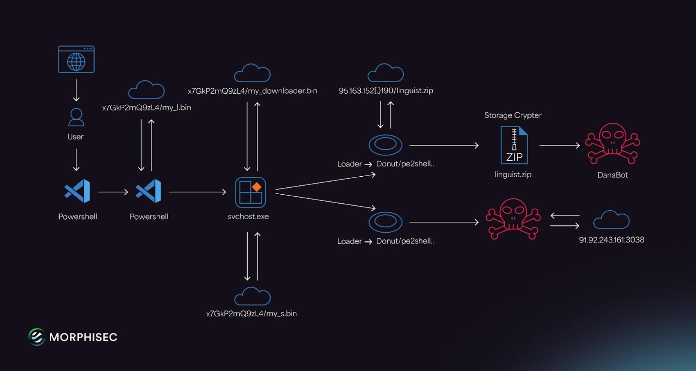
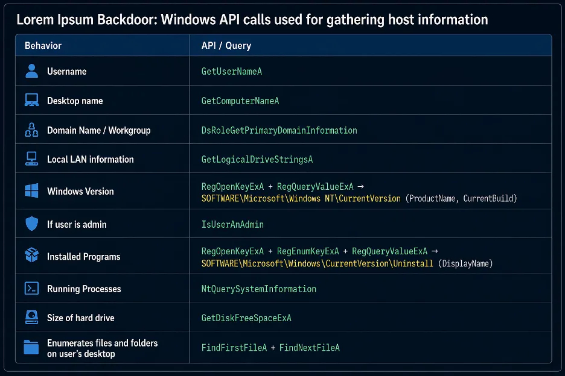
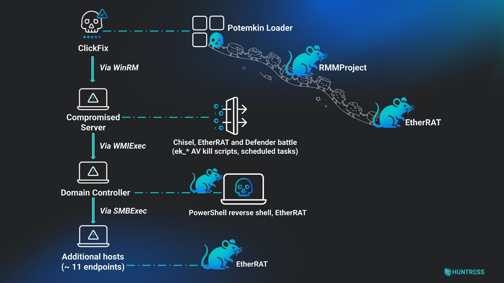

# ClickFix Malware Campaign Expanding Delivery of BabaDeda, Lorem Ipsum, and Potemkin Loaders

**ClickFix**{.cve-chip} **Social Engineering**{.cve-chip} **Malware Loader**{.cve-chip} **LOLBins Abuse**{.cve-chip} **Ransomware**{.cve-chip}

## Overview

Researchers identified expanding ClickFix campaigns that trick users into manually executing malicious PowerShell or Run commands through fake CAPTCHA pages, browser update prompts, and verification messages. The campaigns deliver malware loaders — BabaDeda, Lorem Ipsum, and Potemkin — capable of deploying ransomware, infostealers, and remote access trojans (RATs). The technique bypasses traditional automated defenses by relying on the victim to initiate execution themselves.

## Technical Specifications

| Attribute | Details |
|---|---|
| **Campaign Name** | ClickFix |
| **Malware Loaders Delivered** | BabaDeda, Lorem Ipsum, Potemkin |
| **Final Payloads** | Ransomware, infostealers, RATs |
| **Delivery Method** | Fake CAPTCHA/verification pages, browser update prompts, compromised websites |
| **Execution Technique** | Victim manually executes commands via Windows Run or PowerShell |
| **LOLBins Abused** | powershell.exe, mshta.exe, cmd.exe, wscript.exe |
| **Persistence Techniques** | Scheduled tasks, registry persistence, DLL sideloading, process injection |
| **Payload Retrieval** | Attacker-controlled infrastructure, social media profiles |
| **Obfuscation** | Base64-encoded scripts, outdated Node.js runtimes, anti-analysis techniques |
| **Distribution** | Compromised websites, ZIP archives |

## Affected Products

- Windows endpoints with unrestricted PowerShell and scripting tool execution
- Environments without Attack Surface Reduction (ASR) rules enforced
- Organizations without user security awareness training
- Systems lacking EDR/XDR monitoring for LOLBin execution

## Attack Scenario

1. Victim visits a compromised or malicious website.
2. A fake browser verification prompt, CAPTCHA page, or update message is displayed.
3. User is instructed to copy and paste a command into Windows Run or PowerShell.
4. The command downloads and executes a malware loader (BabaDeda, Lorem Ipsum, or Potemkin).
5. The loader performs system reconnaissance, establishes persistence via scheduled tasks or registry entries, and contacts C2 infrastructure.
6. Additional payloads such as ransomware, RATs, or infostealers are deployed.
7. Attackers steal credentials and data, or perform further compromise and lateral movement activities.

## Impact

=== "Integrity"

    - Ransomware deployment causing data encryption and operational disruption
    - Persistence established via scheduled tasks, registry modifications, and DLL sideloading
    - Potential lateral movement across enterprise networks following initial compromise

=== "Confidentiality"

    - Credential theft and data exfiltration via delivered infostealers
    - Remote access to compromised systems through deployed RATs
    - Financial fraud and cryptocurrency theft from harvested credentials

=== "Availability"

    - Enterprise compromise and service disruption from ransomware payloads
    - Operational disruption from persistent attacker access inside environments
    - Extended incident response burden from multi-stage loader infection chains

## Mitigations

### Immediate Actions

- Train users not to execute commands copied from websites, CAPTCHA pages, or verification prompts
- Restrict or monitor PowerShell and scripting tool execution across endpoints
- Enable Attack Surface Reduction (ASR) rules, particularly those targeting script and LOLBin abuse

### Short-term Measures

- Monitor execution of LOLBins: `mshta.exe`, `wscript.exe`, `rundll32.exe`, `cmd.exe`
- Block execution of scripts and binaries from temporary and download directories
- Deploy EDR/XDR solutions capable of detecting suspicious script execution chains

### Monitoring & Detection

- Monitor for suspicious scheduled tasks and registry persistence mechanisms created post-execution
- Alert on PowerShell commands containing Base64-encoded payloads or web download cradles
- Detect unusual network connections from LOLBin processes to external infrastructure

### Long-term Solutions

- Implement application allowlisting and least-privilege controls across endpoints
- Keep browsers and endpoint security tools updated
- Conduct regular phishing and social engineering awareness training covering ClickFix-style lures

## Resources

!!! info "Open-Source Reporting"
    - [ClickFix Campaigns Expand Malware Delivery With New Loaders and Fake Update Lures](https://thehackernews.com/2026/06/clickfix-campaigns-expand-malware.html)

---

*Last Updated: June 17, 2026*
