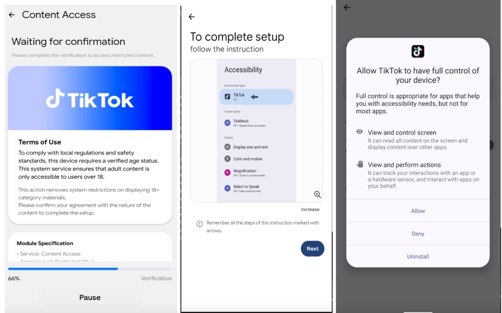
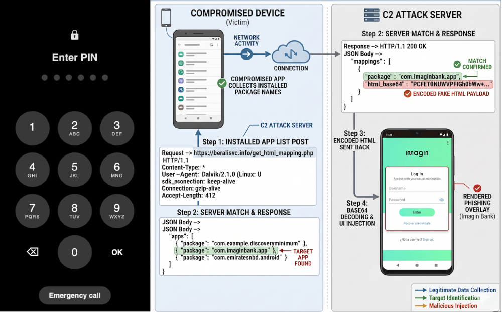

# Rokarolla Android Banking Malware Campaign

**Android Malware**{.cve-chip} **Banking Trojan**{.cve-chip} **Overlay Attack**{.cve-chip} **Cryptocurrency Theft**{.cve-chip} **MFA Bypass**{.cve-chip}

## Overview

Rokarolla is a newly identified Android banking malware targeting 217 banking and cryptocurrency applications. The malware steals credentials, intercepts SMS OTPs, performs overlay phishing attacks, and allows full remote control of infected devices. It spreads primarily through fake Chrome and TikTok update pages and malicious APK downloads distributed outside the Google Play Store. Rokarolla impersonates Google Play Protect during installation to appear legitimate.

## Technical Specifications

| Attribute | Details |
|---|---|
| **Threat Family** | Rokarolla Android Banking Malware |
| **Targeted Applications** | 217 banking and cryptocurrency applications |
| **Delivery Method** | Fake Chrome/TikTok update pages, malicious APK downloads, phishing SMS/messaging apps |
| **Distribution Channel** | Outside Google Play Store (sideloaded APKs) |
| **Abused Permissions** | Android Accessibility Services, Device Administrator |
| **Remote Commands Supported** | ~137 commands |
| **Key Capabilities** | Keylogging, SMS interception, OTP theft, notification suppression, screen monitoring, overlay injection, remote interaction, payload delivery |
| **Evasion Technique** | Impersonates Google Play Protect during installation |
| **Persistence Mechanism** | Accessibility Services abuse and Device Administrator privileges |
| **CVE IDs** | Not assigned |

## Affected Products

- Android devices where users sideload APKs from unofficial sources
- Users of 217 targeted banking and cryptocurrency applications
- Enterprise environments with BYOD mobile device policies
- Devices without Mobile Threat Defense (MTD) solutions

## Attack Scenario

1. Attackers distribute phishing links via SMS, messaging apps, or malicious websites masquerading as Chrome or TikTok update pages.
2. Victim downloads and installs a malicious APK from outside the Google Play Store.
3. During installation, the malware impersonates Google Play Protect to appear legitimate.
4. Malware requests Accessibility Services and Device Administrator permissions, gaining persistence and extensive device control.
5. The malware silently monitors the device for targeted banking and cryptocurrency applications.
6. When a targeted app is opened, Rokarolla overlays a fake login screen to steal credentials and OTP codes.
7. Attackers use intercepted credentials and OTPs to conduct fraudulent transactions or full account takeovers.

## Impact

=== "Integrity"

    - Unauthorized banking transactions and cryptocurrency wallet compromise via stolen credentials and bypassed MFA
    - Remote control of infected devices enabling attacker-directed interactions and payload delivery
    - Potential enterprise compromise through infected BYOD mobile devices

=== "Confidentiality"

    - Credential theft from 217 targeted banking and crypto applications via overlay phishing
    - SMS OTP interception enabling MFA bypass for financial accounts
    - Keylogging and screen monitoring exposing sensitive personal and financial data

=== "Availability"

    - Notification suppression preventing victims from detecting unauthorized account activity
    - Persistent device compromise requiring full factory reset for remediation
    - Financial losses and identity theft leading to extended account recovery processes

## Mitigations

### Immediate Actions

- Install applications only from the Google Play Store; disable installation from unknown sources
- Avoid granting Accessibility permissions to untrusted or unrecognized applications
- Enable Google Play Protect on all Android devices

### Short-term Measures

- Keep Android devices updated with the latest security patches
- Deploy Mobile Threat Defense (MTD) and Mobile Device Management (MDM) solutions across enterprise environments
- Restrict sideloading of APKs through enterprise MDM policies on BYOD devices

### Monitoring & Detection

- Monitor for abnormal banking activity and suspicious transaction patterns
- Alert on unexpected Accessibility Service grants and Device Administrator activations
- Deploy MTD solutions capable of detecting overlay attacks and suspicious APK behavior

### Long-term Solutions

- Educate users about phishing APK campaigns and the risks of fake app update prompts
- Enforce mobile security policies preventing installation from untrusted sources
- Implement app allowlisting on corporate-managed devices to restrict unauthorized application installs

## Resources

!!! info "Open-Source Reporting"
    - [New Rokarolla Android malware targets 217 banking, crypto apps](https://www.bleepingcomputer.com/news/security/new-rokarolla-android-malware-targets-217-banking-crypto-apps/)
    - [New Rokarolla Android Malware Steals PINs, SMS Codes, and Crypto Wallet Funds](https://thehackernews.com/2026/06/new-rokarolla-android-malware-steals.html)

---

*Last Updated: June 17, 2026*
