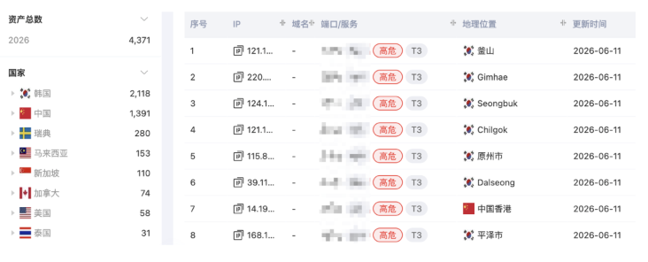
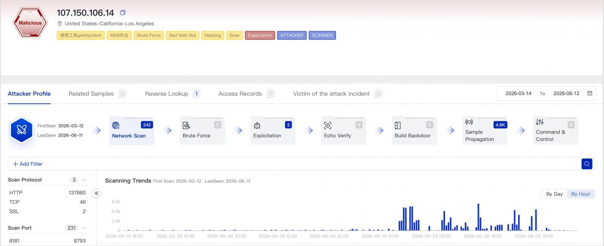

# AryStinger Botnet Infects Thousands of D-Link Routers Worldwide

**CVE-2013-3307**{.cve-chip} **CVE-2016-5681**{.cve-chip} **CVE-2025-11837**{.cve-chip} **IoT Botnet**{.cve-chip} **End-of-Life Devices**{.cve-chip} **DNS Hijacking**{.cve-chip}

## Overview

AryStinger is a previously undocumented router and NAS botnet that has hijacked over 4,000 end-of-life D-Link routers worldwide, turning them into remotely controlled "executors" for scanning, tunneling, proxying, command execution, and DNS hijacking. The botnet primarily exploits known D-Link vulnerabilities (CVE-2013-3307, CVE-2016-5681, CVE-2025-11837) in DIR-850L and DIR-818LW routers. A separate Go-based variant targets NAS devices. Attribution remains unclear, with researchers noting the botnet's operators and ultimate purpose are still under investigation.

## Technical Specifications

| Attribute | Details |
|---|---|
| **Botnet Name** | AryStinger |
| **Scale** | 4,000+ infected routers observed (Qianxin XLab) |
| **Primary Targets** | D-Link DIR-850L, DIR-818LW (end-of-life consumer routers) |
| **Secondary Targets** | NAS devices (Go-based variant) |
| **Exploited CVEs** | CVE-2013-3307 (D-Link HNAP RCE), CVE-2016-5681 (DIR-8xxL RCE), CVE-2025-11837 (D-Link remote takeover) |
| **Exploitation Method** | Unauthenticated RCE via crafted HTTP/HNAP requests |
| **Malware Variants** | C-based (router-focused), Go-based (NAS-focused) |
| **Geographic Distribution** | South Korea (48.5%), China (31.8%), Sweden (6.4%), Malaysia (3.5%), Singapore (2.5%) |
| **Capabilities** | Network scanning, proxy/tunnel relay, DNS hijacking, command execution, traffic interception |
| **Attribution** | Unknown — state-linked or criminal origin unclear |

## Affected Products

- D-Link DIR-850L routers (end-of-life, no longer receiving security updates)
- D-Link DIR-818LW routers (end-of-life, no longer receiving security updates)
- NAS devices vulnerable to the Go-based AryStinger variant
- Home and SMB environments with internet-exposed router management interfaces

## Attack Scenario

1. Threat actors scan the internet for exposed D-Link DIR-850L/818LW routers and NAS devices running firmware vulnerable to CVE-2013-3307, CVE-2016-5681, or CVE-2025-11837.
2. Crafted HTTP/HNAP requests exploit the CVEs to gain unauthenticated remote command execution as root on vulnerable routers.
3. On NAS systems, similar HTTP/API exploit paths or weak credentials are used to deploy the Go-based variant.
4. AryStinger malware is downloaded and executed, beaconing to its C2 and registering the device as an "executor."
5. From the C2, operators instruct bots to scan other networks, act as proxies or tunnels to mask attacker origin, and hijack DNS settings to redirect user traffic to phishing or malware sites.
6. On NAS devices, internal reconnaissance is performed and lateral movement into home or SMB networks is attempted.
7. Because these routers are end-of-life and rarely monitored, infections often persist undetected for extended periods.

## Impact

=== "Integrity"

    - DNS hijacking redirects user traffic to phishing or malware sites without user awareness
    - Arbitrary command execution and payload delivery on compromised routers and NAS devices
    - Infected NAS devices inside SMB environments provide adversaries a foothold for lateral movement

=== "Confidentiality"

    - All traffic traversing the compromised router is subject to inspection and capture, exposing credentials and sensitive data
    - Corporate credentials and traffic exposed if employees connect via compromised home routers
    - Over 4,000 compromised routers form a proxy layer hiding attacker origin for intrusion attempts against enterprises

=== "Availability"

    - Performance degradation and ISP abuse notices from proxying malicious traffic
    - DNS hijacking disrupts normal internet access for all devices behind the compromised router
    - Long-term persistent compromise due to EoL hardware with no available patches

## Mitigations

### Immediate Actions

- **Replace end-of-life D-Link DIR-850L and DIR-818LW routers** with supported models receiving active security updates
- If immediate replacement is not possible: disable remote management and HNAP/HTTP internet-facing access; restrict admin to local or VPN access only
- Change the default admin password to a strong, unique value

### Short-term Measures

- Verify router DNS settings have not been changed to unknown or suspicious servers
- Monitor for unexplained bandwidth usage or ISP abuse complaints
- If compromise is suspected: factory-reset the router, re-flash the latest available firmware, and reconfigure securely

### Monitoring & Detection

- Monitor NAS and router logs for unusual outbound connections initiated toward the internet
- Segment NAS and IoT devices off from critical systems and monitor for anomalous internal traffic
- Track indicators from Qianxin XLab and threat intelligence feeds related to AryStinger C2 infrastructure

### Long-term Solutions

- Keep NAS firmware patched; disable unnecessary services and enforce strong credentials or MFA where supported
- Establish an asset inventory process for all internet-facing edge and IoT devices, including EoL status tracking
- Enforce a hardware refresh policy to retire end-of-life network devices before they become persistent botnet nodes

## Resources

!!! info "Open-Source Reporting"
    - [AryStinger botnet infected thousands of D-Link routers worldwide | BleepingComputer](https://www.bleepingcomputer.com/news/security/arystinger-botnet-infected-thousands-of-d-link-routers-worldwide/amp/)
    - [AryStinger Botnet Hijacks Legacy Routers for Global Attacks | Qianxin XLab](https://blog.xlab.qianxin.com/arystinger-botnet-hijacks-legacy-routers-for-global-attacks-en/)
    - [AryStinger OSINT Report | IBM X-Force Exchange](https://exchange.xforce.ibmcloud.com/osint/guid:5811dc6ebda64f548daba8cdb8f287e8)

---

*Last Updated: June 22, 2026*
