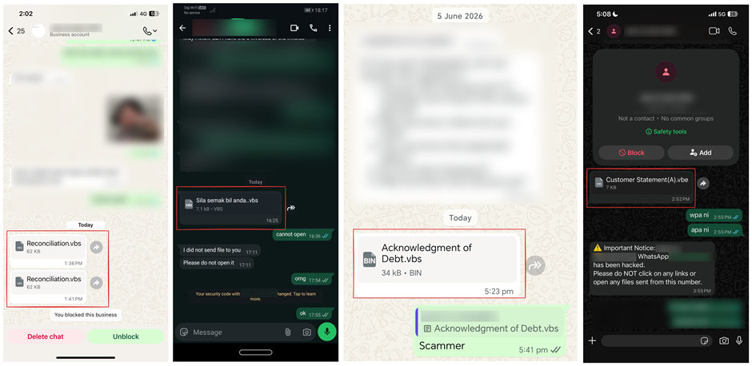
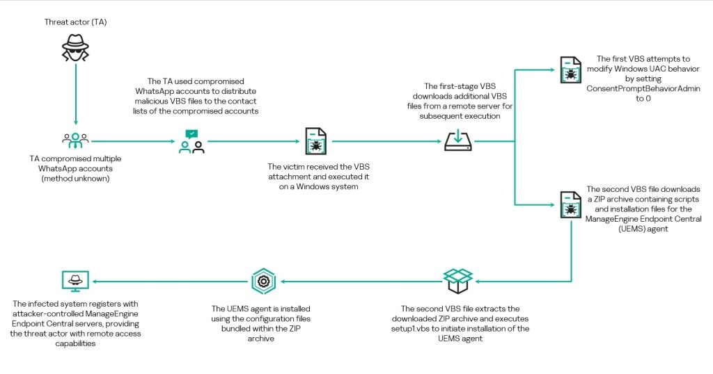

# WhatsApp Business Document Phishing & RMM Malware Campaign

**Phishing**{.cve-chip} **Social Engineering**{.cve-chip} **RMM Abuse**{.cve-chip} **LOLBins**{.cve-chip} **Credential Theft**{.cve-chip}

## Overview

Threat actors conducted a phishing campaign through WhatsApp by sending fake business-related documents — invoices, quotations, and purchase orders — to trick victims into executing malware. The attack relies entirely on social engineering rather than a WhatsApp vulnerability. Once executed, malicious scripts install legitimate Remote Monitoring and Management (RMM) tools such as AnyDesk, ScreenConnect, or TeamViewer, enabling persistent unauthorized remote access to infected systems.

## Technical Specifications

| Attribute | Details |
|---|---|
| **Campaign Type** | WhatsApp-delivered business document phishing |
| **Delivery Method** | WhatsApp messages impersonating suppliers or business contacts |
| **Lure Themes** | Fake invoices, RFQs, quotations, and purchase orders |
| **File Types Used** | ZIP/RAR archives, executables disguised as PDFs or Office documents |
| **Execution Technique** | Embedded scripts using PowerShell, CMD, HTA, mshta.exe, rundll32.exe |
| **Installed Tools** | Legitimate RMM software: AnyDesk, ScreenConnect, TeamViewer, and similar |
| **Persistence Mechanisms** | Scheduled tasks, startup entries, registry modifications |
| **CVE IDs** | Not applicable (social engineering, no software vulnerability) |
| **Attribution** | Unknown |

## Affected Products

- Windows endpoints where users open WhatsApp Web or mobile-to-PC transferred attachments
- Organizations without controls restricting RMM software installation
- Environments lacking PowerShell and script execution restrictions
- Businesses relying on WhatsApp for supplier and procurement communications

## Attack Scenario

1. Attacker sends a WhatsApp message impersonating a supplier, vendor, or business contact.
2. Victim receives a fake invoice, RFQ, or procurement document as a ZIP/RAR archive or disguised executable.
3. Victim opens the malicious attachment, believing it to be a legitimate business document.
4. Embedded scripts execute PowerShell, HTA, or CMD commands using LOLBins such as `mshta.exe` or `rundll32.exe`.
5. Malware downloads secondary payloads and silently installs a legitimate RMM tool (e.g., AnyDesk, ScreenConnect).
6. Persistence is established via scheduled tasks, startup entries, or registry modifications.
7. Threat actor gains persistent remote access and may steal credentials, move laterally, exfiltrate data, or deploy ransomware.

## Impact

=== "Integrity"

    - Persistent unauthorized remote access via legitimate RMM tools evading traditional AV detection
    - Potential ransomware deployment following lateral movement
    - Registry and scheduled task modifications establishing long-term persistence

=== "Confidentiality"

    - Credential theft from compromised endpoints
    - Business Email Compromise (BEC) and financial fraud enabled through account access
    - Data exfiltration from infected systems via attacker-controlled RMM sessions

=== "Availability"

    - Lateral movement spreading compromise across enterprise environments
    - Operational disruption from ransomware deployment following initial foothold
    - Extended incident response burden from covert RMM-based persistence

## Mitigations

### Immediate Actions

- Verify unexpected WhatsApp business documents through a separate, trusted communication channel before opening
- Block execution of scripts and binaries from temporary and download directories
- Monitor for and block unauthorized RMM software installations (AnyDesk, ScreenConnect, TeamViewer)

### Short-term Measures

- Restrict PowerShell and script interpreter execution where not required
- Enable EDR/XDR monitoring and Attack Surface Reduction (ASR) rules
- Use application allowlisting to prevent unauthorized RMM tool installation

### Monitoring & Detection

- Monitor for suspicious scheduled tasks, startup entry modifications, and registry persistence mechanisms
- Alert on LOLBin execution chains: `mshta.exe`, `rundll32.exe`, `wscript.exe` spawning network connections
- Detect unexpected outbound RMM connections from endpoints not managed by IT-sanctioned tools
- Sandbox attachment analysis for ZIP/RAR files and unexpected executable content

### Long-term Solutions

- Train employees on mobile phishing and messaging-platform threats, specifically WhatsApp business lures
- Implement a policy requiring all vendor/supplier documents to arrive via corporate email with gateway scanning
- Maintain an allowlist of approved RMM tools and block all others at the endpoint and network level

## Resources

!!! info "Open-Source Reporting"
    - [WhatsApp phishing attack uses fake business docs to hack PCs | BleepingComputer](https://www.bleepingcomputer.com/news/security/whatsapp-phishing-attack-uses-fake-business-docs-to-hack-pcs/)
    - [WhatsApp Malware Campaign Hijacks Trust, Installs Legitimate Admin Tools | Security Affairs](https://securityaffairs.com/194031/malware/whatsapp-malware-campaign-hijacks-trust-installs-legitimate-admin-tools.html)

---

*Last Updated: June 23, 2026*
