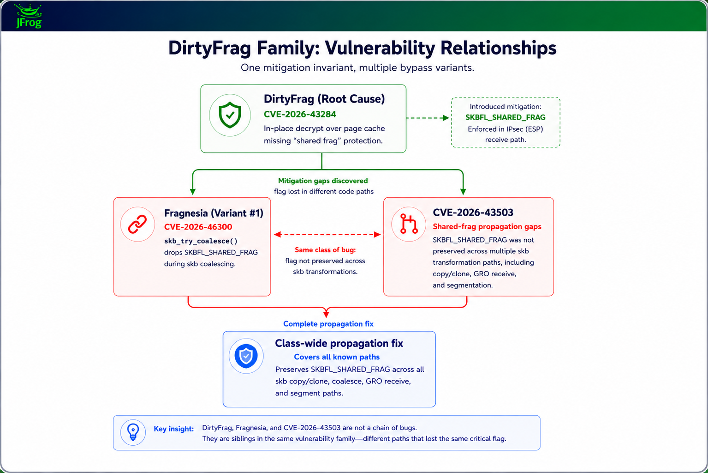

# DirtyClone Linux Kernel Privilege Escalation Vulnerability

**CVE-2026-43503**{.cve-chip}  
**Linux Kernel Privilege Escalation**{.cve-chip}  
**Page Cache Memory Corruption**{.cve-chip}

## Overview
DirtyClone (CVE-2026-43503) is a newly disclosed Linux kernel vulnerability that enables local low-privileged attackers to gain root privileges by corrupting page-cache memory during packet-cloning operations. The flaw affects multiple Linux distributions and server environments, including cloud and containerized deployments.

DirtyClone abuses the kernel’s packet-cloning helpers so that memory pages backing privileged executables in the page cache become writable in practice. Attackers can thereby alter the in-memory representation of binaries like `/usr/bin/sudo` or `/usr/bin/su` without touching the filesystem, making the privilege escalation stealthy and difficult for traditional file-integrity tooling to detect.

## Technical Specifications

| **Attribute**          | **Details** |
|------------------------|-------------|
| **CVE ID**             | CVE-2026-43503 |
| **Vulnerability Type** | Local privilege escalation via page-cache corruption during packet cloning |
| **CVSS Score**         | High/Critical (local root) |
| **Attack Vector**      | Local |
| **Authentication**     | Requires initial low-privileged access |
| **Complexity**         | Medium (requires exploit code and kernel behavior understanding) |
| **User Interaction**   | Not required once attacker has a shell |
| **Affected Versions**  | Linux kernels with vulnerable packet-cloning helper implementations across multiple distributions and server environments |

## Affected Products
- Linux server distributions running kernels that include the vulnerable packet-cloning helper code
- Cloud servers and VPS instances hosting multi-tenant workloads on affected kernels
- Container hosts where local access or container escape can lead to kernel-level exploitation
- Shared multi-user systems that provide shell access to untrusted or semi-trusted users

## Attack Scenario
1. An attacker gains local access to a Linux system (e.g., via SSH, compromised credentials, a web shell, or container escape).
2. The attacker runs a DirtyClone exploit that targets the kernel packet-cloning helper functions.
3. Exploit logic manipulates packet-cloning operations in a way that improperly clears a shared-memory protection flag, causing file-backed page-cache memory to be treated as writable.
4. The exploit corrupts cached memory pages associated with privileged executables such as `/usr/bin/sudo` or `/usr/bin/su`, without modifying the actual files on disk.
5. The attacker executes the temporarily modified binary and obtains a root shell.
6. With root privileges, the attacker fully compromises the system and may establish persistence or move laterally.

## Impact Assessment

### Integrity
- Attackers can alter privileged binaries in memory, undermining assumptions about binary integrity while leaving disk content unchanged.
- Kernel-level manipulation of the page cache enables stealthy modification of execution paths for critical utilities such as `sudo` and `su`.
- Security controls that rely solely on filesystem verification, package integrity, or immutable flags may fail to detect the compromise.

### Confidentiality
- Root access permits reading any data accessible to the system administrator, including credentials, secrets, configuration files, and application data.
- Compromise of cloud or container hosts may expose other tenants’ workloads and sensitive multi-tenant information.
- Attackers can dump process memory, intercept inter-process communications, and extract secrets from privileged services.

### Availability
- With root privileges, attackers can disable security tools, alter system configuration, or deploy destructive payloads such as ransomware.
- Critical services may be stopped or tampered with, leading to outages and degraded performance.
- Recovery may require patching, reboots, and comprehensive investigation of potentially impacted hosts across an enterprise fleet.

## Mitigation Strategies

### Immediate Actions
- Apply the latest Linux kernel security patches that address CVE-2026-43503 as soon as they are available from your distribution.
- Reboot systems after patching to ensure that vulnerable kernel code is no longer in use.
- Restrict unnecessary local user access, especially on shared or internet-facing systems.

### Short-term Measures
- Harden container environments by limiting container-to-host interactions and enforcing strict isolation boundaries.
- Enable and correctly configure SELinux or AppArmor to add additional enforcement layers, limiting what even a compromised binary can do.
- Monitor for suspicious privilege escalation patterns, including unusual invocation of `sudo`, `su`, or other privileged utilities.

### Monitoring & Detection
- Use security tooling capable of detecting anomalous in-memory behavior, kernel exploitation artifacts, or unexpected transitions of unprivileged processes to root.
- Review logs and telemetry for indicators of local exploit execution, including atypical system calls or kernel messages associated with packet cloning.
- Limit exposure of shared multi-user systems and apply stricter access control, logging, and segmentation for high-risk hosts.

## Resources and References

!!! info "Official Documentation"
    - [New DirtyClone Linux Kernel Flaw Lets Local Users Gain Root via Cloned Packets](https://thehackernews.com/2026/06/new-dirtyclone-linux-kernel-flaw-lets.html)
    - [Linux Gets Dirty Again: DirtyClone Kernel Flaw Can Lead to Local Root Access](https://linuxiac.com/linux-gets-dirty-again-dirtyclone-kernel-flaw-can-lead-to-local-root-access/)
    - [2 Linux kernel flaw PoCs published, enabling local privilege escalation | SC Media](https://www.scworld.com/news/2-linux-kernel-flaw-pocs-published-enabling-local-privilege-escalation)

---

*Last Updated: June 28, 2026*