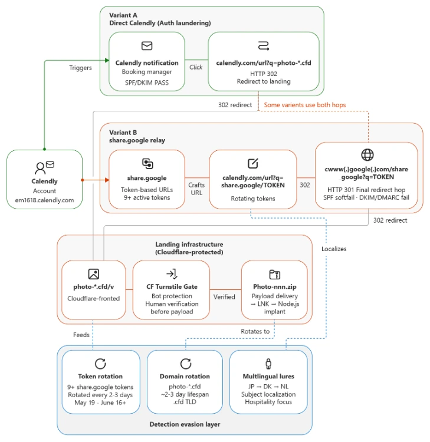

# Hospitality Sector Phishing Campaign Using Fake Guest Complaint Emails

**No Single CVE**{.cve-chip}  
**Phishing / Social Engineering**{.cve-chip}  
**Hospitality Sector Malware Delivery**{.cve-chip}

## Overview
Cybercriminals launched a phishing campaign targeting hotel and hospitality employees using fake guest complaint emails. The messages impersonate customers reporting issues such as dirty rooms, refund disputes, booking complaints, or other service problems, and they contain malicious ZIP attachments intended to infect systems and establish persistence within hotel networks.

The campaign has been observed targeting hospitality organizations in Europe and Asia. Public reporting indicates that the attackers are focused on front-desk, reception, and reservations staff, abusing the normal business expectation that hotel employees regularly open guest-related documents, screenshots, and complaint evidence.

## Technical Specifications

| **Attribute** | **Details** |
|---------------|-------------|
| **CVE ID** | No single CVE |
| **Vulnerability Type** | Phishing, social engineering, malicious ZIP and LNK execution, staged malware delivery |
| **CVSS Score** | Not applicable |
| **Attack Vector** | Email / user execution |
| **Authentication** | None |
| **Complexity** | Low to Medium |
| **User Interaction** | Required |
| **Affected Versions** | Windows endpoints used by hotel and hospitality staff; especially front-desk and reservations systems handling guest communications |

## Affected Products
- Hotel front-desk and reservations workstations
- Hospitality employee email accounts receiving external guest communications
- Windows systems that allow execution of `.LNK` shortcut files from downloaded ZIP archives
- Environments where PowerShell, Node.js execution, or weak email filtering enables staged payload delivery

## Attack Scenario
1. A hotel employee receives a fake complaint email that appears to come from a guest or booking-related contact.
2. The message claims to include evidence photos or screenshots in an attached ZIP archive.
3. The employee opens the archive and executes a disguised `.LNK` shortcut file that appears to be an image such as a PNG photo.
4. The shortcut silently launches PowerShell commands that download and run additional payloads.
5. The malware installs Node.js-based implants, modifies Microsoft Defender exclusions, collects system information, and establishes command-and-control communications.
6. The attackers gain persistent access to the compromised environment and may later deploy credential theft, ransomware, or other follow-on intrusion activity.

## Impact Assessment

### Integrity
- Attackers may install persistent implants and modify endpoint security settings such as Defender exclusions.
- Compromised systems can be repurposed for follow-on payload execution and broader intrusion activity.
- Front-desk and reservations endpoints may be manipulated as footholds into wider hotel networks.

### Confidentiality
- Customer personal information, reservation data, payment-related information, and internal hotel records may be exposed.
- Credential theft could affect booking systems, corporate accounts, and remote administration access.
- System profiling and remote access may support broader espionage or financially motivated data theft.

### Availability
- Persistent access can lead to ransomware deployment and operational disruption.
- Compromise of guest-service systems may interrupt reservations, check-in workflows, or back-office operations.
- Recovery can require host isolation, credential resets, and broad endpoint remediation across the hospitality environment.

## Mitigation Strategies

### Immediate Actions
- Train staff to identify phishing emails posing as guest complaints or booking issues.
- Block or strictly control `.LNK` attachments and inspect ZIP archives from unknown senders.
- Restrict execution from temporary, downloads, and user-writable directories.

### Short-term Measures
- Disable unnecessary PowerShell execution and apply application control where feasible.
- Use EDR/XDR tooling to monitor PowerShell, script execution, and suspicious Node.js activity.
- Enforce MFA for email, reservation systems, and administrative access.

### Monitoring & Detection
- Monitor for changes to Microsoft Defender exclusions and unusual outbound connections.
- Investigate unexpected Node.js execution, PowerShell-launched downloads, and suspicious activity on front-desk systems.
- Hunt for staged persistence mechanisms, registry changes, and command-and-control beaconing associated with ZIP-based phishing infections.

## Resources and References

!!! info "Official Documentation"
    - [Security Affairs - Hospitality Sector Hit by Phishing Campaign Using Fake Guest Complaint Emails](https://securityaffairs.com/194349/uncategorized/hospitality-sector-hit-by-phishing-campaign-using-fake-guest-complaint-emails.html)
    - [TechRadar - Hackers are establishing persistence in hospitality and hotels by posing as guests with poisoned ZIP archives](https://www.techradar.com/pro/security/hackers-are-establishing-persistence-in-hospitality-and-hotels-by-posing-as-guests-with-poisoned-zip-archives-but-no-one-knows-what-their-plan-is)
    - [Microsoft Security Blog - Photo ZIP campaign targeting hospitality industry delivers Node.js implant](https://www.microsoft.com/en-us/security/blog/2026/06/25/photo-zip-campaign-targeting-hospitality-industry-delivers-node-js-implant-for-persistent-access/)

***

*Last Updated: June 28, 2026*