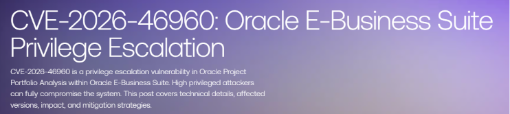

# Oracle E-Business Suite Flaw CVE-2026-46960 Actively Exploited in the Wild

**CVE-2026-46960**{.cve-chip}  
**ERP Privilege Escalation**{.cve-chip}  
**Oracle E‑Business Suite**{.cve-chip}  
**Improper Access Control**{.cve-chip}

## Overview
CVE‑2026‑46960 is a high‑severity privilege‑escalation vulnerability in Oracle Project Portfolio Analysis, a component of Oracle E‑Business Suite (EBS) 12.2.x. It arises from improper access control in the Internal Operations component and allows an authenticated, high‑privileged user to gain full control over the Project Portfolio Analysis module via crafted HTTP requests.

Successful exploitation compromises the confidentiality, integrity, and availability of project portfolios, scoring models, and financial planning data within that module, and may serve as a stepping stone toward broader abuse of the organization’s ERP environment through shared accounts and integrations.

## Technical Specifications

| **Attribute**          | **Details** |
|------------------------|-------------|
| **CVE ID**             | CVE-2026-46960 |
| **Vulnerability Type** | Improper Access Control (CWE‑284) in Oracle Project Portfolio Analysis – Internal Operations |
| **CVSS Score**         | High (privilege escalation within a critical ERP module) |
| **Attack Vector**      | Network (HTTP to Oracle EBS web tier) |
| **Authentication**     | Requires high‑privileged, authenticated Oracle EBS / Project Portfolio Analysis account |
| **Complexity**         | Low to Medium for an attacker who already has admin‑level credentials |
| **User Interaction**   | None required once the attacker is authenticated |
| **Affected Versions**  | Oracle E‑Business Suite – Project Portfolio Analysis 12.2.3 through 12.2.15 |

## Affected Products
- Oracle E‑Business Suite 12.2.x deployments that use Oracle Project Portfolio Analysis versions 12.2.3–12.2.15.
- Environments where Internal Operations endpoints are reachable from high‑privileged user accounts over HTTP.
- Organizations with a large number of high‑privileged EBS/Project Portfolio Analysis accounts or shared admin credentials.
- ERP/finance stacks that integrate Project Portfolio Analysis with other EBS modules using common service or integration accounts.

## Attack Scenario

1. **Obtain high‑privileged account**  
   The attacker is either a trusted insider with high‑priv Project Portfolio Analysis responsibilities or an external actor who has compromised such an account via phishing, password reuse, or a separate vulnerability.

2. **Craft HTTP requests to Internal Operations**  
   Using a browser, script, or proxy, the attacker sends crafted HTTP requests to Internal Operations endpoints within the Project Portfolio Analysis module. Because of flawed authorization checks, the service does not correctly enforce which operations the high‑privileged account should be allowed to perform.

3. **Privilege escalation inside the module**  
   The attacker abuses the improper access control to escalate from a restricted high‑priv role to effective full administrative rights over Project Portfolio Analysis, performing actions outside the intended scope such as editing or deleting portfolios, modifying scoring models, or changing configuration.

4. **Full module compromise and data manipulation**  
   With full control over Internal Operations, the attacker can access and exfiltrate sensitive portfolio and financial planning data, alter budgets and prioritization, and potentially leverage shared or integration accounts to pivot into other EBS modules.

5. **Covering tracks**  
   Because all actions occur via legitimate high‑privileged accounts over standard HTTP, activity can blend into normal administration patterns unless detailed logging, auditing, and anomaly detection are in place.

## Impact Assessment

### Integrity
- Attackers can modify project portfolios, scoring models, budgets, and configuration, undermining the integrity of project evaluation and financial planning.
- Changes to approvals, prioritization, and workflow settings can silently alter decision‑making processes.
- Manipulated ERP data can support fraud, insider gain, or deliberate misallocation of resources.

### Confidentiality
- Complete takeover of Project Portfolio Analysis exposes sensitive project and financial planning information, potentially including strategic initiatives, investment data, and internal performance metrics.
- Exfiltrated data may reveal future projects, M&A plans, or confidential business strategies.

### Availability
- Attackers can disrupt or delete planning data, disable or corrupt configuration, and degrade the availability of the module.
- Administrators may need to take Project Portfolio Analysis offline to investigate and recover, impacting business operations that depend on it.

## Mitigation Strategies

### Immediate Actions – Patch Oracle E‑Business Suite
- Apply the June 2026 Critical Patch Update (CPU) for Oracle E‑Business Suite that addresses CVE‑2026‑46960 in Project Portfolio Analysis.
- Ensure prerequisite CPUs (e.g., April 2026 CPU) are installed as required for your specific EBS 12.2.x release before applying the June update.

### Short‑term Measures – Harden Access and Roles
- Reduce the number of high‑privileged Project Portfolio Analysis accounts to the minimum required for operations.
- Review assigned responsibilities/roles within EBS and remove unnecessary privileges or legacy assignments.
- Enforce multi‑factor authentication (MFA) for all EBS administrative and high‑privileged users to reduce the risk of credential abuse.

### Network and Exposure Controls
- Restrict access to the EBS web tier so that only trusted management networks or VPN connections can reach administrative and sensitive endpoints.
- Avoid exposing Oracle EBS administration interfaces directly to the internet; follow Oracle’s secure deployment and hardening guidelines.

### Monitoring & Detection
- Increase logging and auditing on Project Portfolio Analysis, focusing on:
  - Unusual HTTP requests to Internal Operations endpoints from high‑privileged accounts.
  - Unexpected changes to portfolio configurations, scoring models, and financial planning data.
  - Authentication events from privileged accounts occurring at unusual times or from atypical IP addresses.
- Conduct periodic privileged‑user activity reviews to detect misuse or anomalous patterns.

### Credential Hygiene
- Rotate credentials for privileged EBS and Project Portfolio Analysis accounts, particularly after patching or suspected compromise.
- Use unique credentials for Oracle EBS accounts and integrate with central identity services where possible, enabling enterprise‑wide security controls such as conditional access and centralized monitoring.

## Resources and References

!!! info "Official Documentation"
    - [SentinelOne – CVE‑2026‑46960 Oracle E‑Business Suite Project Portfolio Analysis Improper Access Control](https://www.sentinelone.com/vulnerability-database/cve-2026-46960/)
    - [Risk Ledger – Oracle EBS Emerging Threat](https://riskledger.com/resources/oracle-ebs-emerging-threat)
    - [Oracle – Critical Patch Update Advisories](https://www.oracle.com/security-alerts/cpuapr2026.html)

---

*Last Updated: June 30, 2026*