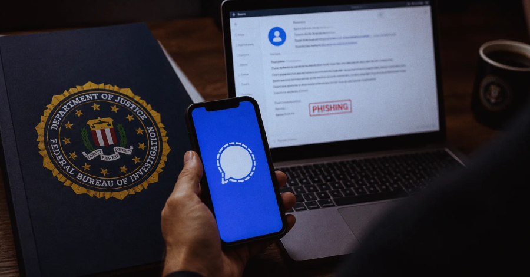
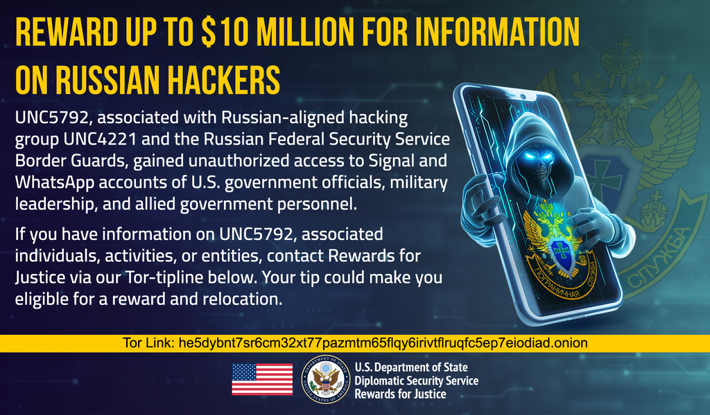
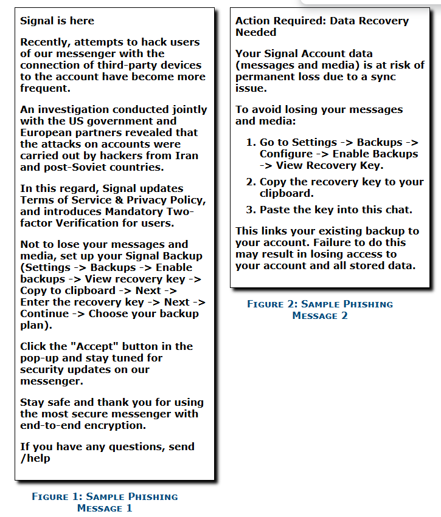

# Russian Intelligence Targeting Signal Backup Recover
  

**No Single CVE**{.cve-chip}  
**Phishing / Social Engineering**{.cve-chip}  
**Secure Messaging Account Takeover**{.cve-chip}

## Overview
The FBI and CISA warned that Russian intelligence-linked threat actors are conducting phishing and social engineering campaigns targeting users of commercial messaging applications such as Signal and WhatsApp. The attackers are attempting to steal Signal Backup Recovery Keys and related account recovery information to gain access to encrypted message backups and sensitive communications.

The campaign does not break Signal's encryption directly. Instead, it abuses legitimate backup and account recovery workflows by tricking users into revealing verification codes, PINs, or Backup Recovery Keys that can be used to restore messages on attacker-controlled devices.

## Technical Specifications

| **Attribute** | **Details** |
|---------------|-------------|
| **CVE ID** | No single CVE |
| **Vulnerability Type** | Phishing, social engineering, account recovery abuse |
| **CVSS Score** | Not applicable |
| **Attack Vector** | Network / social engineering |
| **Authentication** | Victim-supplied recovery key, PIN, or verification code |
| **Complexity** | Low to Medium |
| **User Interaction** | Required |
| **Affected Versions** | Signal accounts with Secure Backups enabled; broader commercial messaging application users targeted through similar tactics |

## Affected Products
- Signal accounts using Secure Backups
- WhatsApp and other commercial messaging application users targeted in related phishing campaigns
- Government officials, military personnel, political figures, journalists, and individuals of high intelligence value
- Users who share Backup Recovery Keys, verification codes, or account PINs with untrusted parties

## Attack Scenario
1. A victim receives a phishing message impersonating Signal support, another trusted service contact, or a known individual.
2. The attacker claims there is a security problem, account issue, or urgent action required.
3. The victim is manipulated into enabling backups or into viewing and sharing their recovery information.
4. The victim provides the Backup Recovery Key, verification code, or Signal PIN.
5. The attacker uses the stolen key to restore the Signal backup on an attacker-controlled device and access historical chats, files, contacts, and group messages.
6. The threat actor maintains intelligence collection or uses the account access to continue phishing, impersonation, or espionage operations.

## Impact Assessment

### Integrity
- Attackers may take over the victim's messaging account and abuse trusted communications channels.
- A compromised account can be used to impersonate the victim and phish additional contacts.
- Long-term account abuse may undermine the operational integrity of secure communications.

### Confidentiality
- Historical private and group messages may be exposed once backups are restored by the attacker.
- Sensitive attachments, contact networks, and operationally important communications may be compromised.
- The activity poses significant espionage risk to government, military, media, and high-value civilian targets.

### Availability
- Victims may lose trusted control of their messaging accounts.
- Incident response can require account recovery, backup key regeneration, and broad trust revalidation among contacts.
- Operational security disruptions may affect teams that rely on secure messaging for coordination.

## Mitigation Strategies

### Immediate Actions
- Never share Signal Backup Recovery Keys, verification codes, or PINs with anyone.
- Regenerate compromised Backup Recovery Keys immediately in the application settings.
- Verify support-related requests only through official channels.

### Short-term Measures
- Disable backups if they are not operationally required.
- Enable strong device authentication and any available multi-factor protections around related accounts and devices.
- Conduct targeted phishing awareness training for high-risk personnel.

### Monitoring & Detection
- Review linked devices and remove any that are unknown or unauthorized.
- Monitor for suspected unauthorized account restoration attempts, unusual support-themed phishing messages, or account takeover indicators.
- Keep Signal and other messaging applications updated and report suspected incidents to relevant organizational security teams or national authorities.

## Resources and References

!!! info "Official Documentation"
    - [IC3 PSA - Russian Intelligence Services Continue to Target Commercial Messaging Applications](https://www.ic3.gov/PSA/2026/PSA260626)
    - [Security Affairs - New FBI Alert: Russian Intelligence Uses Signal Recovery Keys to Access Messages](https://securityaffairs.com/194360/intelligence/new-fbi-alert-russian-intelligence-uses-signal-recovery-keys-to-access-messages.html)
    - [The Hacker News - FBI Warns Russian Intelligence Hackers Target Signal Backup Recovery Keys](https://thehackernews.com/2026/06/fbi-warns-russian-intelligence-hackers.html)
    - [Signal Support - Signal Secure Backups](https://support.signal.org/hc/en-us/articles/9708267671322-Signal-Secure-Backups)

***

*Last Updated: June 28, 2026*