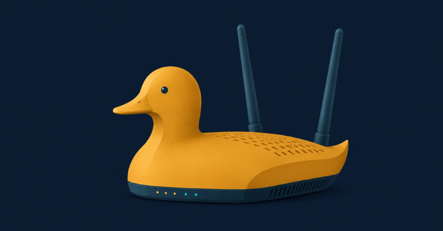
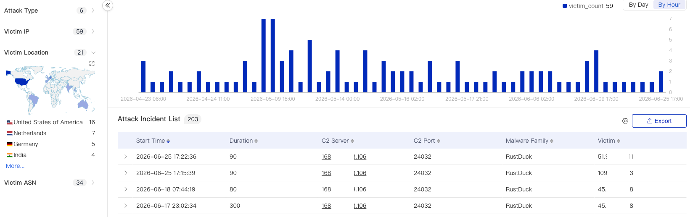
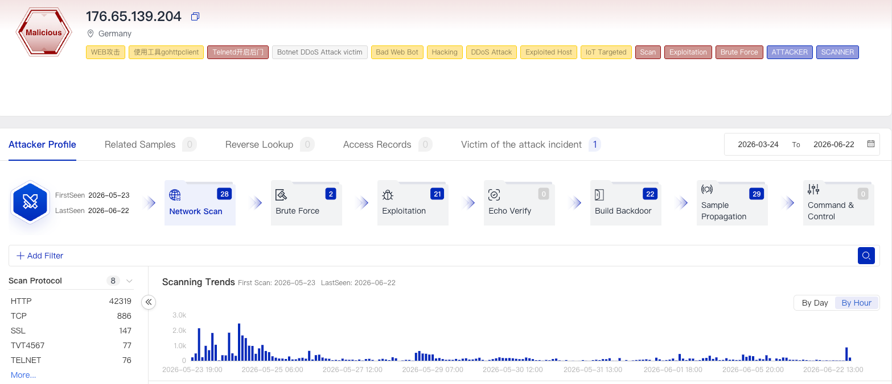

# RustDuck Botnet

**IoT Botnet**{.cve-chip} **Rust Malware**{.cve-chip} **DDoS**{.cve-chip} **Multi-Architecture**{.cve-chip} **Linux/Embedded Threat**{.cve-chip}

## Overview

RustDuck is a rapidly evolving botnet malware family rewritten in Rust to improve stealth, portability, and performance. It targets vulnerable IoT devices, routers, Android TV boxes, IP cameras, and Linux servers to build a distributed botnet primarily used for large-scale DDoS operations. Researchers observed continuous development with stronger obfuscation and increasingly modular capabilities.

## Technical Specifications

| Attribute | Details |
|---|---|
| **Threat Name** | RustDuck |
| **Malware Type** | Botnet malware |
| **Primary Objective** | Distributed Denial-of-Service (DDoS) attacks |
| **Target Platforms** | IoT devices, routers, Android TV boxes, IP cameras, Linux servers |
| **Infection Method** | Weak/default credentials and exploitation of known vulnerabilities |
| **Architecture Support** | ARM, MIPS, x86, x64 |
| **Infection Chain** | Multi-stage (loader + Rust payload) |
| **Core Capabilities** | TCP/UDP flooding, remote command execution, persistence, self-updating |
| **C2 Model** | Remote command-and-control infrastructure |
| **CVE IDs** | Not specified (campaign-level exploitation of multiple known flaws) |

## Affected Products

- Internet-exposed IoT devices with weak or default credentials
- Unpatched consumer and enterprise routers
- Android TV boxes and IP cameras with insecure remote management
- Linux servers exposed to brute-force or known vulnerability exploitation

## Attack Scenario

1. Attackers scan the internet for vulnerable IoT, router, and Linux targets.
2. Weak credentials or known vulnerabilities are used for initial access.
3. A lightweight loader script or binary executes on the compromised system.
4. The loader retrieves the main RustDuck payload from attacker-controlled infrastructure.
5. The infected host connects to C2 infrastructure and is enrolled into the botnet.
6. Operators issue commands to launch coordinated TCP/UDP flood attacks at selected targets.

## Impact

=== "Integrity"

    - Compromise of routers, embedded systems, and Linux servers through unauthorized malware deployment
    - Potential remote command execution and follow-on payload delivery via botnet control channels
    - Elevated risk of lateral movement where IoT and production networks are poorly segmented

=== "Confidentiality"

    - Infected systems may expose network telemetry and environment details to attacker-controlled C2 servers
    - Compromised edge devices can be leveraged as reconnaissance footholds against internal infrastructure
    - Long-lived infections increase risk of credential interception and reuse in mixed-trust environments

=== "Availability"

    - Coordinated DDoS attacks can trigger large-scale service outages
    - Bandwidth exhaustion and network congestion degrade business-critical connectivity
    - Operational disruption for organizations whose infrastructure is used as attack infrastructure

## Mitigations

### Immediate Actions

- Change default credentials on all IoT and edge devices
- Disable unnecessary remote administration services and internet-facing management ports
- Apply latest firmware and security patches across routers, cameras, and embedded systems

### Short-term Measures

- Restrict internet exposure of management interfaces using ACLs, VPNs, or jump hosts
- Segment IoT and OT-style devices away from critical enterprise systems
- Block known malicious IPs and C2 domains from threat intelligence feeds

### Monitoring & Detection

- Monitor outbound traffic for suspicious beaconing or unusual protocol/port behavior
- Deploy IDS/IPS signatures for botnet loader and C2 communication patterns
- Detect anomalous TCP/UDP flood generation from internal edge devices

### Long-term Solutions

- Establish continuous asset inventory and vulnerability management for IoT fleets
- Enforce zero-trust style network isolation for unmanaged embedded endpoints
- Deploy DDoS protection and upstream traffic scrubbing for internet-facing services

## Resources

!!! info "Open-Source Reporting"
    - [RustDuck Botnet Rebuilds in Rust to Hijack Routers and Servers for DDoS](https://thehackernews.com/2026/06/rustduck-botnet-rebuilds-in-rust-to.html)
    - [RustDuck: An In-Depth Analysis of a Two-Stage Botnet](https://blog.xlab.qianxin.com/rustduck-en/)

---

*Last Updated: July 1, 2026*
