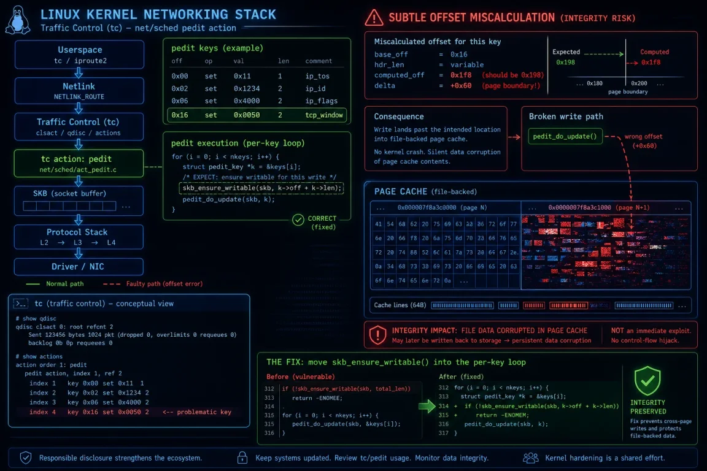

# pedit COW Linux Privilege Escalation Vulnerability


**CVE-2026-46331**{.cve-chip}  
**Linux Kernel Privilege Escalation**{.cve-chip}  
**In-Memory Page Cache Corruption**{.cve-chip}

## Overview
The pedit COW vulnerability (CVE-2026-46331) is a newly disclosed Linux kernel flaw that allows local attackers to escalate privileges to root by abusing the traffic control (tc) subsystem and corrupting page-cache memory. The exploit targets the act_pedit component in the net/sched subsystem, enabling modification of cached pages corresponding to privileged binaries without altering files on disk.

Because the attack operates purely in memory, it can provide stealthy root access that bypasses traditional file-integrity checks and many on-disk detection mechanisms. Systems with unprivileged user namespaces enabled and accessible tc functionality are particularly exposed.



## Technical Specifications

| **Attribute**          | **Details** |
|------------------------|-------------|
| **CVE ID**             | CVE-2026-46331 |
| **Vulnerability Type** | Kernel privilege escalation via page-cache Copy-on-Write (COW) corruption in net/sched act_pedit |
| **CVSS Score**         | High/Critical (local privilege escalation to root) |
| **Attack Vector**      | Local |
| **Authentication**     | Requires initial low-privilege access |
| **Complexity**         | Medium (requires tc/netns knowledge and kernel behavior understanding) |
| **User Interaction**   | Not required after initial shell is obtained |
| **Affected Versions**  | Linux kernels with vulnerable act_pedit implementation and unprivileged user namespaces enabled; distributions exposing tc and traffic control features to unprivileged users |

## Affected Products
- Linux distributions using kernels that include the vulnerable act_pedit net/sched implementation
- Systems with unprivileged user namespaces enabled (`kernel.unprivileged_userns_clone=1`)
- Environments where tc and traffic control features are available to unprivileged users
- Hosts relying primarily on on-disk integrity checks and traditional file-based monitoring for detection

## Attack Scenario
1. An attacker gains low-privileged shell access on a Linux system (e.g., via a user account or application compromise).
2. The attacker creates a user namespace and obtains namespace-level CAP_NET_ADMIN privileges.
3. Using crafted tc rules and act_pedit filters, the attacker triggers improper Copy-on-Write behavior in the page cache.
4. The exploit corrupts cached memory pages of privileged binaries such as `/bin/su`, injecting malicious payloads or shellcode into executable memory.
5. The attacker executes the corrupted binary, which runs with elevated privileges and yields a root shell.
6. With root access and no changes on disk, the attacker gains full control of the system while evading many integrity-monitoring tools.

## Impact Assessment

### Integrity
- Attackers can modify executable code in memory for privileged binaries without touching the underlying filesystem.
- Kernel-level manipulation of page-cache contents undermines assumptions about binary integrity and trust.
- Security controls dependent on on-disk signatures, checksums, or package verification may be bypassed.

### Confidentiality
- Successful exploitation allows attackers to read any data accessible to root, including sensitive files, credentials, secrets, and logs.
- Root access enables dumping of memory, access to protected application data, and inspection of secure configuration stores.
- In multi-tenant or shared environments, compromise can extend to other workloads on the same host.

### Availability
- Root-level control allows disabling or tampering with security tools, altering system configuration, and potentially causing service outages.
- Attackers can install persistent backdoors, manipulate networking, or deploy destructive payloads such as ransomware.
- Recovery may require kernel updates, reboots, and thorough compromise assessment across affected fleets.

## Mitigation Strategies

### Immediate Actions
- Apply the latest Linux kernel security patches that address CVE-2026-46331 as soon as they are available from your distribution.
- Reboot systems after patching to ensure the vulnerable kernel code is no longer in use.
- Disable unprivileged user namespaces if not operationally required:
  ```bash
  sysctl -w kernel.unprivileged_userns_clone=0
  ```

### Short-term Measures
- Restrict access to the `tc` utility and traffic-control features to trusted administrative users only.
- Limit exposure of CAP_NET_ADMIN within user namespaces and review namespace-related configurations.
- Use endpoint detection and response tools that can detect anomalous in-memory behavior, kernel exploitation patterns, and unusual execution of privileged binaries.

### Monitoring & Detection
- Monitor for suspicious namespace creation activity, especially where CAP_NET_ADMIN is granted to non-admin contexts.
- Log and alert on unusual tc usage, unexpected net/sched rule changes, and atypical traffic-control configurations on hosts.
- Track execution of privileged binaries for anomalous behavior, including unexpected parent processes, command-line arguments, or runtime patterns.

## Resources and References

!!! info "Official Documentation"
    - [New Linux pedit COW Exploit Enables Root Access by Poisoning Cached Binaries](https://thehackernews.com/2026/06/new-linux-pedit-cow-exploit-enables.html)
    - [CVE-2026-46331: Linux pedit net/sched Bug Fix Prevents Page Cache Corruption](https://windowsforum.com/threads/cve-2026-46331-linux-pedit-net-sched-bug-fix-prevents-page-cache-corruption.428355/)
    - [pedit-cow (CVE-2026-46331): Linux tc Flaw Grants Root](https://tuxcare.com/blog/pedit-cow-cve/)
    - [CVE-2026-46331 pedit COW Linux Kernel LPE - Shared Page Cache Exploitation](https://threatlandscape.io/blog/cve-2026-46331-pedit-cow-linux-privilege-escalation)
    - [pedit COW & DirtyClone: Two New Linux Root Exploits That Bypass On-Disk Integrity Checks](https://hivesecurity.gitlab.io/blog/linux-lpe-pedit-cow-dirtyclone-2026/)
    - [New Linux pedit COW Exploit Allows Attackers to Gain System Root Access](https://cybersecuritynews.com/linux-pedit-cow-exploit/)

---

*Last Updated: June 28, 2026*