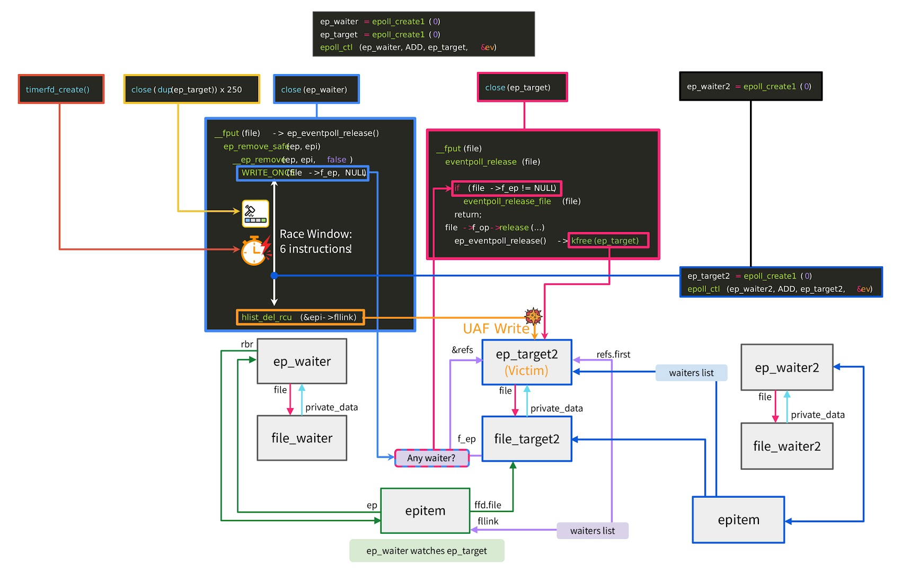

# Bad Epoll (CVE-2026-46242)

**CVE-2026-46242**{.cve-chip} **Linux Kernel LPE**{.cve-chip} **Use-After-Free**{.cve-chip} **Race Condition**{.cve-chip} **Android Impact**{.cve-chip}

## Overview

Bad Epoll (CVE-2026-46242) is a Linux kernel vulnerability affecting the epoll/eventpoll subsystem. It allows an unprivileged local user to escalate privileges to root by exploiting a race condition that leads to a use-after-free (UAF) memory corruption. The flaw impacts Linux desktops, servers, cloud environments, containers, and Android devices using vulnerable kernels.

## Technical Specifications

| **Attribute** | **Details** |
|---|---|
| **CVE ID** | CVE-2026-46242 |
| **Vulnerability Type** | Local Privilege Escalation via Use-After-Free (UAF) in epoll/eventpoll |
| **CVSS Score** | Not finalized across all advisories at time of reporting |
| **Attack Vector** | Local |
| **Authentication** | Low privileges required (unprivileged local user/code execution context) |
| **Complexity** | Medium (race condition exploitation with reliable primitive) |
| **User Interaction** | Not required once local execution is achieved |
| **Affected Versions** | Linux kernels 6.4 and newer until patched |
| **Affected Platforms** | Linux desktops/servers, cloud hosts, containers, and Android devices using vulnerable kernels |

## Affected Products

- Linux systems running vulnerable kernels (6.4+ unpatched)
- Android devices whose vendor kernels include the vulnerable epoll code
- Cloud and containerized workloads sharing affected host kernels
- Enterprise endpoints and developer workstations with local code execution exposure

## Attack Scenario

1. An attacker gains local code execution through malware, stolen credentials, or another vulnerability.
2. The attacker executes a Bad Epoll exploit.
3. The exploit repeatedly triggers the epoll race condition.
4. Kernel memory is corrupted through the UAF vulnerability.
5. Arbitrary code executes in kernel mode.
6. The attacker obtains root privileges, allowing full system compromise.

## Impact Assessment

=== "Integrity"

    - Attackers can modify system binaries, configurations, and security controls with root privileges
    - Kernel-level execution enables stealthy tampering and persistent compromise
    - Container and host integrity can be undermined when the shared kernel is affected

=== "Confidentiality"

    - Root access permits theft of credentials, tokens, and sensitive local or mounted data
    - Attackers can access secrets used by applications, CI agents, and cloud tooling
    - Privilege escalation increases lateral movement potential in enterprise environments

=== "Availability"

    - Exploitation attempts can destabilize systems and trigger crashes
    - Successful compromise enables destructive actions including service interruption
    - Android and Linux endpoints may require emergency patching and reboot windows

## Mitigation Strategies

### Immediate Actions

- Immediately install vendor kernel updates containing the fix
- Upgrade to patched Linux kernel versions or vendor backports
- Apply Android security updates from device vendors

### Short-term Measures

- Restrict local shell and SSH access to trusted users only
- Reduce local attack surface by limiting executable paths and hardening endpoint policies
- Prioritize patching internet-facing and multi-tenant systems first

### Monitoring & Detection

- Monitor for privilege-escalation attempts and unusual local process behavior
- Alert on suspicious kernel crash patterns or exploit-like race-trigger loops
- Correlate endpoint detections with authentication anomalies indicating post-login abuse

### Long-term Solutions

- Enforce principle of least privilege across users, services, and developer tooling
- Strengthen kernel vulnerability management and rapid patch rollout processes
- Since epoll cannot be disabled safely for normal operation, maintain aggressive patch governance

## Resources and References

!!! info "Public Reporting"
    - [New "Bad Epoll" Linux Kernel Flaw Lets Unprivileged Users Gain Root, Hits Android](https://thehackernews.com/2026/07/new-bad-epoll-linux-kernel-flaw-lets.html)
    - [NVD - CVE-2026-46242](https://nvd.nist.gov/vuln/detail/CVE-2026-46242)

---

*Last Updated: July 5, 2026*
