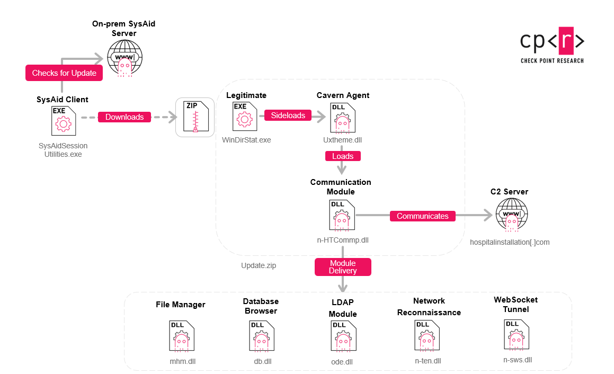

# Iran-linked Cavern Manticore Uses Cavern (Cav3rn) Modular C2 Framework Against Israeli IT Providers and Government Organizations

**Iran-Nexus Threat Actor**{.cve-chip} **Cavern (Cav3rn) C2**{.cve-chip} **DLL Sideloading**{.cve-chip} **Supply Chain Targeting**{.cve-chip} **CVE-2025-54068 Context**{.cve-chip}

## Overview

An Iran-linked threat cluster dubbed Cavern Manticore is using a modular .NET command-and-control framework called Cavern (Cav3rn) to target Israeli organizations, with a focus on IT service providers and government entities.

The framework reflects a mature, adaptable toolset that supports stealthy DLL sideloading, modular post-exploitation, and multi-protocol C2. Reporting also links activity to a broader Iran-nexus campaign that includes exploitation of CVE-2025-54068 in Laravel Livewire and targeting of internet-exposed services across aviation, energy, and government sectors in the Middle East.

## Technical Specifications

| **Attribute** | **Details** |
|---|---|
| **Threat Cluster** | Cavern Manticore (assessed Iran-nexus) |
| **Attribution Context** | Reported ties to MOIS ecosystem; tactical overlap with MuddyWater and Lyceum/OilRig activity |
| **Primary Malware/C2** | Cavern (Cav3rn) modular .NET framework |
| **Core Tradecraft** | DLL sideloading, modular payloading, post-exploitation orchestration |
| **C2 Capability** | Multi-protocol command-and-control communications |
| **Initial Access Paths** | SysAid update-chain abuse, phishing, exposed services, vulnerable web applications |
| **Related Vulnerability Context** | CVE-2025-54068 (Laravel Livewire RCE) highlighted in parallel MuddyWater operations |
| **Target Focus** | Israeli IT providers, MSPs, government entities; regional aviation, energy, and public-sector organizations |
| **Campaign Objective** | Persistent access, credential harvesting, data exfiltration, strategic espionage positioning |

## Affected Products

- Organizations using SysAid or similarly exposed IT management/update infrastructure
- Internet-exposed web services vulnerable to known RCE flaws, including Laravel Livewire instances
- IT providers and MSP environments with trusted downstream access
- Government and critical-sector networks connected through provider trust relationships

## Attack Scenario

1. Attackers gain initial foothold through vulnerable provider infrastructure, software update abuse, phishing, or exposed services.
2. A trojanized DLL (for example, uxtheme.dll in trusted software directories) is deployed for sideloading.
3. The malicious loader launches Cavern Agent components inside trusted application context.
4. Agent modules establish multi-protocol C2 and execute post-exploitation tasks including discovery, credential access, and lateral movement.
5. Adversaries pivot through compromised IT/MSP trust paths into downstream customer environments.
6. In parallel operations, exploitation of CVE-2025-54068 and other service flaws supports credential harvesting and sensitive data exfiltration in aviation, energy, and government sectors.

## Impact Assessment

=== "Integrity"

    - Trusted management and provider pathways can be abused to alter systems across multiple organizations
    - Modular post-exploitation enables long-term tampering with identity and access infrastructure
    - Supply-chain style pivots increase blast radius beyond the originally compromised entity

=== "Confidentiality"

    - Confirmed campaign patterns include credential harvesting and exfiltration of sensitive operational data
    - Government and critical-sector intelligence exposure can create long-term strategic disadvantage
    - Provider compromise can expose data from multiple customers simultaneously

=== "Availability"

    - Persistent intrusions can disrupt IT operations and incident response capacity
    - Remediation often requires credential resets, segmentation changes, and service downtime
    - Even espionage-focused operations can degrade reliability through containment and recovery actions

## Mitigation Strategies

### Immediate Actions

- Patch and harden SysAid and similar management/update platforms immediately
- Hunt for DLL sideloading artifacts in trusted application directories and startup paths
- Isolate compromised hosts and revoke/rotate potentially exposed credentials

### Short-term Measures

- Prioritize patching of internet-exposed applications, including Laravel Livewire CVE-2025-54068 where applicable
- Harden OWA/VPN authentication with MFA and brute-force protections
- Restrict and continuously validate cross-organization trust paths with IT providers/MSPs

### Monitoring & Detection

- Monitor for suspicious DLL loads from non-standard paths and unsigned module execution
- Detect unusual multi-protocol outbound C2 patterns and rare provider-to-customer admin activity
- Alert on anomalous identity behavior, credential abuse, and unexpected lateral movement

### Long-term Solutions

- Treat IT providers/MSPs as high-value attack surfaces under zero-trust architecture
- Implement supplier security governance, segmentation, and least-privilege third-party access
- Run recurring threat hunts focused on Iran-linked TTPs and modular C2 persistence patterns

## Resources and References

!!! info "Public Reporting"
    - [The Hacker News: Iran-Linked Hackers Use New Cavern C2](https://thehackernews.com/2026/07/iran-linked-hackers-use-new-cavern-c2.html)
    - [Check Point Research: Cavern Manticore](https://research.checkpoint.com/2026/cavern-manticore-exposing-iran-linked-modular-c2-framework/)
    - [SC Media Brief](https://www.scworld.com/brief/iranian-hackers-use-new-modular-c2-framework-against-israeli-organizations)
    - [CNN Reporting](https://www.cnn.com/2026/04/07/politics/iran-linked-hackers-disrupt-us-industrial-sites)

---

*Last Updated: July 7, 2026*
