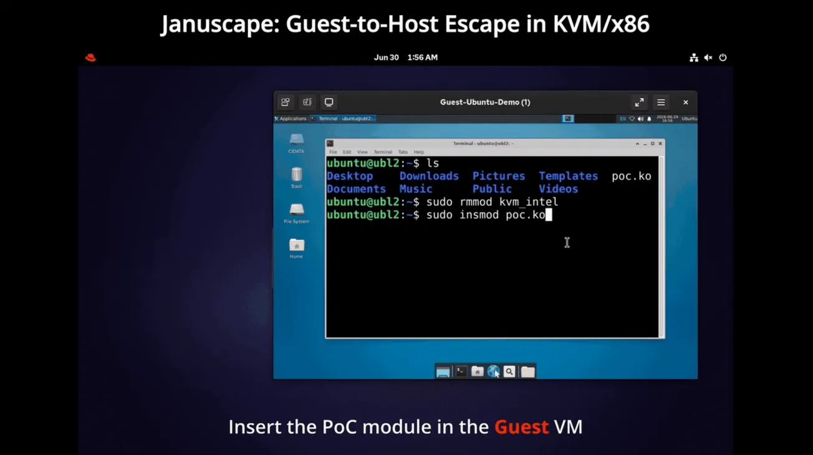

# Januscape - 16-year-old Linux KVM/x86 Shadow MMU Use-After-Free Flaw (CVE-2026-53359)

**CVE-2026-53359**{.cve-chip} **Linux KVM**{.cve-chip} **Shadow MMU UAF**{.cve-chip} **Guest-to-Host Escape Risk**{.cve-chip} **Nested Virtualization**{.cve-chip}

## Overview

CVE-2026-53359, nicknamed Januscape, is a long-lived use-after-free vulnerability in the Linux KVM x86 shadow MMU that can allow a malicious guest VM to corrupt host kernel memory, reliably panic the host, and potentially escape from guest to host under specific conditions on Intel and AMD x86 systems.

The flaw is reported as present since around Linux 2.6.36 (2010) and addressed in July 2026 stable kernel updates. Risk is highest for KVM hosts using shadow paging, especially where nested virtualization is enabled for untrusted tenants.

## Technical Specifications

| **Attribute** | **Details** |
|---|---|
| **CVE ID** | CVE-2026-53359 |
| **Component** | Linux kernel KVM x86 shadow paging / shadow MMU |
| **Vulnerability Type** | Use-after-free (UAF) via race/logic issue in shadow page lifecycle and reverse mapping |
| **Attack Vector** | Local to virtualized environment (attacker-controlled guest VM) |
| **Authentication** | Guest-level control required (typically privileged control inside guest) |
| **Complexity** | Medium to High (requires precise VM/MMU interaction) |
| **User Interaction** | Not required |
| **Affected Scope** | KVM hosts using vulnerable kernels, especially with nested virtualization and shadow MMU paths |
| **Patch Status** | Fixed upstream and in July 2026 stable updates; vendor backports vary by distribution |
| **Reference Fix** | Mainline fix associated with commit 81ccda30b4e8 |

## Affected Products

- Linux KVM/x86 hosts running unpatched kernels
- Public cloud and virtualization environments that permit nested virtualization
- Enterprise/private virtualization clusters using vulnerable host kernels
- Dependent guest workloads sharing compromised host infrastructure

## Attack Scenario

1. An attacker gains control over a guest VM in an environment where nested virtualization is enabled.
2. The attacker triggers KVM shadow paging behavior that causes mismatched shadow page role/GFN handling.
3. Memslot deletion and stale reverse-mapping paths leave dangling references to freed shadow page structures.
4. Subsequent MMU operations reuse corrupted/freed structures, causing host kernel memory corruption.
5. Publicly observable outcome is host kernel panic and denial of service for workloads on that node.
6. In advanced exploit paths, controlled corruption may enable guest-to-host code execution and root compromise.

## Impact Assessment

=== "Integrity"

    - Hypervisor trust boundary can be broken in vulnerable nested KVM scenarios
    - Host kernel memory corruption may enable unauthorized modification of host state
    - Successful host compromise can affect integrity of all guest workloads on the node

=== "Confidentiality"

    - Host-level compromise can expose memory, credentials, and data of multiple tenants
    - Attackers may access sensitive administrative artifacts and orchestration metadata
    - Cross-tenant confidentiality risk rises in shared infrastructure

=== "Availability"

    - Reliable host panic path can cause denial of service across all VMs on impacted hosts
    - Emergency patching and host reboots can interrupt production services
    - Multi-node clusters may face cascading disruption if patch rollout lags

## Mitigation Strategies

### Immediate Actions

- Apply vendor July 2026 kernel updates (or later) containing the KVM/x86 shadow MMU fix
- Reboot hosts into patched kernels, or use verified live patching where supported
- Prioritize patching internet-facing and multi-tenant virtualization nodes first

### Short-term Measures

- Disable nested virtualization for untrusted guests until all hosts are patched
- Restrict VM creation/control privileges on shared host pools
- Audit exposed virtualization plans/features that grant nested virtualization capability

### Monitoring & Detection

- Monitor host crash telemetry and KVM-related kernel logs for anomalous MMU failures
- Alert on suspicious tenant behavior involving repeated low-level VM/MMU manipulation
- Validate post-patch host and guest virtualization flags and KVM parameters

### Long-term Solutions

- Maintain continuous kernel vulnerability management for hypervisor fleets
- Enforce least privilege for tenant and operator VM lifecycle actions
- Segment high-risk multi-tenant workloads from sensitive internal virtualization clusters

## Resources and References

!!! info "Public Reporting"
    - [A long-lived KVM bug resurfaces: Shadow paging use-after-free in the Linux kernel (CVE-2026-53359)](https://darkwebinformer.com/a-long-lived-kvm-bug-resurfaces-shadow-paging-use-after-free-in-the-linux-kernel-cve-2026-53359/)
    - [NerdsCave analysis: Linux Januscape CVE-2026-53359 KVM escape](https://nerdscave-consulting.com/blog/security/linux-januscape-cve-2026-53359-kvm-escape)
    - [Researcher post on X](https://x.com/v4bel/status/2074162435339207141)
    - [Feedly CVE reference](https://feedly.com/cve/CVE-2026-53359)

---

*Last Updated: July 7, 2026*
