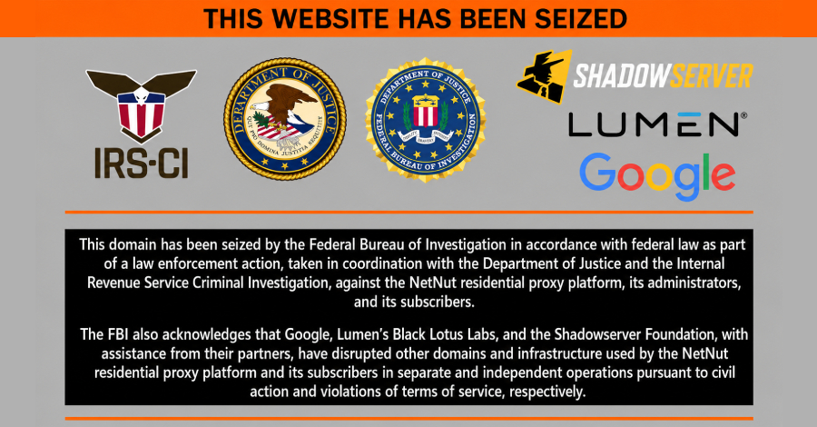
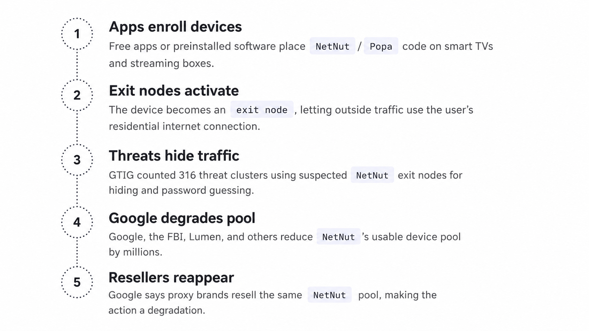
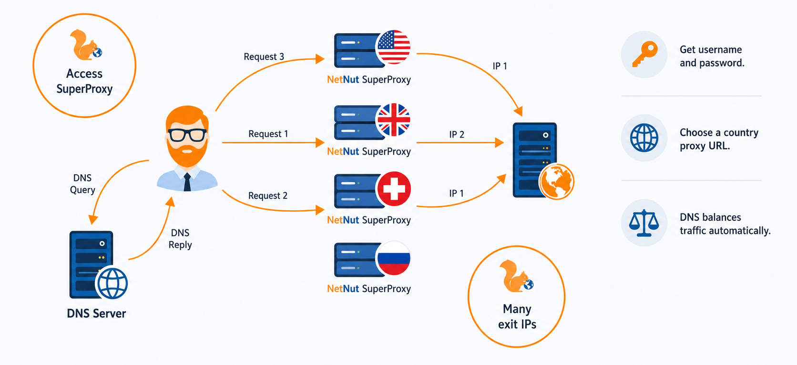
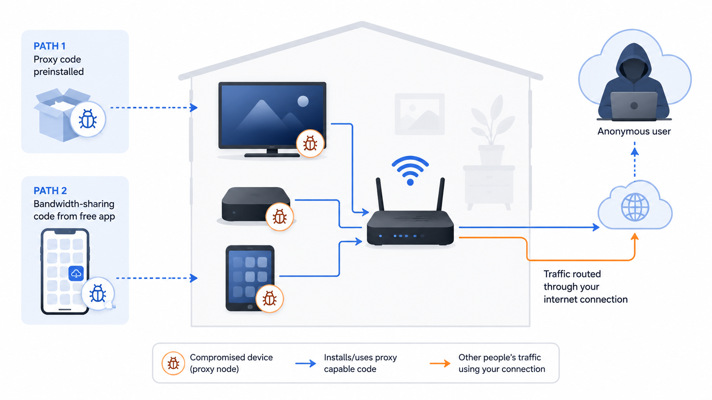

# NetNut Residential Proxy Network Disruption

**Residential Proxy Abuse**{.cve-chip} **Android Botnet**{.cve-chip} **NetNut Disruption**{.cve-chip} **FBI Operation**{.cve-chip} **BadBox 2.0**{.cve-chip}

## Overview

Google, in collaboration with the FBI and industry partners, disrupted the NetNut malicious residential proxy network. The service abused millions of compromised Android-based consumer devices to provide anonymous residential proxy services that cybercriminals used to conceal their identities during malicious activities such as credential attacks, malware delivery, and command-and-control communications.

## Technical Specifications

| **Attribute** | **Details** |
|---|---|
| **Incident Type** | Criminal residential proxy network disruption |
| **Infrastructure Scale** | Approximately 2 million compromised devices |
| **Primary Platforms** | Android TV boxes, smart TVs, streaming devices, Android-based IoT hardware |
| **Infection Vectors** | Trojanized Android apps, hidden proxy SDKs, malware families including BadBox 2.0 |
| **Abuse Mechanism** | Compromised devices operated as proxy exit nodes via victims' residential internet connections |
| **Observed Threat Activity** | 316 distinct threat clusters observed using infrastructure in one week (June 2026) |
| **Law Enforcement Action** | FBI seizure of multiple NetNut-related domains |
| **Platform Response** | Google disabled related accounts and updated Google Play Protect detections |
| **CVE ID** | Not applicable (botnet/proxy abuse operation, not a single software CVE) |

## Affected Products

- Android consumer endpoints enrolled into malicious proxy infrastructure
- Android TV boxes and smart TV ecosystems with weak app trust controls
- Home networks and internet subscribers whose IP reputation was abused
- Organizations targeted by attacks routed through compromised residential proxies

## Attack Scenario

1. Victims install a malicious or trojanized Android application, or purchase a device already infected with malware.
2. Malware silently enrolls the device into the NetNut residential proxy network.
3. The device communicates with NetNut command-and-control infrastructure.
4. Cybercriminals rent access to the residential proxy service.
5. Attackers route malicious traffic, including password spraying, phishing, malware delivery, reconnaissance, and botnet communications, through compromised residential IP addresses to appear as legitimate home users.

## Impact Assessment

=== "Integrity"

    - Compromised devices execute unauthorized proxy workloads controlled by third parties
    - Device behavior and network use are altered without owner consent
    - Criminal infrastructure can be repurposed rapidly for additional malicious operations

=== "Confidentiality"

    - Compromised devices may expose telemetry and metadata useful to attackers
    - Residential proxies mask attacker identity and hinder attribution of downstream attacks
    - Victim households and enterprises may face investigation exposure due to abuse-linked IP activity

=== "Availability"

    - Infected devices may suffer degraded performance and bandwidth exhaustion
    - Residential IPs can be blocked by services due to association with malicious activity
    - Large-scale abuse increases operational burden on defenders and service providers

## Mitigation Strategies

### Immediate Actions

- Install applications only from trusted sources such as Google Play
- Keep Google Play Protect enabled
- Remove suspicious or unused applications from Android and Android-based IoT devices

### Short-term Measures

- Apply Android security updates and firmware updates promptly
- Avoid apps requesting unnecessary permissions or offering payment for "sharing bandwidth"
- Segment IoT devices from critical enterprise networks

### Monitoring & Detection

- Monitor outbound network traffic from Android and IoT devices for suspicious proxy-like behavior
- Block known malicious domains and indicators of compromise (IOCs)
- Use Endpoint Detection and Response (EDR) or Mobile Threat Defense (MTD) solutions where applicable

### Long-term Solutions

- Build app vetting and allowlisting policies for consumer and enterprise-managed Android fleets
- Maintain asset inventory for connected Android/IoT devices and enforce lifecycle patching
- Incorporate residential-proxy abuse detection into threat hunting and fraud prevention workflows

## Resources and References

!!! info "Public Reporting"
    - [Google Disrupts NetNut Residential Proxy Network Spanning 2 Million Home Devices](https://thehackernews.com/2026/07/google-disrupts-netnut-residential.html)
    - [Google’s Continued Disruption of Malicious Residential Proxy Networks | Google Cloud Blog](https://cloud.google.com/blog/topics/threat-intelligence/google-continued-disruption-residential-proxy-networks)
    - [Google disrupts NetNut proxy network used in malware operations | Reuters](https://www.reuters.com/business/media-telecom/google-disrupts-netnut-proxy-network-used-malware-operations-2026-07-02/)
    - [Google, FBI Disrupt NetNut Residential Proxy Network Powered by Millions of Devices - SecurityWeek](https://www.securityweek.com/google-fbi-disrupt-netnut-residential-proxy-network-powered-by-millions-of-devices/)
    - [Google disrupts NetNut proxy network in FBI operation](https://itbrief.asia/story/google-disrupts-netnut-proxy-network-in-fbi-operation)
    - [FBI and Google Disrupt NetNut Botnet That Rented 2 Million Home Devices to Spies](https://www.techtimes.com/articles/319625/20260703/fbi-google-disrupt-netnut-botnet-that-rented-2-million-home-devices-spies.htm)

---

*Last Updated: July 5, 2026*
