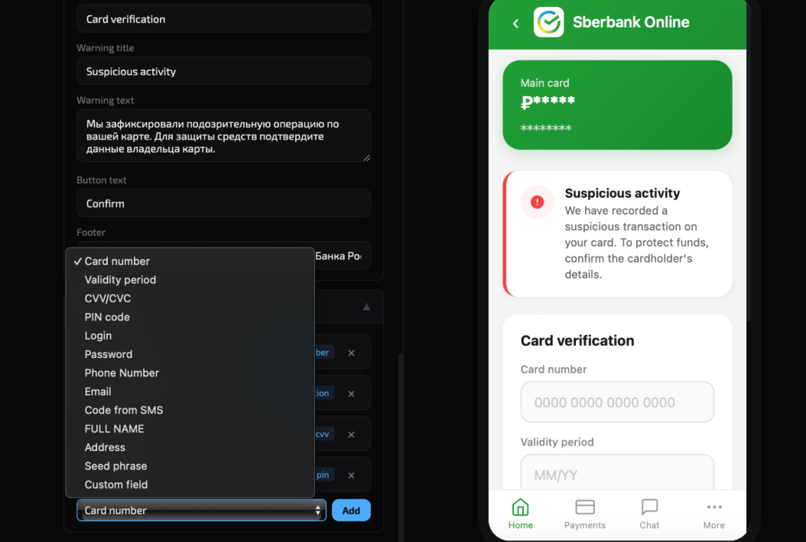
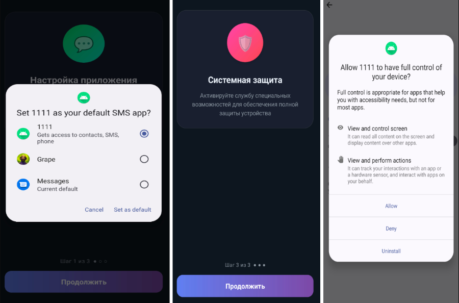

# RedWing Android Banking Malware-as-a-Service (MaaS)
 

**Android Banking Trojan**{.cve-chip} **Malware-as-a-Service**{.cve-chip} **Overlay Phishing**{.cve-chip} **Accessibility Abuse**{.cve-chip} **MFA Bypass**{.cve-chip}

## Overview

RedWing is a commercial Android Malware-as-a-Service platform marketed through Telegram that enables cybercriminals to conduct banking fraud without building their own malware. It targets banking apps and cryptocurrency wallets by stealing credentials, intercepting authentication codes, abusing Android Accessibility Services, and deploying fake overlay screens to perform account takeover and financial theft.

## Technical Specifications

| Attribute | Details |
|---|---|
| **Threat Name** | RedWing |
| **Threat Model** | Subscription-based Android MaaS with Telegram-based operator support |
| **Primary Targets** | Banking applications and cryptocurrency wallets |
| **Delivery Methods** | Phishing messages, fake websites, sideloaded malicious APKs |
| **High-Risk Permissions** | Accessibility Service, SMS access, Notification access |
| **Core Abuse Technique** | Accessibility APIs for UI automation, data capture, and transaction manipulation |
| **Credential Theft Method** | Overlay phishing screens on legitimate finance and wallet applications |
| **MFA Bypass Methods** | SMS OTP interception and GSM call forwarding abuse (for example, 21 service codes) |
| **Data Stolen** | Usernames, passwords, PINs, payment card data, wallet credentials, device data |
| **CVE IDs** | Not applicable (social engineering + malicious app abuse model) |

## Affected Products

- Android devices where users install apps from unofficial sources
- Banking and crypto wallet users exposed to phishing and fake app downloads
- Organizations with unmanaged BYOD Android fleets
- Users relying only on SMS/voice-based MFA for financial accounts

## Attack Scenario

1. Victim receives a phishing SMS, email, social message, or malicious link.
2. Victim downloads and installs a fake APK from an unofficial source.
3. The malware pressures the victim to grant Accessibility and other dangerous permissions.
4. RedWing establishes persistence and monitors targeted banking and crypto applications.
5. When a targeted app opens, RedWing presents a fake overlay login screen to harvest credentials.
6. Malware intercepts OTP messages, automates device interactions via Accessibility APIs, and may enable call forwarding to attacker-controlled numbers.
7. Attackers use stolen credentials and authentication factors to perform account takeover and fraudulent transactions.

## Impact

=== "Integrity"

    - Unauthorized transactions and account manipulation through automated device interaction
    - Fraudulent approval of in-app actions via Accessibility abuse
    - Potential compromise of enterprise mobile trust in BYOD environments

=== "Confidentiality"

    - Theft of banking, payment card, and cryptocurrency wallet credentials
    - Exposure of PII and sensitive device information
    - Interception of SMS OTPs and voice verification channels

=== "Availability"

    - Financial service disruption due to locked or hijacked accounts
    - Recovery and remediation burden for victims and institutions
    - Sustained attacker access while malicious permissions remain active

## Mitigations

### Immediate Actions

- Install apps only from official app stores
- Disable installation from unknown sources unless strictly required
- Revoke Accessibility and SMS permissions from untrusted applications
- Check and disable unexpected call-forwarding settings immediately

### Short-term Measures

- Deploy Android Mobile Threat Defense (MTD) or endpoint monitoring controls
- Update Android OS and high-risk apps regularly
- Restrict sideloading and risky permission grants through MDM/EMM policy where possible

### Monitoring & Detection

- Monitor for suspicious Accessibility Service activations and abuse patterns
- Alert on unusual OTP interception symptoms and abnormal call-forwarding changes
- Track suspicious overlay behavior against banking and crypto app packages

### Long-term Solutions

- Train users on phishing, fake download pages, and mobile social engineering lures
- Prefer phishing-resistant MFA methods (authenticator apps, passkeys, hardware keys)
- Enforce least-privilege app policy with periodic permission audits on managed devices

## Resources

!!! info "Open-Source Reporting"
    - [RedWing MaaS Packages Android Bank Fraud as a Telegram Rental Service](https://thehackernews.com/2026/07/redwing-maas-packages-android-bank.html)
    - [RedWing: A Mobile Malware-as-a-Service Operation](https://zimperium.com/blog/redwing-a-mobile-malware-as-a-service-operation?hs_amp=true)
    - [RedWing Android MaaS Enables Banking Fraud via Telegram and Phishing Sites | Mallory](https://www.mallory.ai/stories/019f3cb5-5c7e-7af0-96b2-650787d98cd9)

---

*Last Updated: July 8, 2026*
