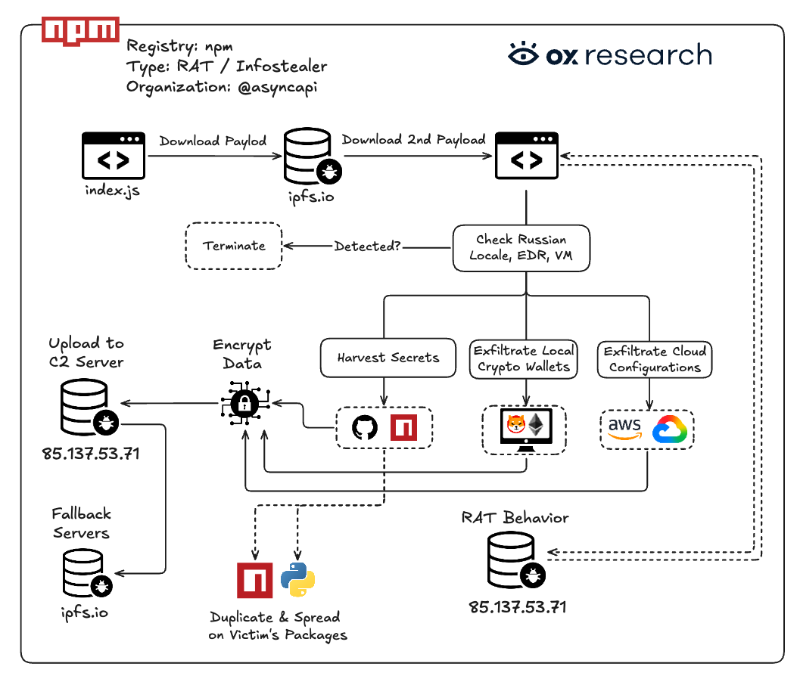

# AsyncAPI npm Supply Chain Attack

**Supply Chain Compromise**{.cve-chip} **npm Packages**{.cve-chip} **CI/CD Abuse**{.cve-chip} **GitHub Actions**{.cve-chip} **Miasma RAT**{.cve-chip}

## Overview

Attackers compromised the AsyncAPI release process and injected malicious code into official @asyncapi npm packages. Because the compromised packages were distributed through the legitimate npm registry and had very high adoption volume, the incident created broad risk across developer endpoints, CI/CD pipelines, and downstream software products.

Public reporting indicates the compromise abused project CI/CD and release credentials, not npm infrastructure itself.

## Technical Specifications

| **Attribute** | **Details** |
|---|---|
| **Incident Type** | Software supply chain compromise |
| **Impacted Ecosystem** | Official @asyncapi npm packages |
| **Approximate Exposure Scale** | Over 2 million weekly package downloads (reported) |
| **Initial Weakness** | Insecure GitHub Actions workflow using pull_request_target |
| **Credential Exposure** | Privileged GitHub PAT obtained and abused |
| **Compromise Path** | Malicious commits pushed, official release workflow triggered |
| **Payload Form** | Obfuscated JavaScript executed when affected package loaded |
| **Observed Malware Family** | Miasma-related RAT activity (reported) |
| **C2 Behavior** | Malicious code contacted attacker-controlled infrastructure |
| **Infrastructure Status** | npm platform not compromised; project release process abused |

## Affected Products

- Official AsyncAPI npm packages published during the compromised release window
- Developer workstations installing/updating affected package versions
- CI/CD pipelines and build agents resolving compromised dependency versions
- Downstream applications shipping builds with tainted dependencies

## Attack Scenario

1. Attacker exploits unsafe pull_request_target workflow behavior in project GitHub Actions.
2. A privileged token is exposed or captured and used for unauthorized repository/release actions.
3. Malicious payload code is inserted into official package source/releases.
4. Legitimate release automation publishes compromised package versions to npm.
5. Developers and CI systems install or update to affected versions.
6. Malicious payload executes on import/load and establishes outbound C2 communication.
7. RAT functionality enables remote access, credential theft, and possible lateral movement.

## Impact Assessment

=== "Integrity"

    - Trusted package integrity is broken, enabling execution of attacker code in build and runtime paths
    - Downstream software artifacts may be silently backdoored
    - CI/CD trust chain can be subverted across dependent repositories

=== "Confidentiality"

    - Theft risk for source code, secrets, environment variables, and signing materials
    - Developer tokens and cloud credentials can be exposed from compromised hosts/pipelines
    - Sensitive organization metadata may leak through C2 exfiltration channels

=== "Availability"

    - Incident response and dependency remediation can disrupt build/release operations
    - Emergency credential rotations and package pinning can temporarily slow delivery pipelines
    - Broad dependency blast radius increases recovery complexity across organizations

## Mitigation Strategies

### Immediate Actions

- Remove compromised AsyncAPI versions and upgrade to known clean releases
- Rotate GitHub, npm, CI/CD, cloud, and signing credentials where affected packages executed
- Identify and quarantine impacted developer endpoints and build runners

### Short-term Measures

- Audit GitHub Actions workflows and eliminate unsafe pull_request_target patterns
- Enforce least privilege token scopes and short-lived credentials for automation
- Require protected branches, mandatory review, and controlled release permissions

### Monitoring & Detection

- Monitor CI/CD and endpoint telemetry for suspicious child processes and outbound C2 traffic
- Track dependency changes and alert on unexpected package version drift
- Use SCA and SBOM tooling to locate impacted versions across repositories and artifacts

### Long-term Solutions

- Implement package provenance verification and signed release attestation workflows
- Adopt hardened CI/CD runner isolation and secret management guardrails
- Establish continuous supply chain threat modeling and tabletop exercises

## Resources and References

!!! info "Public Reporting"
    - [AsyncAPI npm Supply Chain Attack: Malware Injected Into Packages With 2 Million Weekly Downloads](https://securityaffairs.com/195395/security/asyncapi-npm-supply-chain-attack-malware-injected-into-packages-with-2-million-weekly-downloads.html)
    - [AsyncAPI supply chain compromise via GitHub Actions (July 2026)](https://www.chainguard.dev/unchained/asyncapi-supply-chain-compromise-npm-packages-backdoored-via-github-actions)
    - [Inside the AsyncAPI npm supply chain attack | Cloudsmith](https://cloudsmith.com/blog/inside-the-asyncapi-npm-supply-chain-attack)
    - [Coordinated AsyncAPI Supply Chain Attack | StepSecurity](https://www.stepsecurity.io/blog/compromised-next-branch-pushes-malicious-asyncapi-generator-generator-helpers-and-generator-components-to-npm)
    - [2M weekly downloads affected: AsyncAPI npm compromised](https://www.ox.security/blog/asyncapi-npm-organization-compromised-2m-weekly-downloads-affected/)
    - [AsyncAPI Supply Chain Compromise via GitHub Actions | Wiz Blog](https://www.wiz.io/blog/m-red-team-asyncapi-supply-chain-compromise-via-github-actions)

---

*Last Updated: July 16, 2026*
