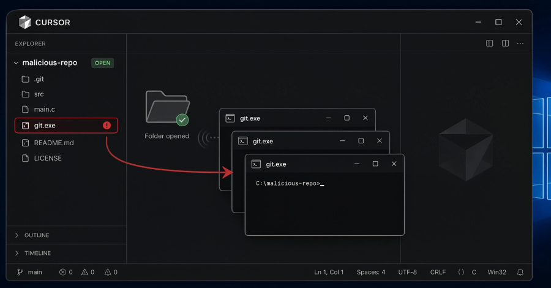
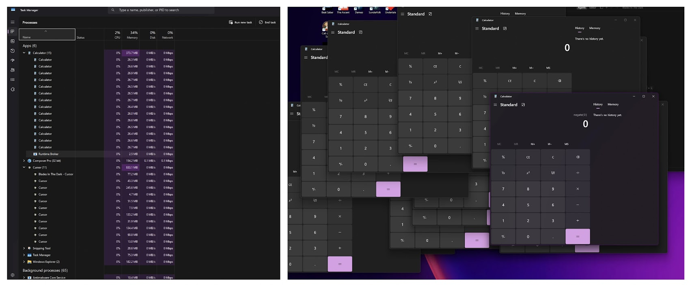

# Unpatched Cursor IDE Local Git Executable Vulnerability

**Cursor IDE**{.cve-chip} **Local Executable Hijack**{.cve-chip} **Arbitrary Code Execution**{.cve-chip} **Windows Developers**{.cve-chip} **Supply Chain Risk**{.cve-chip}

## Overview

A vulnerability in Cursor IDE on Windows allows arbitrary code execution when a user opens a malicious Git repository. Cursor may execute a repository-supplied local `git.exe` from the project directory instead of the trusted system Git binary.

Because this behavior occurs during normal Git operations, opening an untrusted repository can trigger attacker-controlled code execution under the current user's context. At disclosure time, public reporting indicated no official vendor patch was yet available.

## Technical Specifications

| **Attribute** | **Details** |
|---|---|
| **Vulnerability Type** | Insecure executable resolution / local binary hijacking |
| **Primary Affected Platform** | Windows |
| **Affected Product** | Cursor AI-powered IDE (Windows workflows using Git operations) |
| **Trigger Condition** | Project contains malicious `git.exe` in repository root (or executable search path precedence) |
| **Attack Vector** | User opens/clones/downloads malicious repository and opens it in Cursor |
| **Privileges Required (attacker)** | None on victim host prior to lure success |
| **User Interaction** | Required (open repository in Cursor) |
| **Execution Context** | Logged-in developer user privileges |
| **Patch Status at Disclosure** | No official patch publicly available at initial disclosure |

## Affected Products

- Cursor IDE on Windows systems
- Developer workstations opening untrusted repositories
- Environments where project-directory executables are not constrained by application control

## Attack Scenario

1. An attacker prepares a malicious repository containing a trojanized `git.exe`.
2. The repository is distributed via Git hosting services, archive files, or direct sharing.
3. A developer clones/downloads the project and opens it in Cursor on Windows.
4. Cursor resolves and executes the attacker-controlled local `git.exe` instead of the trusted system Git binary.
5. Malicious code executes with developer user privileges.
6. Attackers may steal source code and credentials, establish persistence, and attempt broader enterprise compromise.

## Impact Assessment

=== "Integrity"

    - Arbitrary code execution on developer endpoints can alter local projects and build artifacts
    - Attackers may inject malicious code into repositories and CI/CD workflows
    - High potential for software supply-chain compromise through trusted developer environments

=== "Confidentiality"

    - Theft of source code, SSH keys, Git credentials, API tokens, cloud credentials, and signing material
    - Exposure of proprietary software and internal architecture details
    - Compromised developer identities can be reused for broader access abuse

=== "Availability"

    - Endpoint compromise can disrupt developer operations and incident response workflows
    - Enterprise-wide containment actions may require temporary workstation isolation and credential rotation
    - Downstream release delays may occur while integrity of code and signing pipelines is verified

## Mitigation Strategies

### Immediate Actions

- Do not open unknown or untrusted repositories in Cursor until patched guidance is validated
- Inspect repositories for unexpected executables such as `git.exe`, `ssh.exe`, and other suspicious binaries
- Use isolated VMs/sandboxes for high-risk repository review

### Short-term Measures

- Keep endpoint protection and behavioral detection enabled for executable launch anomalies
- Restrict execution of unsigned/untrusted binaries via WDAC or AppLocker where operationally feasible
- Enforce least privilege on developer endpoints and reduce local admin usage

### Monitoring & Detection

- Monitor for process execution originating from project directories (especially `git.exe` under repo paths)
- Alert on unusual child-process chains spawned by IDE processes
- Hunt for credential-access behavior and suspicious file access on developer systems

### Long-term Solutions

- Standardize secure development workstation baselines with application control and repo hygiene checks
- Integrate repository pre-open scanning into developer tooling and onboarding workflows
- Rapidly apply vendor security updates when patch guidance is released

## Resources and References

!!! info "Public Reporting"
    - [Unpatched Cursor Vulnerability Exposes Users to Code Execution - SecurityWeek](https://www.securityweek.com/unpatched-cursor-vulnerability-exposes-users-to-code-execution/)
    - [Cursor Flaw Lets Malicious Cloned Repositories Trigger Windows Code Execution](https://thehackernews.com/2026/07/cursor-flaw-lets-malicious-cloned.html)
    - [Unpatched Cursor vulnerability exposes users to code execution risk](https://cryptobriefing.com/cursor-vulnerability-code-execution-risk/)

---

*Last Updated: July 16, 2026*
