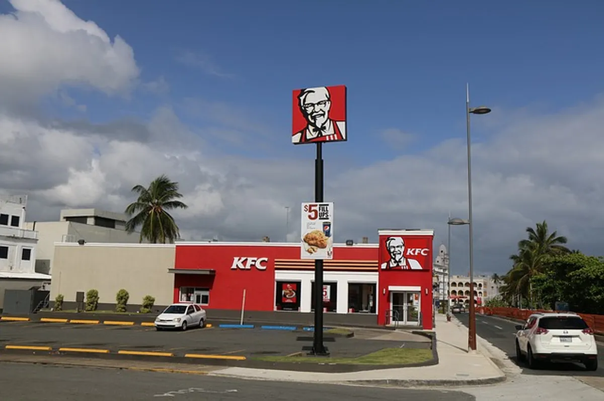

# Cyberattack on Nichirei Logistics Disrupting KFC Japan and Food Supply Chain

**Supply Chain Cyberattack**{.cve-chip} **Third-Party Risk**{.cve-chip} **Cold-Chain Logistics**{.cve-chip} **Operational Disruption**{.cve-chip} **Food Sector Impact**{.cve-chip}

## Overview

A cyberattack hit Nichirei, one of Japan's largest frozen food and cold-chain logistics providers, causing system failures that disrupted refrigerated and frozen-food deliveries to multiple downstream organizations.

Affected organizations reportedly included KFC Japan, Kura Sushi, supermarkets, food manufacturers, and elderly care facilities, showing how compromise of a third-party logistics provider can cascade across critical consumer and care services.

## Technical Specifications

| **Attribute** | **Details** |
|---|---|
| **Incident Type** | Third-party logistics cyberattack / operational technology-adjacent service disruption |
| **Primary Victim** | Nichirei (frozen food and cold-chain logistics provider) |
| **Downstream Impacted Organizations** | KFC Japan, Kura Sushi, supermarkets, manufacturers, care facilities |
| **Confirmed Condition** | Unauthorized access to Nichirei IT systems |
| **Operational Effects** | Internal logistics and warehouse-management system failures; distribution suspension |
| **Known Attack Vector** | Not publicly confirmed |
| **Known Malware / CVE / IOC** | Not publicly disclosed |
| **Data Theft / Ransomware Status** | Not confirmed as of latest public reporting |
| **Investigation Status** | Forensic investigation and restoration ongoing |

## Affected Products

- Nichirei internal logistics systems
- Warehouse management and transportation scheduling systems
- Refrigerated and frozen distribution workflows supporting external customers
- Customer-facing ordering and delivery services dependent on upstream food supply availability

## Attack Scenario

1. Attackers gain initial access through an unknown vector (for example phishing, credential theft, exposed remote access, or exploitation of internet-facing systems).
2. Attackers establish presence in internal logistics IT environments.
3. Core distribution-supporting systems (warehouse and scheduling operations) become unavailable or unstable.
4. Refrigerated/frozen shipments are delayed or suspended across multiple dependent organizations.
5. Restaurants and food operators experience shortages, reduced menus, temporary closures, and ordering interruptions.

## Impact Assessment

=== "Integrity"

    - Potential unauthorized manipulation of logistics workflows and scheduling data
    - Risk of tampering with inventory or routing records during disruption response
    - Cross-organization dependency on one provider magnifies integrity risk in downstream planning

=== "Confidentiality"

    - No confirmed public evidence of customer-data theft at publication time
    - Exposure risk remains under investigation due to confirmed unauthorized system access
    - Sensitive partner and logistics metadata may still be at risk pending forensic outcomes

=== "Availability"

    - Suspended or delayed cold-chain deliveries to restaurants, supermarkets, and care facilities
    - Product shortages, menu reductions, temporary store closures, and service-order interruptions
    - Business continuity disruption and financial impact across dependent food-sector organizations

## Mitigation Strategies

### Immediate Actions

- Isolate affected systems and preserve forensic evidence
- Restore critical services from clean, validated backups
- Activate incident response and crisis communications across supply-chain partners

### Short-term Measures

- Enforce MFA for remote and privileged access paths
- Strengthen segmentation between enterprise IT, logistics systems, and administrative planes
- Deploy EDR/XDR monitoring and tighten endpoint controls on core operations systems

### Monitoring & Detection

- Increase monitoring of privileged account behavior and configuration changes
- Correlate warehouse/logistics outages with suspicious authentication and administrative activity
- Hunt for persistence indicators before reconnecting recovered systems to production workflows

### Long-term Solutions

- Mature third-party/vendor risk management and security assurance requirements
- Build resilient business continuity and disaster recovery playbooks for logistics outages
- Conduct recurring phishing and credential-theft awareness exercises for operations teams

## Resources and References

!!! info "Public Reporting"
    - [Cyberattack threatens utterly critical infrastructure in Japan: KFC](https://www.theregister.com/security/2026/07/16/cyberattack-threatens-utterly-critical-infrastructure-in-japan-kfc/5272220)
    - [KFC Japan faces delivery disruptions due to third-party cyberattack | SC Media](https://www.scworld.com/brief/kfc-japan-faces-delivery-disruptions-due-to-third-party-cyberattack)
    - [KFC Japan, major sushi chain fear shortages after cyberattack | The Straits Times](https://www.straitstimes.com/asia/east-asia/chicken-shipment-delayed-kfc-japans-operations-disrupted-after-cyberattack-on-logistics-provider)

---

*Last Updated: July 16, 2026*
