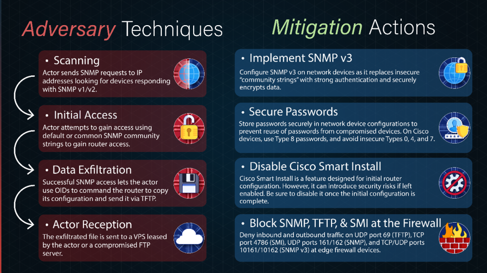

# US and Allies Warn of Russian APT Groups Targeting Routers and Network Devices

**Russian State-Sponsored Activity**{.cve-chip} **Network Infrastructure Targeting**{.cve-chip} **Credential Abuse**{.cve-chip} **Router Hygiene**{.cve-chip} **Critical Infrastructure Risk**{.cve-chip}

## Overview

A joint cybersecurity advisory from NSA, CISA, FBI, and allied agencies warns that Russian state-sponsored actors are actively targeting internet-exposed network infrastructure, including routers, switches, firewalls, VPN gateways, and related appliances.

The activity is attributed to FSB Center 16-linked operations (also tracked as Berserk Bear, Dragonfly, Energetic Bear, and Crouching Yeti). Rather than depending primarily on new zero-days, attackers are exploiting weak security hygiene such as default credentials, exposed management interfaces, outdated firmware, and legacy protocols to establish persistence for espionage and potential follow-on disruptive operations.

## Technical Specifications

| **Attribute** | **Details** |
|---|---|
| **Threat Cluster** | Russian FSB Center 16-linked activity |
| **Known Tracking Names** | Berserk Bear, Dragonfly, Energetic Bear, Crouching Yeti |
| **Primary Target Surface** | Internet-exposed network infrastructure devices |
| **Targeted Device Types** | Routers, switches, firewalls, VPN gateways, network appliances |
| **Primary Access Methods** | Weak/default credentials, password spraying, credential reuse |
| **Secondary Access Methods** | Exploitation of known patched vulnerabilities, exposed admin interfaces |
| **Legacy/Weak Protocol Abuse** | SNMPv1/v2, TFTP, Telnet, Cisco Smart Install |
| **Post-Compromise Objectives** | Config theft, credential harvesting, topology mapping, persistent foothold |
| **Data at Risk** | Config files, admin creds, VPN secrets/PSKs, routing and firewall rules, internal addressing |
| **Advisory Focus** | Immediate router hygiene and infrastructure hardening |

## Affected Products

- Internet-facing routers, switches, firewalls, VPN gateways, and network appliances
- Environments retaining unsupported firmware or end-of-life network hardware
- Organizations exposing management interfaces directly to the internet
- Networks still relying on insecure legacy protocols (for example Telnet, TFTP, SNMPv1/v2)

## Attack Scenario

1. Attackers perform internet-wide reconnaissance for exposed network-device management interfaces.
2. Vulnerable targets are identified based on old firmware, weak access controls, or legacy protocol exposure.
3. Threat actors gain administrative access using default credentials, password spraying, credential reuse, or known exploitable weaknesses.
4. Device configuration files are extracted, often via insecure transfer paths (for example TFTP).
5. Stolen credentials and topology data are used to map internal environments and support lateral movement.
6. Compromised edge devices are retained as long-term persistence points for espionage and potential future disruptive operations.

## Impact Assessment

=== "Integrity"

    - Unauthorized administrative control can alter routing, ACLs, and firewall policy enforcement
    - Attackers can tamper with device configurations to create covert persistence
    - Trust in network segmentation and control-plane integrity is degraded

=== "Confidentiality"

    - Exposure of configuration files, admin credentials, VPN secrets, and internal topology
    - Sensitive network architecture intelligence can be harvested for broader intrusion planning
    - Persistent edge footholds can facilitate long-term intelligence collection

=== "Availability"

    - Compromised network devices can be degraded or disrupted, affecting enterprise connectivity
    - Misconfiguration or malicious policy changes can cause outages in critical services
    - Critical infrastructure operators face increased risk of future disruptive follow-on attacks

## Mitigation Strategies

### Immediate Actions

- Replace unsupported and end-of-life network devices
- Apply latest firmware and security updates across all managed network infrastructure
- Remove internet exposure of administrative interfaces wherever possible

### Short-term Measures

- Disable unnecessary and insecure services such as Telnet, TFTP, and Cisco Smart Install
- Migrate SNMPv1/v2 deployments to SNMPv3 with strong authentication and encryption
- Restrict device-management access to trusted admin networks or VPN paths only

### Monitoring & Detection

- Continuously monitor logs for suspicious admin logins, config exports, and privilege changes
- Alert on abnormal use of legacy management protocols and failed login bursts
- Audit for unauthorized configuration drift in routing, firewall, and VPN settings

### Long-term Solutions

- Enforce strong, unique administrator credentials and rotate high-value secrets regularly
- Implement MFA on management planes where supported
- Institutionalize network-device hardening baselines and periodic compliance validation

## Resources and References

!!! info "Public Reporting"
    - [US and allied Governments' Recommendations: Securing Network Devices Against Russian APT Groups](https://securityaffairs.com/195448/apt/us-and-allied-governments-recommendations-securing-network-devices-against-russian-apt-groups.html)
    - [Improve Router Hygiene to Protect Against Russian State-Sponsored Targeting | CISA](https://www.cisa.gov/news-events/cybersecurity-advisories/aa26-194a)
    - [NSA and Partners Release Guidance on Improving Router Hygiene to Protect Against Russian State-Sponsored Targeting](https://www.nsa.gov/Press-Room/Press-Releases-Statements/Press-Release-View/Article/4541059/nsa-and-partners-release-guidance-on-improving-router-hygiene-to-protect-agains/)
    - [CSA Improve Router Hygiene Advisory PDF](https://media.defense.gov/2026/Jul/09/2003959498/-1/-1/1/CSA_IMPROVE_ROUTER_HYGIENE.PDF)

---

*Last Updated: July 16, 2026*
