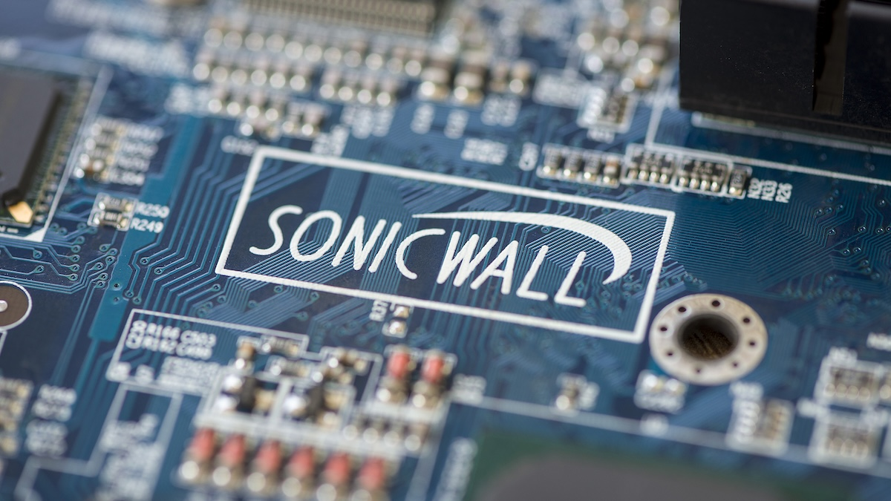

# SonicWall SMA Urgent Zero-Day Patch Warning

**CVE-2025-23006**{.cve-chip} **CVE-2025-40602**{.cve-chip} **SonicWall SMA 1000**{.cve-chip} **Zero-Day Exploitation**{.cve-chip} **Unauthenticated Root RCE**{.cve-chip}

## Overview

SonicWall issued an urgent security advisory warning that two vulnerabilities in Secure Mobile Access (SMA) 1000 series appliances are being actively exploited in targeted zero-day attacks.

The vulnerabilities can be chained to deliver unauthenticated remote code execution with root privileges through Appliance Management Console (AMC) and Central Management Console (CMC) administration paths. SonicWall stated this issue does not affect SSL-VPN functionality on SonicWall firewall products.

## Technical Specifications

| **Attribute** | **Details** |
|---|---|
| **Affected Product Family** | SonicWall SMA 1000 series access gateways |
| **Unaffected Scope** | SonicWall firewall SSL-VPN products (per vendor advisory) |
| **CVE-2025-23006** | AMC/CMC remote code execution path (previously disclosed zero-day context) |
| **CVE-2025-40602** | New zero-day local privilege escalation in AMC authorization flow |
| **Observed Attack Pattern** | Chained exploitation of CVE-2025-23006 + CVE-2025-40602 |
| **End State of Chain** | Unauthenticated root-level remote code execution on appliance |
| **Public Exploitation Status** | Confirmed exploited in the wild by SonicWall and CISA KEV inclusion |
| **CISA Action** | Added CVE-2025-40602 to KEV with one-week federal remediation window |
| **Threat Attribution** | Not publicly disclosed at advisory time |

## Affected Products

- SonicWall SMA 1000 series appliances exposing AMC/CMC management interfaces
- Organizations using internet-reachable or weakly restricted SMA management planes
- Government and enterprise remote-access environments dependent on SMA gateways

## Attack Scenario

1. An attacker identifies an exposed SMA 1000 AMC/CMC management interface.
2. The attacker exploits CVE-2025-23006 to achieve initial unauthenticated code execution on the appliance.
3. The attacker then abuses CVE-2025-40602 authorization weakness to elevate privileges to root.
4. With root control, the attacker can persist on the gateway, alter appliance behavior, and access or manipulate remote-access workflows.
5. The compromised SMA appliance is used as a foothold for broader internal network access and follow-on operations.

## Impact Assessment

=== "Integrity"

    - Full root compromise enables attackers to alter gateway configurations and security controls
    - Appliance trust can be subverted to facilitate persistent backdoor access
    - Administrative data and policy settings may be modified without authorization

=== "Confidentiality"

    - Compromised remote-access infrastructure can expose sensitive session and network context
    - Gateway foothold can aid credential theft and internal reconnaissance
    - High-value environments face elevated risk of data access through trusted access paths

=== "Availability"

    - Attackers may disrupt remote-access services and administrative operations
    - Incident response and emergency patching can cause planned/unplanned connectivity interruptions
    - Gateway compromise can degrade business continuity for distributed workforces

## Mitigation Strategies

### Immediate Actions

- Apply SonicWall SMA 1000 patches immediately per latest PSIRT guidance
- Treat exposed AMC/CMC interfaces as critical attack surface and prioritize containment
- Follow CISA KEV remediation timelines, especially in regulated and federal environments

### Short-term Measures

- Restrict AMC/CMC administrative access to dedicated management networks or VPN-only paths
- Block direct internet exposure of appliance management interfaces
- Rotate administrative credentials and review privileged accounts after patching

### Monitoring & Detection

- Review appliance logs for suspicious management interface access and anomalous admin activity
- Hunt for indicators of chained exploitation attempts and privilege escalation behavior
- Alert on unexpected configuration changes, new admin objects, and unusual process execution

## Resources and References

!!! info "Public Reporting"
    - [SonicWall Patches Exploited SMA 1000 Zero-Day](https://www.securityweek.com/sonicwall-patches-exploited-sma-1000-zero-day/)
    - [SonicWall Patches Critical Zero-Day in Administration Tools](https://fieldeffect.com/blog/sonicwall-patches-critical-zero-day-administration-tools)
    - [SonicWall PSIRT Advisories](https://psirt.global.sonicwall.com/)

---

*Last Updated: July 15, 2026*
