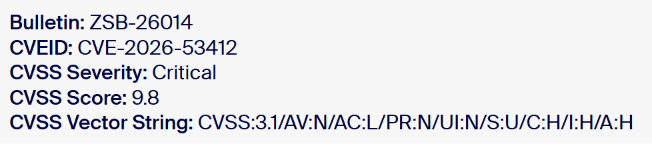

# Zoom Critical Account Takeover Vulnerability (CVE-2026-53412)

**CVE-2026-53412**{.cve-chip} **Account Takeover**{.cve-chip} **Improper Input Validation**{.cve-chip} **Zoom Windows Clients**{.cve-chip} **Critical Patch**{.cve-chip}

## Overview

Zoom disclosed a critical vulnerability, CVE-2026-53412, affecting Zoom Desktop Client for Windows, Zoom VDI Client for Windows, and Zoom Meeting SDK for Windows.

The flaw is caused by improper input validation and could allow an unauthenticated remote attacker to take over a victim's Zoom account. Zoom released security updates and advised immediate patching. At disclosure time, no active exploitation in the wild was reported.

## Technical Specifications

| **Attribute** | **Details** |
|---|---|
| **CVE ID** | CVE-2026-53412 |
| **CVSS Score** | 9.8 (Critical) |
| **CWE Class** | Improper Input Validation |
| **Affected Products** | Zoom Desktop Client for Windows, Zoom VDI Client for Windows, Zoom Meeting SDK for Windows |
| **Attack Vector** | Network |
| **Privileges Required** | None |
| **User Interaction** | None |
| **Primary Impact** | Account takeover |
| **Root Cause** | Improper validation of network input enabling crafted request abuse |
| **Exploit Disclosure Status** | Detailed exploit mechanics withheld by vendor pending patch uptake |
| **Exploitation in the Wild** | No public evidence at time of advisory |

## Affected Products

- Zoom Desktop Client for Windows (vulnerable unpatched versions)
- Zoom VDI Client for Windows (vulnerable unpatched versions)
- Zoom Meeting SDK for Windows deployments using vulnerable builds
- Enterprise environments with unmanaged or outdated Zoom client versions

## Attack Scenario

1. The attacker identifies systems running vulnerable Zoom Windows client or SDK versions.
2. The attacker sends specially crafted network traffic to the vulnerable component.
3. The application improperly handles malicious input due to validation weakness.
4. The attacker gains unauthorized control of the victim's Zoom account without credentials.
5. The compromised account is abused to access meetings, contacts, metadata, settings, and potentially integrated organizational resources.

## Impact Assessment

=== "Integrity"

    - Attackers can alter account settings and abuse trusted identities for impersonation
    - Compromised accounts may be used in internal social engineering and meeting abuse
    - Elevated risk where Zoom identity is linked to enterprise SSO workflows

=== "Confidentiality"

    - Unauthorized access to meetings, schedules, contact data, and account metadata
    - Potential exposure of internal collaboration context and organizational relationships
    - Increased phishing and BEC risk through trusted compromised Zoom identities

=== "Availability"

    - Security response actions (forced resets, session revocations, emergency patching) can temporarily disrupt operations
    - Meeting operations may be impacted if attacker-driven misuse triggers account lockout/containment actions
    - Broad enterprise patching and version enforcement can cause short-term service friction

## Mitigation Strategies

### Immediate Actions

- Update all affected Zoom Windows applications and SDK deployments to patched versions
- Verify endpoint management systems have successfully rolled out updates
- Force session revocation and credential resets for suspicious accounts if compromise is suspected

### Short-term Measures

- Enable MFA for all Zoom accounts, especially privileged and admin roles
- Block or restrict outdated Zoom client versions using endpoint compliance policies
- Maintain an accurate inventory of client and SDK versions across the environment

### Monitoring & Detection

- Monitor Zoom audit logs for suspicious logins, unusual device/geolocation access, and configuration changes
- Review meeting and account activity after patch deployment for anomaly baselines
- Correlate Zoom alerts with identity provider and SSO telemetry for takeover indicators

### Long-term Solutions

- Formalize rapid third-party client patch SLAs for collaboration tools
- Integrate Zoom version and vulnerability posture into continuous compliance checks
- Run periodic user awareness campaigns focused on account security and update hygiene

## Resources and References

!!! info "Public Reporting"
    - [Zoom warns of critical account takeover vulnerability](https://www.bleepingcomputer.com/news/security/zoom-warns-of-critical-account-takeover-vulnerability/)
    - [ZSB-26014 | Zoom Security Bulletin](https://www.zoom.com/en/trust/security-bulletin/zsb-26014/)
    - [CVE-2026-53412: Update Zoom Workplace for Windows](https://blog.gridinsoft.com/zoom-cve-2026-53412-account-takeover/)
    - [Zoom Vulnerability CVE-2026-53412: CVSS 9.8 Takeover Flaw](https://securityonline.info/zoom-account-takeover-flaw/)

---

*Last Updated: July 16, 2026*
