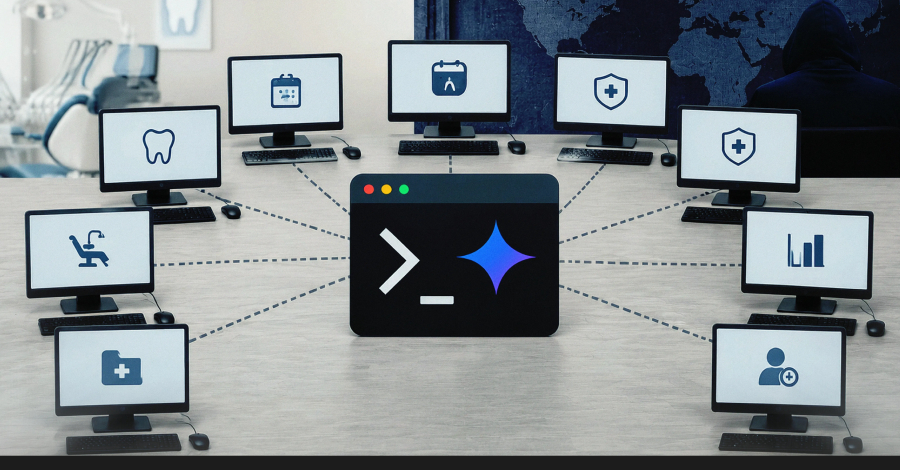
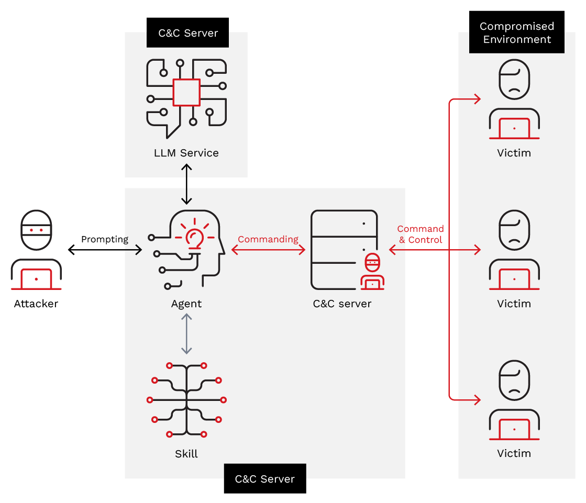

# Russian-Speaking Threat Actor Uses Google Gemini CLI to Operate Botnet Infrastructure

**AI-Assisted Operations**{.cve-chip} **Botnet Management**{.cve-chip} **Gemini CLI Abuse**{.cve-chip} **Cloudflare Tunnel**{.cve-chip} **PowerShell Tradecraft**{.cve-chip}

## Overview

Trend Micro reported that a Russian-speaking threat actor tracked as bandcampro used Google Gemini CLI extensively as an operational assistant to deploy, troubleshoot, migrate, and manage live botnet infrastructure.

Instead of manually writing all administration and deployment logic, the actor used AI-generated commands and troubleshooting guidance to accelerate command-and-control (C2) operations, improve resilience, and reduce technical friction during active campaigns.

## Technical Specifications

| **Attribute** | **Details** |
|---|---|
| **Threat Actor** | bandcampro (Russian-speaking actor per reporting) |
| **Observed Activity Window** | March 19 to April 21, 2026 |
| **AI Tool Abused** | Google Gemini CLI |
| **Observed AI Sessions** | Approximately 200 sessions analyzed |
| **C2 Hosting Model** | VPS-hosted C2 over HTTPS |
| **Infrastructure Obfuscation** | Cloudflare Tunnel used to conceal backend origin |
| **Malicious Commanding** | AI-generated PowerShell/admin commands for recon and remote control |
| **Operational Assistance** | AI helped troubleshoot HTTP 502 errors, headers, and Cloudflare deployment issues |
| **Rebuild Resilience** | Infrastructure reportedly restorable from a small set of prompt/instruction files |
| **Victim Scale Mentioned** | At least 8 Windows systems (dental clinic context in reporting) |

## Affected Products

- Windows endpoints infected and enrolled into attacker-controlled botnet infrastructure
- Organizations with weak controls over scripted administrative execution (especially PowerShell abuse)
- Environments where outbound encrypted C2 traffic via tunneling/proxy services is weakly monitored

## Attack Scenario

1. Attacker provisions or rents VPS infrastructure to host C2 services.
2. Gemini CLI is used to generate and refine deployment scripts and server configuration tasks.
3. Cloudflare Tunnel is configured to mask backend C2 origin and improve operational stealth.
4. Victim endpoints are compromised and begin beaconing to HTTPS-based C2.
5. Gemini-assisted command generation is used for reconnaissance, file discovery, and remote administration actions.
6. During outages or detection pressure, AI-assisted troubleshooting and migration are used to quickly restore botnet capability.

## Impact Assessment

=== "Integrity"

    - Compromised endpoints can execute attacker commands and be repurposed for further intrusions
    - AI-assisted iteration can speed attacker reconfiguration and persistence maintenance
    - Increased campaign agility supports faster adaptation after defender disruption

=== "Confidentiality"

    - Potential theft of sensitive patient, organizational, and endpoint-resident data
    - Credential and token harvesting risk increases with scripted remote administration capabilities
    - C2-mediated control channels can facilitate covert data collection and exfiltration

=== "Availability"

    - Botnet control can disrupt clinical/office operations on affected systems
    - Defender response burden increases due to rapidly changing infrastructure and command patterns
    - Faster attacker recovery after takedowns can prolong incidents and containment timelines

## Mitigation Strategies

### Immediate Actions

- Isolate suspected compromised endpoints and perform incident-response triage
- Monitor and constrain high-risk PowerShell behavior, including encoded and obfuscated command execution
- Investigate unusual outbound HTTPS traffic, particularly toward tunneling endpoints

### Short-term Measures

- Deploy or tune EDR/XDR detections for behavioral command-and-control patterns
- Enforce application control (AppLocker or WDAC) to restrict unauthorized script and binary execution
- Review scheduled tasks, persistence artifacts, and remote administration traces on endpoints

### Monitoring & Detection

- Correlate PowerShell telemetry with network beacons and process-tree anomalies
- Alert on unexpected Cloudflare Tunnel communication patterns from non-approved hosts
- Monitor credential access behavior and suspicious administrative account activity

### Long-term Solutions

- Segment high-risk environments (including healthcare systems) and enforce least privilege
- Strengthen MFA coverage for privileged/admin workflows
- Train security teams to detect AI-assisted attacker iteration patterns and rapid infrastructure pivots

## Resources and References

!!! info "Public Reporting"
    - [Russian-Speaking Hacker Uses Google Gemini CLI to Control Botnet of Eight Dental Clinic PCs](https://thehackernews.com/2026/07/russian-speaking-hacker-uses-google.html)

---

*Last Updated: July 21, 2026*
