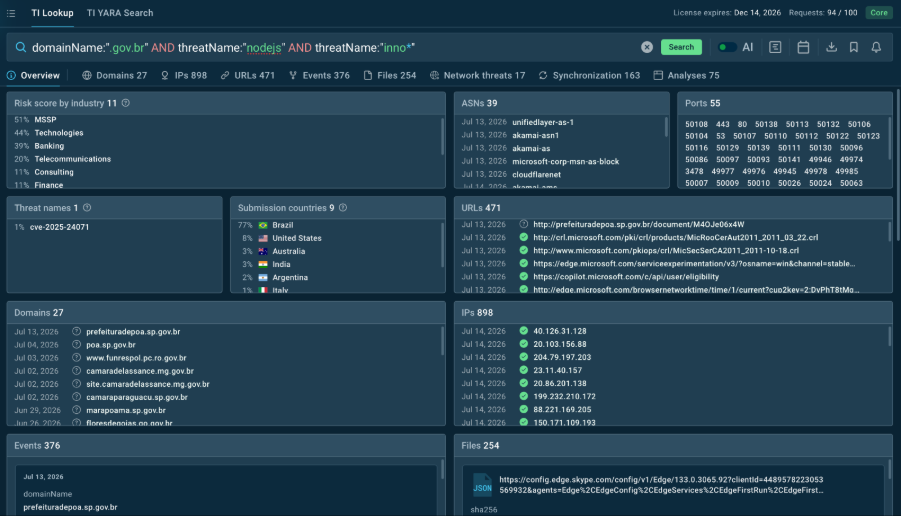
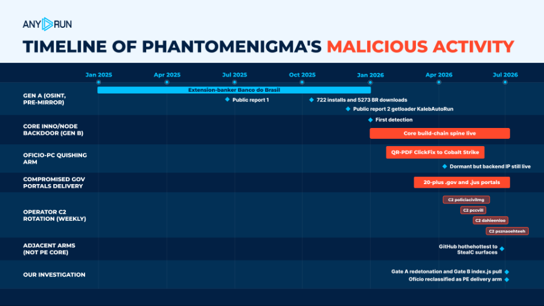
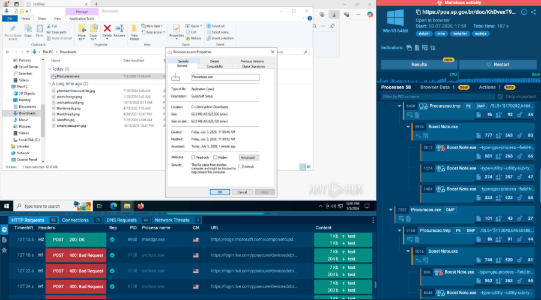

# PhantomEnigma Malware Campaign Leveraging Hijacked Brazilian Government Websites

**Supply-Chain Style Delivery**{.cve-chip} **Government Site Hijack**{.cve-chip} **Node.js Backdoor**{.cve-chip} **Trojanized Installers**{.cve-chip} **C2-Controlled Modules**{.cve-chip}

## Overview

Security researchers at ANY.RUN uncovered a malware campaign named PhantomEnigma in which attackers compromised more than 20 Brazilian government websites. Adversaries altered legitimate download pages to distribute trojanized installers that deploy a Node.js-based backdoor.

By abusing trusted government domains as distribution points, the campaign increases victim trust and can evade some reputation-based security controls.

## Technical Specifications

| **Attribute** | **Details** |
|---|---|
| **Campaign Name** | PhantomEnigma |
| **Compromised Infrastructure** | 20+ Brazilian government websites |
| **Initial Delivery** | Modified/replaced legitimate software installers on official download pages |
| **Malware Type** | Modular Node.js backdoor |
| **Primary Capability** | Remote JavaScript command execution |
| **Host Profiling** | Collects hostname, username, OS details, installed software |
| **Persistence** | Establishes startup persistence to survive reboot cycles |
| **Network Behavior** | Encrypted communications with attacker-controlled C2 |
| **Payload Expansion** | On-demand retrieval/execution of additional malware modules |
| **Observed Trojanized Software** | Includes modified installers for legitimate apps such as Boostnote |

## Affected Products

- Users downloading software from compromised Brazilian government websites
- Organizations that rely on trust/reputation of government domains for software safety
- Endpoints vulnerable to unauthorized script and installer execution
- Enterprises where infected user endpoints can become internal pivot points

## Attack Scenario

1. Attackers compromise legitimate Brazilian government websites.
2. Software download pages are modified to host trojanized installers.
3. Victims download files believing they are safe because they originate from official domains.
4. During installation, the embedded Node.js backdoor is deployed.
5. Malware establishes persistence and fingerprints the host.
6. Infected systems beacon to attacker-controlled C2 infrastructure.
7. Operators execute remote commands, steal data, and deploy additional payloads such as stealers or banking trojans.

## Impact Assessment

=== "Integrity"

    - Trojanized software execution undermines software trust chains
    - Attackers can modify endpoint behavior and deliver follow-on payloads
    - Persistent backdoors allow repeated tampering after initial compromise

=== "Confidentiality"

    - System reconnaissance can expose environment details and user context
    - Credential theft and data exfiltration risks increase after C2 establishment
    - Trusted-domain delivery improves success rate of sensitive data theft operations

=== "Availability"

    - Additional payload deployment can degrade endpoint stability or uptime
    - Incident response and containment can disrupt affected organizations
    - Compromised endpoints may be weaponized for broader attacks, impacting business operations

## Mitigation Strategies

### Immediate Actions

- Verify installer authenticity through digital signatures and trusted checksums before deployment
- Block known malicious URLs, C2 indicators, and compromised distribution artifacts
- Isolate suspected hosts and remove unauthorized persistence mechanisms

### Short-term Measures

- Restrict execution of unauthorized scripts and binaries through application control policies
- Monitor for suspicious Node.js activity in non-development endpoint contexts
- Harden browser/download controls for software acquisition from external sources

### Monitoring & Detection

- Deploy EDR with behavioral analytics for script-based backdoors and child-process anomalies

## Resources and References

!!! info "Public Reporting"
    - [20+ Hijacked Government Websites Became an Attack Channel](https://thehackernews.com/2026/07/20-hijacked-government-websites.html)
    - [SEPE - 20+ Hijacked Government Websites Became an Attack Channel](https://www.sepe.gr/en/it-technology/cybersecurity/22751343/20-hijacked-government-websites-became-an-attack-channel/)
    - [20+ Hijacked Government Websites Became an Attack Channel - HEAL Security](https://healsecurity.com/20-hijacked-government-websites-became-an-attack-channel-the-hacker-news/)

---

*Last Updated: July 19, 2026*
