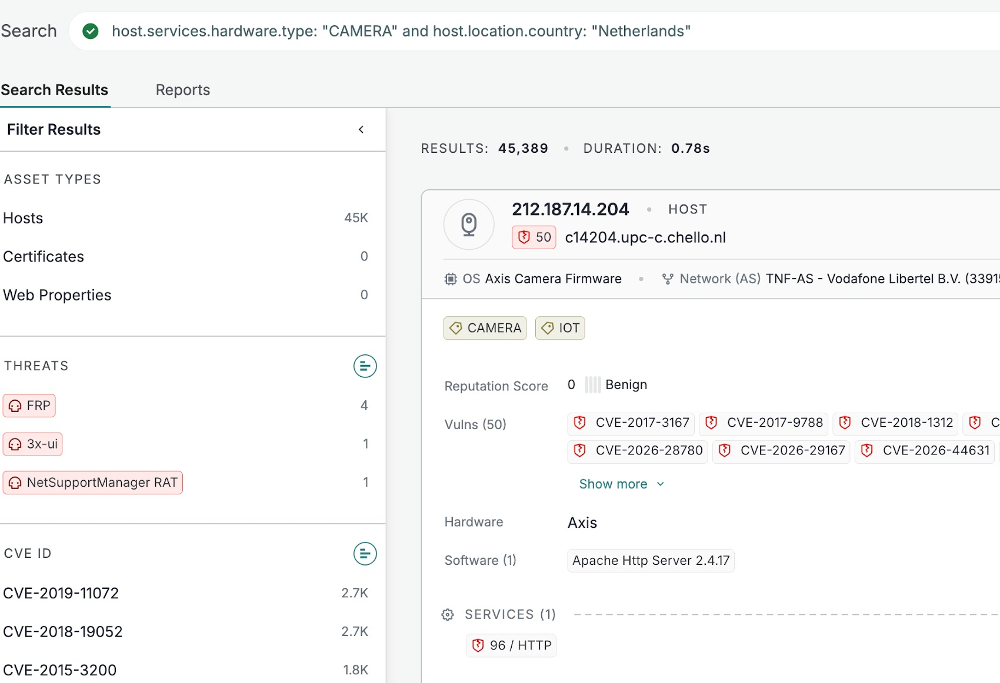

# Russian Intelligence Campaign Targeting Internet-Connected IP Cameras for Military Espionage

**Russian Espionage**{.cve-chip} **IP Camera Compromise**{.cve-chip} **Military Logistics Surveillance**{.cve-chip} **IoT Exposure**{.cve-chip} **OPSEC Risk**{.cve-chip}

## Overview

Dutch intelligence services (AIVD and MIVD) warned that Russian intelligence actors are compromising internet-connected IP cameras and surveillance systems across Europe to monitor military logistics, troop movement patterns, and aid shipments linked to Ukraine.

Rather than directly penetrating hardened military networks, attackers are exploiting weaker civilian surveillance infrastructure located near strategic transport and defense-adjacent locations, turning exposed cameras into real-time intelligence collection points.

## Technical Specifications

| **Attribute** | **Details** |
|---|---|
| **Threat Activity Type** | State-linked espionage via compromised civilian surveillance infrastructure |
| **Primary Targets** | Internet-exposed IP cameras and IoT surveillance devices |
| **Likely Access Vectors** | Weak/default credentials, exposed web management, RTSP/ONVIF services, poor remote-access configuration, unpatched firmware |
| **Disclosed CVEs/Malware** | Not publicly disclosed in advisory reporting |
| **Operational Objective** | Real-time and historical monitoring of military logistics and movement patterns |
| **Collection Scope** | Live streams, recorded footage, and location-correlated visual intelligence |
| **Potential Enhancement** | Automated image analysis at scale for identifying military assets and transport activity |
| **Primary Geographic Context** | European surveillance infrastructure near strategic logistics corridors |

## Affected Products

- Internet-accessible IP cameras and network video devices
- Surveillance systems with exposed HTTP/HTTPS management portals
- Devices with enabled RTSP/ONVIF services and weak access controls
- Civilian camera networks near ports, rail hubs, highways, border crossings, bases, and defense contractors

## Attack Scenario

1. Russian operators scan for exposed IP cameras near military and logistics-relevant locations.
2. Vulnerable devices are identified via weak authentication, exposed management services, or outdated firmware.
3. Attackers gain persistent unauthorized access to live and recorded surveillance feeds.
4. Video intelligence is collected to track troop movements, convoy flows, and military aid routing.
5. Data from multiple compromised camera vantage points is correlated to build broader situational awareness for military intelligence planning.

## Impact Assessment

=== "Integrity"

    - Compromised camera infrastructure can be reconfigured or manipulated by unauthorized actors
    - Surveillance trust is degraded for facilities relying on these systems for safety and monitoring
    - Threat actors may alter device settings to retain long-term covert access

=== "Confidentiality"

    - Exposure of sensitive military-adjacent movement and logistics patterns
    - Leakage of operational security context for government and defense-linked transport chains
    - Civilian and institutional privacy impact where compromised devices capture mixed environments

=== "Availability"

    - Surveillance systems may be impaired or destabilized during or after compromise
    - Incident response actions can require temporary camera isolation and service interruption
    - Increased risk of follow-on targeting informed by collected intelligence

## Mitigation Strategies

### Immediate Actions

- Remove surveillance devices from direct internet exposure where possible
- Replace default credentials with strong, unique administrative passwords
- Restrict management access through VPNs or hardened secure gateways

### Short-term Measures

- Patch camera firmware regularly and retire unsupported device models
- Disable unnecessary services such as Telnet and UPnP
- Restrict management interfaces with firewall policy and IP allowlists

### Monitoring & Detection

- Monitor authentication logs for brute-force attempts and unusual geographic access
- Track anomalous streaming/session behavior and unexpected configuration changes
- Maintain a complete inventory of internet-connected IoT surveillance assets

### Long-term Solutions

- Segment surveillance infrastructure from enterprise and operational networks
- Deploy continuous anomaly detection for camera and NVR ecosystems
- Integrate camera security posture audits into recurring national/enterprise OPSEC programs

## Resources and References

!!! info "Public Reporting"
    - [Russian Intelligence Hacks IP Cameras to Spy on Military Logistics Across NATO States and Ukraine](https://thehackernews.com/2026/07/russian-intelligence-hacks-ip-cameras.html)
    - [Dutch Intelligence Warns Russia Uses Hacked IP Cameras for Military Espionage](https://securityaffairs.com/195708/intelligence/dutch-intelligence-warns-russia-uses-hacked-ip-cameras-for-military-espionage.html)
    - [Dutch Intelligence Warns Russia Uses Hacked IP Cameras for Military Espionage | SOC Defenders](https://www.socdefenders.ai/item/838ca2ed-f499-4edf-bf99-763a304513be)
    - [Russian Intelligence Is Using IP Cameras Across Europe for Military Espionage](https://hackyourmom.com/en/novyny/rosijski-speczsluzhby-vykorystovuyut-ip-kamery-v-yevropi-dlya-vijskovogo-shpygunstva/)
    - [Russian spies are hacking European security cameras](https://cybernews.com/security/russian-spies-hacking-european-ip-cameras/)

---

*Last Updated: July 21, 2026*
