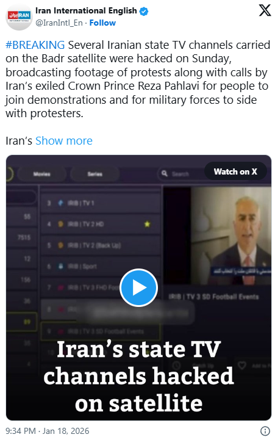

# Iran State Television Broadcast Hijacking (Badr Satellite Signal Intrusion)

**Satellite Hijacking**{.cve-chip} **Broadcast Intrusion**{.cve-chip} **Iran**{.cve-chip} **Badr Satellite**{.cve-chip} **Hacktivism**{.cve-chip} **Signal Injection**{.cve-chip} **Information Warfare**{.cve-chip}

## Overview

**anti-regime activists** successfully **hijacked Iranian state television broadcasts** by compromising the **Badr satellite uplink infrastructure** used to distribute multiple Iranian state TV channels across the country. 

The intrusion lasted approximately **10 minutes**, during which attackers replaced regular programming with **anti-government content** including protest footage from nationwide demonstrations and a **recorded video appeal** by **exiled Crown Prince Reza Pahlavi** calling for renewed protests and urging Iranian military and security forces to refuse orders to fire on civilians. 

The broadcast reached **millions of Iranian households** nationwide via channels transmitted through the **Badr-4, Badr-5, and Badr-7 satellites** (operated by the Arab Satellite Communications Organization), which are the primary distribution method for Iranian state television due to their wide coverage across Iran, the Middle East, and North Africa. 

The hijacking represents a significant **breach of Iran's information security infrastructure**, demonstrating vulnerabilities in satellite broadcast systems that authoritarian regimes rely upon to control national narratives. While the **exact technical exploitation method has not been publicly disclosed**, the incident likely involved compromise of **ground station uplink equipment**, exploitation of **weak authentication mechanisms** in satellite transmission infrastructure, or infiltration of **third-party broadcast service providers** with access to uplink facilities. 

The attack occurred during a period of **nationwide internet blackouts** imposed by Iranian authorities to suppress protest coordination, making state television one of the few remaining mass communication channels accessible to citizens—amplifying the impact of the hijacking. 

The incident demonstrates the vulnerability of **centralized broadcast infrastructure** to signal injection attacks and highlights the evolving tactics of **information warfare** in authoritarian states where activists target state-controlled media as a means of bypassing censorship and reaching populations with alternative narratives.

---

## Incident Specifications

| **Attribute**              | **Details**                                                                 |
|----------------------------|-----------------------------------------------------------------------------|
| **Incident Type**          | Satellite broadcast hijacking, signal intrusion                             |
| **Target**                 | Iranian state television channels (IRIB networks)                           |
| **Satellite Network**      | Badr satellite constellation (Badr-4, Badr-5, Badr-7)                       |
| **Satellite Operator**     | Arab Satellite Communications Organization (Arabsat)                        |
| **Affected Channels**      | Multiple Iranian state TV channels (IRIB TV1, TV2, News, etc.)              |
| **Incident Date**          | 18 January 2026                                                             |
| **Duration**               | Approximately 10 minutes                                                    |
| **Geographic Reach**       | Nationwide Iran, Middle East, North Africa (Badr footprint)                 |
| **Estimated Viewers**      | Millions (Iranian state TV has ~50 million potential viewers)               |
| **Attack Vector**          | Satellite uplink compromise (specific method undisclosed)                   |
| **Likely Methods**         | Ground station infiltration, weak uplink authentication, third-party compromise |
| **Injected Content**       | Anti-government protest footage, Crown Prince Reza Pahlavi video appeal     |
| **Message Theme**          | Call for protests, military/security defection, anti-regime messaging       |
| **Attribution**            | Anti-regime activists (specific group unidentified)                         |
| **Political Context**      | Ongoing protests in Iran, government internet blackouts                     |
| **Government Response**    | No public disclosure of technical remediation, likely internal investigation |
| **Technical Disclosure**   | Limited (no public details on exploitation method, vulnerabilities, patches)|
| **Verification**           | Confirmed by multiple independent media outlets, diaspora sources           |
| **Strategic Significance** | Demonstrates vulnerability of authoritarian information control infrastructure |
| **Information Warfare**    | Bypassed state censorship to deliver opposition messaging to mass audience  |

---

## Technical Details

### Badr Satellite Network Architecture

The Badr satellites are a series of geostationary communication satellites operated by Arabsat, providing broadcast services across the Middle East, North Africa, and parts of Asia. Iranian State Television (IRIB) relies on this satellite constellation to distribute programming nationwide.

**Iranian TV Distribution Chain**:

The broadcast follows this path: IRIB Studios produce content → Master Control Room in Tehran processes feeds → Signal transmitted to Satellite Uplink Facility → Ground Station transmits to Badr satellite → Satellite relays signal across Iran → Millions of household satellite dishes receive the broadcast.

The compromise occurred at the uplink facility stage, where attackers injected their content before transmission to the satellite.

**Badr Satellite Coverage**:

- **Badr-4, Badr-5, Badr-7**: All positioned at 26° East orbital slot
- **Coverage**: Middle East, North Africa, Central Asia, parts of Europe
- **Frequencies**: Ku-band (11.0-12.75 GHz) and Ka-band (18-30 GHz)
- **Channels**: IRIB TV1, TV2, News, and additional regional channels

### Satellite Uplink Security Vulnerabilities

Satellite uplink facilities typically implement multiple security layers including perimeter fencing, security guards, biometric access control, surveillance systems, authentication for equipment access, encrypted signals, network segmentation, background checks for operators, and real-time transmission monitoring.

**Potential Attack Vectors**:

**Ground Station Physical Infiltration**: An insider employee, contractor with legitimate access, or infiltrator posing as maintenance personnel could physically access the uplink facility, connect to video encoding equipment, and inject alternative content directly into the transmission chain.

**Uplink Authentication Bypass**: Many satellite uplink systems suffer from weak security practices such as default passwords, lack of multi-factor authentication, or shared credentials. Attackers could exploit these vulnerabilities to remotely access uplink control systems and override legitimate programming.

**Third-Party Service Provider Compromise**: Iranian state TV may rely on intermediary service providers including the satellite operator (Arabsat), teleport services, broadcast equipment vendors, or fiber network providers. Compromising any of these third parties could provide access to inject content before final satellite transmission.

**Satellite Control System Compromise**: While highly sophisticated and less likely for hacktivist groups, attackers could theoretically compromise the satellite ground control station itself to reconfigure transponders or redirect signals, though this would require nation-state level resources and expertise.

### Signal Injection Mechanism

The broadcast signal consists of video (H.264/H.265 encoded), audio (AAC), and metadata multiplexed into an MPEG-2 Transport Stream. This stream is optionally encrypted, then modulated and uplinked to the satellite at 14 GHz. The satellite transponder amplifies and relays the signal, which is then downlinked at 12 GHz to receivers across Iran.

The attackers inserted their alternative video content (protest footage and Reza Pahlavi's appeal) at or before the modulation stage, replacing legitimate IRIB programming. From the perspective of Iranian households, the hijacked signal appeared identical to a normal state TV broadcast with no visible indication of tampering.

---

## Attack Scenario

### Satellite Broadcast Hijacking Operation

**Target Selection & Reconnaissance**

Activists identified Iranian State Television (IRIB) as their target, specifically focusing on the Badr satellite network (Badr-4, Badr-5, Badr-7) that reaches approximately 50 million potential viewers nationwide. The strategic value was amplified by the timing—during nationwide internet blackouts, state television remained one of the few mass communication channels accessible to Iranian citizens.

The reconnaissance phase involved identifying satellite uplink facility locations in Tehran, Qom, and Mashhad, researching the uplink equipment and broadcast chain infrastructure, and potentially identifying insiders through open-source intelligence gathering.

**Access Acquisition**

While the exact method has not been publicly confirmed, several scenarios are plausible. The attackers may have recruited or coerced an IRIB technician or satellite uplink operator with legitimate credentials and access to uplink facilities, motivated by political opposition or ideological alignment. Alternatively, physical infiltration through social engineering—posing as equipment maintenance personnel with fake credentials—could have provided entry during vulnerable periods. A third possibility involves remote compromise through exploitation of weak authentication on uplink control systems or exposed remote management access.

**Content Preparation**

The activists prepared approximately 10 minutes of pre-recorded material consisting of anti-government protest footage from recent demonstrations in Tehran and Isfahan, a recorded video appeal by exiled Crown Prince Reza Pahlavi, text overlays with protest slogans, and direct appeals calling for military and security forces to defect from the regime.

**Signal Injection Execution**

On January 18, 2026, during prime viewing hours at 8:00 PM Tehran time, the hijacking was executed. The perpetrator gained access to the uplink control room and connected pre-recorded content to the video encoder, then configured the video router to switch from the legitimate IRIB feed to the rogue source.

Iranian households tuned to state television channels suddenly saw protest footage instead of regular programming. Crown Prince Reza Pahlavi appeared on screen, urging military and security forces not to fire on protesters and calling for continued demonstrations for democracy and human rights. Additional protest clips showed crowds chanting anti-regime slogans with text overlays reading "Rise up Iran" and "Mahsa Amini - We will not forget."

After approximately 10 minutes, IRIB control room staff realized the hijacking and initiated emergency protocols. The uplink facility was locked down, the rogue video source was removed, and regular programming was restored.

**Amplification & Propaganda Value**

The opposition immediately leveraged the successful hijacking for maximum propaganda value. Diaspora activists recorded the hijacked broadcast and uploaded footage to social media platforms within minutes, generating millions of views within hours. International media outlets including BBC Persian, Voice of America, and Western news organizations covered the story extensively.

The incident demonstrated the regime's inability to secure its own infrastructure, broke the information monopoly during internet blackouts, emboldened protesters by proving that opposition could challenge state power, and raised morale among activists inside Iran.

**Government Response**

Iranian authorities likely responded with immediate emergency lockdowns of all satellite uplink facilities, replacement of credentials for uplink equipment access, investigations of potential insider threats, and increased physical security measures. Technical remediation probably included implementing real-time broadcast monitoring, adding encryption to uplink signals, deploying multi-factor authentication, and network segmentation to isolate critical systems.

Publicly, state media either downplayed the incident or blamed "foreign interference" with no official acknowledgment of the security breach. Internally, authorities likely increased surveillance of IRIB employees and contractors while tightening media censorship and information control.

**Strategic Assessment**

For the opposition, the operation successfully demonstrated regime vulnerability and undermined the perception of state invincibility through psychological warfare. It provided inspiration for future information warfare tactics and generated significant global media attention for Iranian protests.

For the regime, the incident exposed critical infrastructure security gaps, resulted in loss of information monopoly during a crucial blackout period, and created the risk of copycat attacks while requiring increased resources for information security.

The incident revealed that satellite broadcast systems remain vulnerable to insider threats, legacy broadcast infrastructure often employs weak authentication mechanisms, centralized media distribution creates single points of failure, and information warfare tactics can be highly effective in authoritarian contexts where state control of media is paramount.

---

## Impact Assessment

=== "Information Access"
    Breach of information monopoly in authoritarian state:

    - **Mass Reach**: Millions of Iranian viewers exposed to anti-regime messaging during prime viewing hours (state TV has ~50 million potential audience)
    - **Blackout Context**: Occurred during nationwide internet blackouts when state TV was one of few mass communication channels accessible to citizens
    - **Narrative Control Failure**: Demonstrated regime's inability to maintain complete information control even over its own broadcast infrastructure
    - **Alternative Messaging**: Delivered opposition viewpoint (Crown Prince Reza Pahlavi appeal, protest footage) directly into Iranian households bypassing censorship
    - **Global Amplification**: Footage shared internationally via social media, magnifying impact beyond 10-minute broadcast window

=== "Political Impact"
    Psychological warfare and opposition morale:

    - **Regime Credibility Damage**: Exposed vulnerability of state security apparatus (inability to protect critical media infrastructure)
    - **Protester Morale**: Emboldened opposition activists and protesters by demonstrating successful challenge to state power
    - **Military/Security Messaging**: Reza Pahlavi's direct appeal to security forces urging defection potentially sows doubt among regime enforcers
    - **International Attention**: Global media coverage amplified Iranian opposition narrative and protest movement visibility
    - **Precedent Setting**: Established template for future information warfare operations against authoritarian broadcast systems

=== "Security Implications"
    Infrastructure vulnerability exposure:

    - **Satellite System Security**: Revealed weaknesses in satellite uplink authentication, access control, physical security
    - **Insider Threat**: Highlighted risk of disgruntled or ideologically-motivated employees with access to critical broadcast infrastructure
    - **Single Point of Failure**: Centralized satellite distribution creates vulnerability—compromise of single uplink facility affects all channels
    - **Copycat Risk**: Successful hijacking may inspire similar attacks against state broadcast infrastructure in Iran or other authoritarian countries
    - **Resource Diversion**: Regime forced to allocate additional resources to securing broadcast infrastructure, diverting from other security priorities

=== "Scope" 
    Geographic and demographic reach:

    - **Primary Audience**: Iranian citizens nationwide (Badr satellite footprint covers entire country)
    - **Estimated Viewers**: Millions watching state TV during prime evening hours (state TV dominates Iranian media landscape)
    - **Diaspora Impact**: Iranian diaspora communities in Middle East, Europe, North America received broadcast via Badr satellite footprint
    - **Secondary Audience**: Global public via social media amplification (videos of hijacked broadcast shared internationally)
    - **Strategic Timing**: Maximum impact during government-imposed internet blackouts when alternative information sources unavailable to Iranian public

---

## Mitigation Strategies

### Immediate Tactical Response

**Secure Satellite Uplink Facilities**

Physical security hardening includes increasing perimeter security with additional fencing and vehicle barriers, deploying armed security guards at all uplink facilities, implementing biometric access control systems, installing comprehensive CCTV with continuous monitoring, establishing two-person authorization rules for critical operations, and conducting thorough background checks with continuous vetting of all personnel.

Access control measures involve revoking and reissuing all credentials, implementing role-based access control with least privilege principles, requiring multi-factor authentication for all system access, deploying hardware security keys for critical systems, and logging all access attempts with alerts for anomalous patterns.

**Uplink Signal Encryption**

Implement DVB-S2 encryption standards including DVB-CSA or AES encryption for MPEG-2 Transport Streams before modulation, with secure key distribution limited to authorized receivers only. Deploy conditional access systems using smart card-based decryption for authorized receivers with government-controlled key distribution and periodic key rotation. Establish end-to-end encryption from content source through satellite to receivers using hardware security modules for key management.

**Real-Time Broadcast Monitoring**

Deploy automated anomaly detection systems including video fingerprinting to compare live broadcasts against expected content schedules, content recognition AI trained to flag unexpected imagery or unauthorized messaging, audio analysis with speech recognition to detect unauthorized speeches and opposition keywords, and instant kill switch capabilities to immediately cut transmission upon detection with automatic fallback to emergency backup content.

### Strategic Cybersecurity Measures

**Comprehensive Infrastructure Audit**

Conduct regular security assessments covering physical security reviews of perimeter defenses and access control systems, network security audits to identify unnecessary connections and implement network segmentation, system hardening through credential changes and firmware updates, and personnel security including loyalty screenings and continuous monitoring for insider threat indicators.

**Redundant Authentication & Authorization**

Implement multi-layer authentication requiring badge and biometric verification for physical access, username with strong password plus hardware token for system access, dual authorization for critical operations with supervisor approval, and continuous verification through session timeouts and behavioral analysis with immutable audit logging.

**Insider Threat Detection**

Establish behavioral monitoring programs including comprehensive user activity logging with alerts for unusual actions, psychological evaluations for high-risk personnel with anonymous reporting systems, financial monitoring to detect potential bribery or coercion vulnerabilities, and personnel rotation with cross-training to reduce single points of failure.

### Broadcast Continuity & Resilience

**Backup Transmission Paths**

Deploy redundant broadcast infrastructure with geographically distributed uplink facilities, independent satellite transponders on multiple satellites with instant failover capability, and alternative distribution methods including terrestrial broadcast transmitters, cable TV infrastructure, and internet streaming as backup channels.

**Incident Response Procedures**

Establish rapid response protocols for broadcast hijacking incidents including immediate detection through monitoring systems, containment within 60 seconds via kill switch activation and emergency backup feed deployment, eradication within 5 minutes by identifying and disconnecting compromised equipment, recovery within 30 minutes to restore normal programming, and post-incident forensic investigation within 24-48 hours with protocol updates based on lessons learned.

### Operator Training & Awareness

**Security Training Program**

Implement mandatory training for all broadcast personnel covering threat awareness including political motivations and social engineering tactics, secure operations procedures for authentication and device security, incident recognition and emergency response protocols, and regular simulations including red team exercises and quarterly security drills.

---

## Resources

!!! info "Incident Reports"
    - [Hacktivists hijacked Iran ’s state TV to air anti-regime messages and an appeal to protest from Reza Pahlavi](https://securityaffairs.com/187055/hacktivism/hacktivists-hijacked-iran-state-tv-to-broadcast-anti-regime-messages-and-reza-pahlavis-protest-appeal.html)
    - [Television broadcasts hacked in Iran: 'Continue your struggle. Freedom is closer than](https://www.ynetnews.com/article/sjubhxjrwg)
    - [Reports: Iran’s state television broadcasts hacked | Israel National News](https://www.israelnationalnews.com/news/421103)
    - [Iran State TV Hacked for Several Minutes as Opposition Message Airs](https://www.thewrap.com/media-platforms/politics/iran-state-tv-hacked-opposition-message-crown-prince-reza-pahlavi/)

---

*Last Updated: January 19, 2026*
