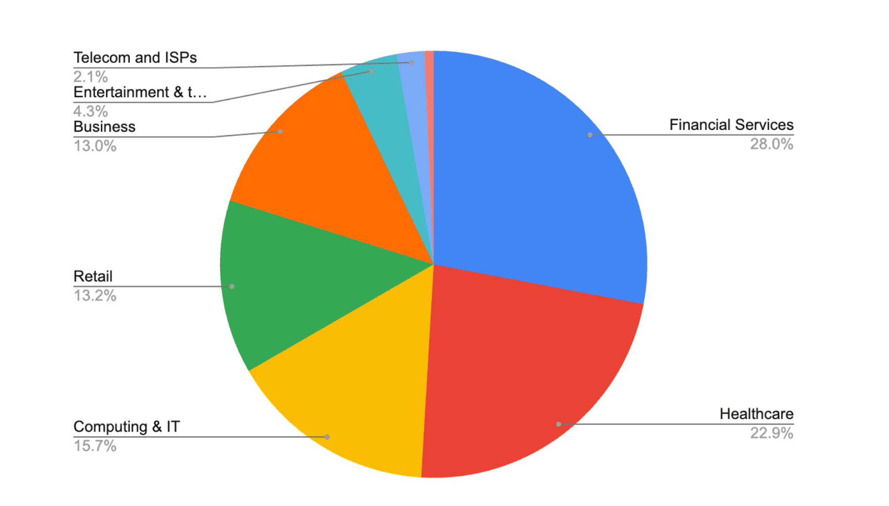

# Active Exploitation of Fastjson 1.x Zero-Day Remote Code Execution (CVE-2026-16723)

**CVE-2026-16723**{.cve-chip} **Fastjson 1.x Zero-Day**{.cve-chip} **Java Deserialization RCE**{.cve-chip} **Spring Boot Risk**{.cve-chip} **Active Exploitation**{.cve-chip}

## Overview

Security researchers observed active exploitation of a previously unknown vulnerability in Alibaba Fastjson 1.x, tracked as CVE-2026-16723, allowing remote code execution through crafted JSON payloads.

Early attack activity reportedly focused on U.S. organizations before broad mitigation and migration actions were in place.

## Technical Specifications

| **Attribute** | **Details** |
|---|---|
| **Vulnerability** | CVE-2026-16723 |
| **Affected Component** | Alibaba Fastjson 1.x JSON deserialization library |
| **Affected Versions** | Fastjson 1.2.68 through 1.2.83 (including final 1.x release) |
| **Primary Exposure Context** | Spring Boot applications packaged as executable fat JARs under specific deployment conditions |
| **Root Behavior** | Improper processing of attacker-controlled JSON during deserialization |
| **Exploit Prerequisites** | Does not require AutoType enabled and does not rely on third-party gadget chains |
| **Security Impact** | Arbitrary remote code execution with privileges of the Java process |
| **Observed Threat Posture** | In-the-wild exploitation against Internet-exposed targets |

## Affected Products

- Java applications using vulnerable Fastjson 1.x versions
- Spring Boot services that deserialize untrusted JSON input
- Internet-exposed API endpoints accepting attacker-controlled request bodies
- Enterprise environments where vulnerable application services run with elevated privileges

## Attack Scenario

1. Attackers identify publicly exposed Java services likely using vulnerable Fastjson 1.x builds.
2. A crafted HTTP request with a malicious JSON payload is sent to a vulnerable endpoint.
3. The application deserializes attacker-controlled content via Fastjson.
4. Vulnerable parsing logic triggers remote code execution.
5. Attackers establish persistence and perform follow-on actions such as malware staging, credential theft, lateral movement, or ransomware deployment.

## Impact Assessment

=== "Integrity"

    - Full application compromise enables tampering with business logic and server-side processes
    - Attackers can deploy web shells/backdoors and alter runtime behavior
    - Privilege escalation paths may allow broader host and domain control

=== "Confidentiality"

    - Exposure of application data, secrets, and credentials stored in process memory or configuration
    - Potential database compromise and large-scale data exfiltration
    - Token and key theft can lead to compromise of integrated upstream/downstream services

=== "Availability"

    - Service instability or outages due to malicious process execution
    - Ransomware or destructive payload deployment can cause prolonged downtime
    - Incident response containment can interrupt production API operations

## Mitigation Strategies

### Immediate Actions

- Upgrade to Fastjson 2.x wherever technically feasible
- If migration cannot be immediate, enable Fastjson SafeMode as a short-term hardening measure
- Restrict public exposure of vulnerable API endpoints and apply emergency access controls

### Short-term Measures

- Deploy WAF detections/rules for suspicious JSON deserialization patterns
- Audit dependency trees to locate direct and transitive Fastjson 1.x usage
- Remove or replace unnecessary Fastjson dependencies in affected services

### Monitoring & Detection

- Monitor logs for anomalous deserialization requests and unexpected object construction behavior
- Alert on unusual Java child-process creation, outbound callbacks, and command execution indicators
- Correlate endpoint, application, and network telemetry for post-exploitation movement attempts

### Long-term Solutions

- Standardize secure deserialization patterns and strict input validation across Java services
- Adopt software composition analysis and rapid dependency patch governance
- Run services under least-privilege accounts with segmented network access to reduce blast radius

## Resources and References

!!! info "Public Reporting"
    - [Hackers target US firms in FastJson RCE zero-day attacks](https://www.bleepingcomputer.com/news/security/hackers-target-us-firms-in-fastjson-rce-zero-day-attacks/)
    - [Fastjson 1.x RCE Vulnerability Targeted in Attacks With No Patched Available](https://thehackernews.com/2026/07/fastjson-1x-rce-vulnerability-targeted.html)

---

*Last Updated: July 28, 2026*
