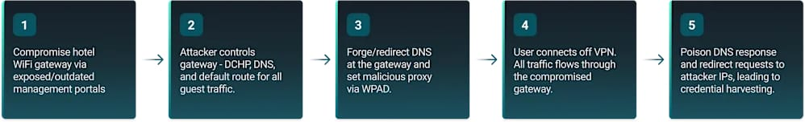

# Hotel Wi-Fi DNS Hijacking Campaign Targeting Microsoft 365 Accounts

**DNS Hijacking**{.cve-chip} **Public Wi-Fi Risk**{.cve-chip} **Microsoft 365 Phishing**{.cve-chip} **OAuth Device Flow Abuse**{.cve-chip} **BEC Exposure**{.cve-chip}

## Overview

Threat actors are compromising hotel and conference Wi-Fi gateways, modifying DNS settings, and redirecting Microsoft 365 authentication traffic to attacker-controlled phishing infrastructure.

The campaign targets travelers and enterprise users on public Wi-Fi, enabling theft of credentials and, in some cases, persistent access via OAuth device authorization workflows even when MFA is present.

## Technical Specifications

| **Attribute** | **Details** |
|---|---|
| **Primary Target** | Hotel and conference Wi-Fi gateways |
| **Likely Initial Access** | Exposed management interfaces (SSH/SNMP/web admin), weak or reused admin credentials |
| **Core Technique** | Gateway DNS hijacking for auth traffic redirection |
| **Phishing Infrastructure** | Domains reported include `m365-owa[.]com`, `owa-ms365[.]com`, `ms365-device[.]com`, `ms365-live[.]com` |
| **Credential Capture Path** | Fake Microsoft 365 login pages mimicking legitimate portals |
| **Persistence/Bypass Observed** | Abuse of Microsoft OAuth Device Code Flow in some cases |
| **Additional Technique** | WPAD abuse to push malicious proxy configuration (observed in some incidents) |
| **Primary Objective** | Account takeover and cloud-tenant access expansion |

## Affected Products

- Public/hospitality Wi-Fi gateway and captive-access infrastructure
- Microsoft 365 accounts used over untrusted networks
- Organizations with traveling staff and weak conditional access controls

## Attack Scenario

1. Attacker compromises a hotel or conference Wi-Fi gateway.
2. Administrative control is obtained via exposed services or weak credentials.
3. DNS settings are altered to redirect Microsoft 365 authentication traffic.
4. Victim connects to Wi-Fi and attempts normal Microsoft 365 login.
5. Victim is sent to attacker-controlled phishing pages and submits credentials.
6. Credentials and/or OAuth authorization artifacts are captured.
7. Attackers access Microsoft 365 resources and may pivot into broader Entra ID/Azure environments.

## Impact Assessment

=== "Integrity"

    - Unauthorized account use can alter mailbox rules, tenant settings, and collaboration artifacts
    - Attacker-controlled sessions may be used to stage internal phishing and trust abuse
    - Device registration and token abuse can establish durable unauthorized footholds

=== "Confidentiality"

    - Exposure of Outlook, OneDrive, SharePoint, Teams, and Exchange Online data
    - Theft of sensitive corporate communications and documents
    - Increased likelihood of BEC and targeted social engineering using trusted identities

=== "Availability"

    - Account lockouts and emergency response actions can disrupt normal business workflows
    - Tenant-wide containment (token revocation, access policy hardening) may cause temporary access friction
    - Follow-on compromise and lateral movement risks can impact operational continuity

## Mitigation Strategies

### Immediate Actions

- Enforce phishing-resistant MFA (FIDO2 security keys, passkeys, Windows Hello for Business)
- Restrict or disable OAuth Device Code Flow where unnecessary
- Investigate and contain suspicious account and token activity rapidly

### Short-term Measures

- Enforce always-on full-tunnel VPN for users on public Wi-Fi
- Enable DNS-over-HTTPS (DoH) or DNS-over-TLS where feasible
- Strengthen Microsoft Entra Conditional Access (trusted locations, device compliance, risk-based controls)

### Monitoring & Detection

- Monitor sign-in logs for impossible travel, abnormal geolocation, and unusual device registration
- Detect anomalous OAuth consent/device code behavior and long-lived token misuse
- Track suspicious authentication attempts tied to known phishing infrastructure patterns

### Long-term Solutions

- Harden and patch Wi-Fi gateway infrastructure; disable unnecessary exposed management interfaces
- Use strong unique administrative credentials with strict access control for network appliances
- Train travelers to validate login domains and avoid submitting credentials to unexpected prompts

## Resources and References

!!! info "Public Reporting"
    - [Hackers hijack hotel Wi-Fi DNS to steal Microsoft 365 accounts](https://www.bleepingcomputer.com/news/security/hackers-hijack-hotel-wi-fi-dns-to-steal-microsoft-365-accounts/)

---

*Last Updated: July 26, 2026*
