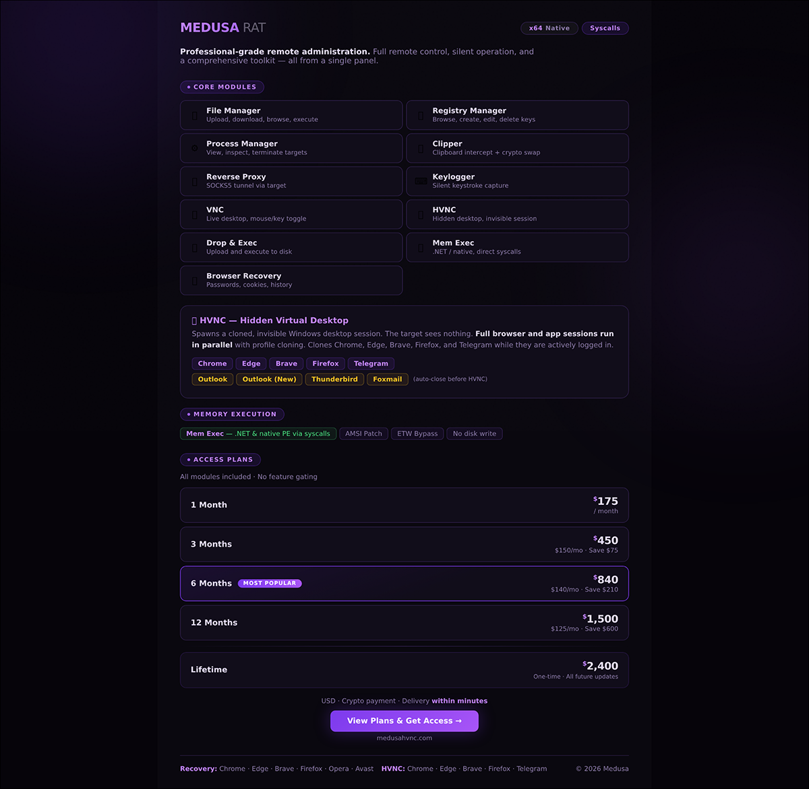
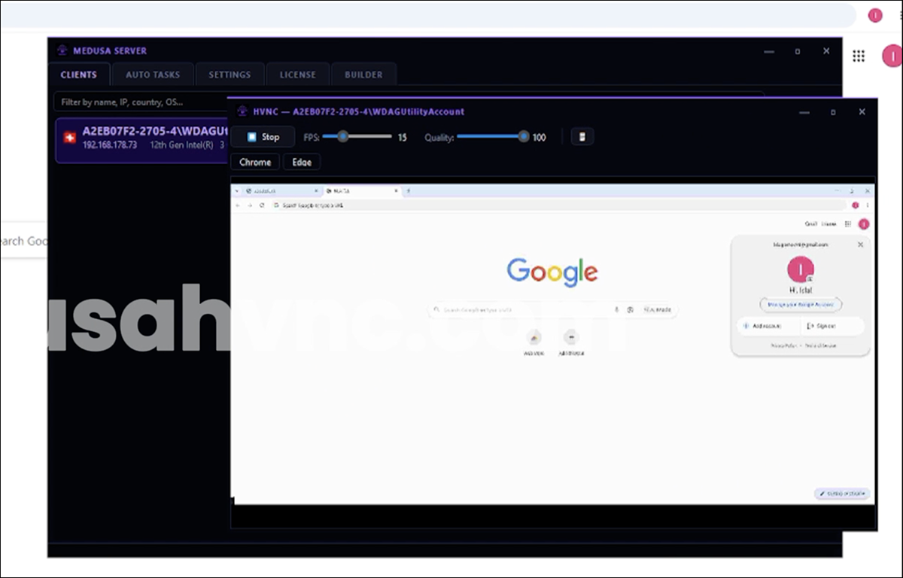

# MedusaHVNC - Hidden Desktop Remote Access Trojan (HVNC)

**HVNC Malware**{.cve-chip} **MaaS Threat**{.cve-chip} **Session Hijacking**{.cve-chip} **Browser Abuse**{.cve-chip} **Stealth Persistence**{.cve-chip}

## Overview

MedusaHVNC is an advanced Hidden Virtual Network Computing (HVNC) remote access trojan offered via a Malware-as-a-Service (MaaS) model.

It creates an invisible Windows desktop and launches legitimate browsers (Chrome, Edge, Firefox, and others) under the victim context, allowing attackers to abuse existing authenticated sessions while remaining hidden from the user.

## Technical Specifications

| **Attribute** | **Details** |
|---|---|
| **Execution Vector** | `wscript.exe` launching a malicious JScript loader |
| **Sandbox Evasion** | Approximate 7.5-second delayed execution before payload activity |
| **Drop Path** | `%TEMP%\Nx2981Okkr2\` |
| **Payload Handling** | Decrypts and loads payload components directly in memory |
| **Persistence** | Startup folder batch-script mechanism |
| **Stealth Mechanism** | Uses Windows Hidden Desktop APIs to create an invisible desktop |
| **Browser Abuse Model** | Launches legitimate browsers with victim's existing profile and session context |
| **Credential/Session Abuse** | Credential theft, cookie theft, active session hijacking, browser history extraction |
| **Additional Capability Set** | Telegram data theft, command execution, file upload/download, payload injection |
| **Defense Evasion** | AMSI and ETW bypass techniques |
| **C2 Operations** | Communication with attacker-controlled command-and-control infrastructure |

## Affected Products

- Windows endpoints where scripting execution is permitted
- User browser profiles containing active authentication sessions
- Enterprise SaaS and identity environments accessed from compromised endpoints
- Organizations exposed to malware-lure delivery via scripts or malicious attachments

## Attack Scenario

1. Victim executes a malicious attachment, script, or downloaded file.
2. Malware invokes `wscript.exe` to run a JScript loader.
3. Payload is extracted/decrypted from temporary storage and executed.
4. Persistence is established through Startup folder modification.
5. Malware creates an invisible hidden desktop session.
6. Legitimate browser processes start on the hidden desktop with the victim profile.
7. Attacker remotely controls hidden browser activity against email, banking, Microsoft 365, cloud services, and enterprise portals.
8. Credentials, cookies, sessions, and sensitive data are exfiltrated while the visible user desktop appears normal.

## Impact Assessment

=== "Integrity"

    - Unauthorized remote control of browser sessions can alter account settings and security controls
    - Attackers can execute additional commands and inject follow-on payloads
    - Compromised hosts may be staged for broader enterprise intrusion operations

=== "Confidentiality"

    - Theft of saved credentials, cookies, and active session tokens enables deep account compromise
    - MFA protections may be bypassed through session hijacking of already-authenticated browser contexts
    - Sensitive personal, financial, and enterprise data can be exfiltrated across cloud and SaaS platforms

=== "Availability"

    - Persistent unauthorized access can disrupt user and business operations over extended periods
    - Follow-on malware or ransomware deployment may cause service outages and system downtime
    - Incident response containment and credential reset efforts can temporarily reduce workforce productivity

## Mitigation Strategies

### Immediate Actions

- Isolate suspected infected systems and terminate malicious scripting/browser sessions
- Revoke active sessions and rotate credentials for impacted user and admin accounts
- Hunt for persistence artifacts in Startup folders and suspicious `%TEMP%` execution paths

### Short-term Measures

- Restrict or disable Windows Script Host (`wscript.exe`/`cscript.exe`) where not operationally required
- Monitor and alert on JScript/PowerShell execution and unusual script-child process chains
- Detect browser launches in non-interactive or hidden desktop contexts

### Monitoring & Detection

- Deploy EDR analytics for hidden desktop creation and stealth browser automation behavior
- Alert on AMSI/ETW tampering attempts and abnormal telemetry suppression patterns
- Monitor outbound C2-like traffic patterns and unusual data exfiltration behavior

### Long-term Solutions

- Enforce conditional access, device-compliance, and continuous-authentication controls for SaaS usage
- Harden endpoint baselines with least-privilege controls and controlled script execution policies
- Strengthen user awareness against untrusted attachments, loaders, and script-based lures

## Resources and References

!!! info "Public Reporting"
    - [MedusaHVNC Trojan Creates Hidden Desktops to Hijack Browsers and Steal Data](https://securityaffairs.com/196111/malware/medusahvnc-trojan-creates-hidden-desktops-to-hijack-browsers-and-steal-data.html)
    - [MedusaHVNC Malware Uses Hidden Windows Desktops to Evade Detection - SecurityWeek](https://www.securityweek.com/medusahvnc-malware-uses-hidden-windows-desktops-to-evade-detection/)
    - [MedusaHVNC: A Hidden Desktop That Steals Live Windows Sessions | BlackFog](https://www.blackfog.com/medusahvnc-a-hidden-desktop/)
    - [Behind Closed Doors: The Rise of Hidden Malicious Remote Access](https://www.cybereason.com/blog/behind-closed-doors-the-rise-of-hidden-malicious-remote-access)

---

*Last Updated: July 28, 2026*
