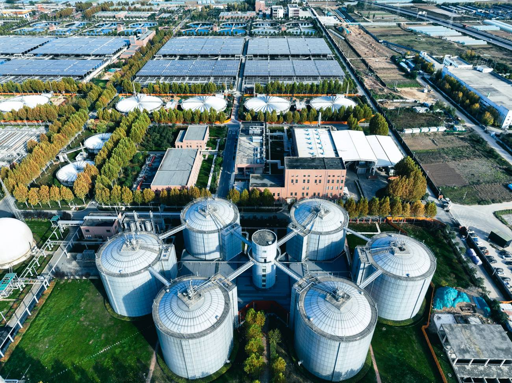

# Coordinated Cyberattack on Minnesota Municipal Water and Wastewater Utilities

**Critical Infrastructure**{.cve-chip} **Water Utility OT**{.cve-chip} **Coordinated Disruption**{.cve-chip} **Unauthorized Access**{.cve-chip} **SCADA/ICS Risk**{.cve-chip}

## Overview

Minnesota IT Services (MNIT) reported a coordinated cyberattack over Sunday and Monday that disrupted municipal water and wastewater operations in more than 30 communities across the state.

Communities ranged from smaller cities such as Braham to larger suburbs such as Plymouth, where automated systems supporting water plants, towers, and lift stations were temporarily impacted or taken offline during response actions.

## Technical Specifications

| **Attribute** | **Details** |
|---|---|
| **Primary Sector** | Municipal water and wastewater utilities |
| **Scope of Impact** | 30+ communities across Minnesota |
| **Observed Activity** | Unauthorized access with malicious intent directed at utility operating systems (per MNIT) |
| **Known Targeted Functions** | Automated operational controls for wells, treatment plants, towers, and lift stations |
| **Braham Event Detail** | Operating controls disrupted; well/treatment operations taken offline temporarily |
| **Plymouth Response Detail** | Affected equipment disconnected from networks to contain attack and prevent retargeting |
| **Publicly Confirmed Initial Vector** | Not disclosed at time of reporting |
| **Malware/Exploit Disclosure** | No confirmed public technical disclosure of specific malware family or exploit chain |
| **Attribution Status** | No official attribution confirmed |
| **Contextual Note** | Investigators reported similarities to other coordinated critical-infrastructure incidents, but specifics remain under investigation |

## Affected Products

- Municipal water and wastewater utility control environments
- SCADA/OT operations involving automated water and lift-station workflows
- Remote telemetry and cellular-linked utility communication paths (reported in some affected communities)
- Supporting IT/OT integrations that enable operational monitoring and control

## Attack Scenario

1. Unknown threat actors obtain unauthorized access to municipal utility operating environments.
2. Access impacts computerized control systems tied to water and wastewater operations.
3. Automated workflows are disrupted across affected communities.
4. In Braham, plant operating controls are shut down, temporarily taking well/treatment functions offline.
5. In Plymouth and other locations, utilities disconnect affected equipment to contain activity and prevent additional compromise.
6. Utilities move to manual operational modes while response teams restore and reconfigure impacted systems.
7. State and federal partners continue investigation, containment, and remediation while attribution remains unresolved.

## Impact Assessment

=== "Integrity"

    - Unauthorized access to utility operating systems threatens trust in control-plane integrity
    - Potential manipulation risk exists for configuration and control workflows in OT environments
    - Coordinated targeting across multiple communities indicates systemic adversary intent

=== "Confidentiality"

    - Public reporting does not confirm large-scale data theft details at this stage
    - However, compromise of utility operational environments may expose sensitive network and system information
    - Ongoing forensic analysis is needed to determine potential credential or configuration-data exposure

=== "Availability"

    - Automated water and wastewater operations were disrupted in over 30 communities
    - Manual fallback operations were required to maintain essential services
    - Temporary outages/operational limitations were reported, including reduced water-use advisories in affected areas

## Mitigation Strategies

### 1. Network and Access Hardening for Utility OT Systems

- Remove direct internet exposure of OT management interfaces where possible
- Enforce strong authentication, least privilege, and secure remote access controls
- Restrict administrative access paths to approved and monitored channels

### 2. Segmentation and Monitoring

- Segment IT and OT networks with strict inter-zone policy controls
- Continuously monitor for unauthorized remote access, abnormal commands, and lateral movement indicators
- Expand logging and alerting across SCADA, telemetry, and supporting infrastructure

### 3. Manual Fallback and Operational Continuity

- Maintain and regularly test manual operations for critical water/wastewater processes
- Validate emergency runbooks for rapid switchover from automated to manual control
- Conduct tabletop and live exercises for multi-site disruption scenarios

### 4. Government and Sector Coordination

- Strengthen threat-intelligence sharing between state agencies, utilities, and federal partners
- Establish rapid incident coordination channels across public safety, health, and infrastructure stakeholders
- Align local incident playbooks with CISA and sector-specific guidance

### 5. Risk Assessment and Vulnerability Studies

- Perform recurring OT risk assessments and external exposure reviews
- Audit cellular/remote connectivity pathways and legacy control assets
- Prioritize remediation of high-impact weaknesses in critical utility workflows

## Resources and References

!!! info "Public Reporting"
    - [Coordinated cyberattack disrupts water utilities in 30+ Minnesota communities](https://statescoop.com/coordinated-cyberattack-disrupts-water-utilities-in-30-minnesota-communities/)
    - [Minnesota IT officials disclose coordinated cyberattack at more than 30 local water systems](https://wkzo.com/2026/07/28/minnesota-it-officials-disclose-coordinated-cyberattack-at-more-than-30-local-water-systems/)
    - [Multiple Minnesota water utilities investigate coordinated cyberattack](https://www.waterworld.com/water-utility-management/news/55394026/multiple-minnesota-water-utilities-investigate-coordinated-cyberattack)
    - [30 Minnesota municipal water systems targeted in cyberattack](https://www.mprnews.org/story/2026/07/28/30-minnesota-municipal-water-systems-targeted-cyberattack)
    - [Cyberattack malware investigation after Braham water plant outage](https://www.cbsnews.com/minnesota/news/cyberattack-malware-braham-water-plant-outage/)
    - [Braham water plant offline after cyber incident](https://www.kare11.com/article/news/local/braham-water-plant-offline-residents-limit-water-use/89-f3dbab4f-cb72-44b0-adfa-fda923f94e7f)

---

*Last Updated: July 30, 2026*
