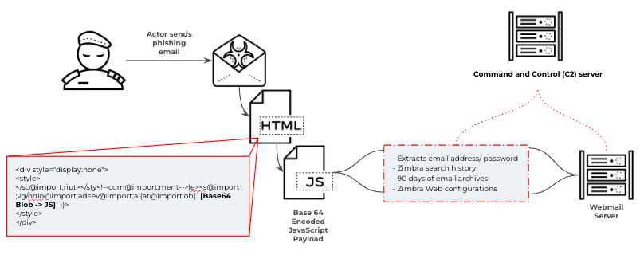

# Russian Espionage Group Exploited Zimbra Zero-Day (CVE-2025-66376) to Steal Emails

**CVE-2025-66376**{.cve-chip} **Zimbra Zero-Day**{.cve-chip} **Stored XSS**{.cve-chip} **Email Theft**{.cve-chip} **State-Sponsored Espionage**{.cve-chip}

## Overview

A Russian state-sponsored espionage group tracked as Laundry Bear (also known as Void Blizzard by Microsoft) exploited a zero-day flaw in Zimbra Collaboration Suite Classic Web UI to steal sensitive communications and account recovery data.

The vulnerability allows malicious JavaScript to run when a victim opens a crafted HTML email in an authenticated Zimbra web session, enabling mailbox and directory intelligence collection without traditional credential phishing.

## Technical Specifications

| **Attribute** | **Details** |
|---|---|
| **Vulnerability** | CVE-2025-66376 |
| **Type** | Stored Cross-Site Scripting (Stored XSS) |
| **Affected Component** | Zimbra Collaboration Suite Classic Web UI |
| **Attack Vector** | Crafted HTML email with CSS/JavaScript payload |
| **Trigger Model** | "Half-click" execution when victim opens email in Classic Web UI |
| **Privilege Required (attacker)** | None in victim environment before delivery |
| **Execution Context** | Victim's authenticated browser session |
| **Observed Objective** | Espionage-focused mailbox and identity data theft |

### Observed Post-Execution Capabilities

- Access mailbox content through authenticated Zimbra APIs
- Collect approximately 90 days of email data (reported)
- Steal contacts and address books
- Extract browser-saved authentication artifacts/credentials
- Capture 2FA recovery codes
- Enumerate organizational directory data
- Exfiltrate collected data to attacker-controlled infrastructure

## Affected Products

- Zimbra Collaboration Suite deployments using vulnerable Classic Web UI builds
- Organizations with users accessing untrusted HTML email content in Classic UI context
- High-value sectors handling diplomatic, government, or strategic communications via Zimbra

## Attack Scenario

1. Attacker crafts and delivers a malicious HTML email containing stored XSS payload elements.
2. Target user opens the message in Zimbra Classic Web UI.
3. Injected JavaScript executes inside the victim's active authenticated session.
4. Script abuses legitimate Zimbra APIs to pull mailbox, contact, and identity-recovery data.
5. Data is silently exfiltrated to attacker-controlled endpoints for ongoing intelligence collection.

## Impact Assessment

=== "Integrity"

    - Session-context script execution can abuse trusted application behavior
    - Mailbox and account settings may be altered depending on available session permissions
    - Compromised accounts can become persistence points for further espionage operations

=== "Confidentiality"

    - Unauthorized access to confidential email communications and contact networks
    - Exposure of authentication and account recovery material (including 2FA recovery codes)
    - Strategic intelligence leakage risk for government, diplomatic, and enterprise targets

=== "Availability"

    - Incident containment may require session invalidation, credential resets, and temporary service controls
    - Large-scale mailbox review and forensic response can impact normal communication workflows
    - Follow-on compromise risk can disrupt operations if remediation is delayed

## Mitigation Strategies

### Immediate Actions

- Apply Zimbra security updates addressing CVE-2025-66376 immediately
- Upgrade to supported Zimbra versions and reduce dependence on Classic Web UI where feasible
- Rotate credentials and regenerate recovery codes for potentially exposed users

### Short-term Measures

- Restrict or sanitize active HTML content in inbound email where operationally possible
- Invalidate active sessions and review suspicious mailbox/API activity post-patch
- Enforce MFA and verify account recovery workflows are tightly controlled

### Monitoring & Detection

- Monitor Zimbra API usage for abnormal bulk mailbox/contact access patterns
- Review authentication/session logs for unusual browser sessions and geographic anomalies
- Alert on suspicious outbound exfiltration patterns from mail access workflows

### Long-term Solutions

- Implement stronger content sanitization and script-execution controls in webmail interfaces
- Segment and harden high-value communication systems handling sensitive data
- Exercise incident response playbooks for webmail session abuse and account recovery compromise

## Resources and References

!!! info "Public Reporting"
    - [Russian Espionage Group Exploited Zimbra Zero-Day to Steal Mail and 2FA Codes](https://thehackernews.com/2026/07/russian-espionage-group-exploited.html)
    - [Russian hackers exploit Zimbra zero-click flaw for email theft](https://www.bleepingcomputer.com/news/security/russian-hackers-exploit-zimbra-zero-click-flaw-for-email-theft/)
    - [US and allies say Russian hackers stole emails without social engineering](https://www.reuters.com/legal/government/us-allies-say-russian-hackers-stole-emails-without-social-engineering-2026-07-23/)
    - [Russian Espionage Group Exploited Zimbra Zero-Day to Steal…](https://www.develeap.com/news/russian-espionage-group-exploited-zimbra-zero-day-to-steal-m-e6c08585/)

---

*Last Updated: July 26, 2026*
