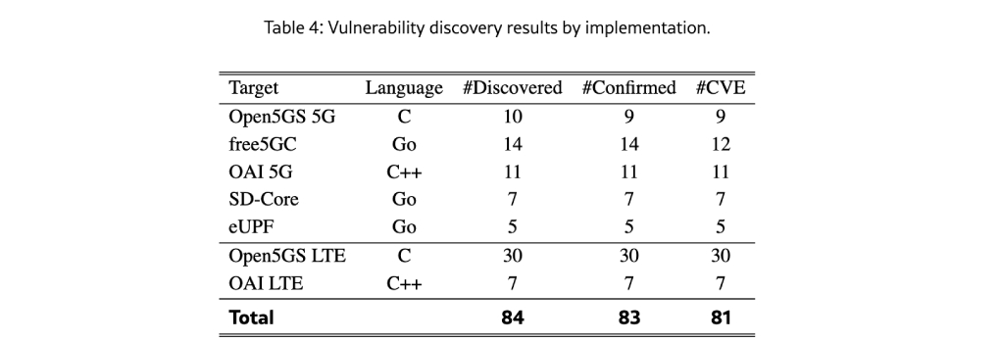
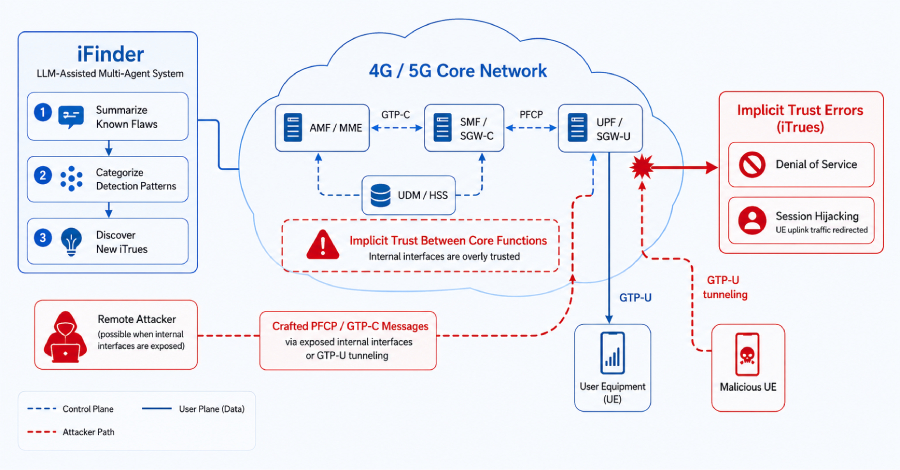
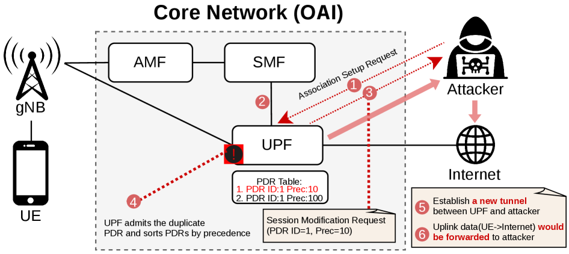

# 84 Vulnerabilities Discovered in Open-Source 4G LTE and 5G Core Network Implementations

**Telecom Core Security**{.cve-chip} **4G LTE**{.cve-chip} **5G Core (5GC)**{.cve-chip} **Protocol Exploitation**{.cve-chip} **Service Disruption Risk**{.cve-chip}

## Overview

Security researchers identified 84 previously unknown vulnerabilities across seven open-source 4G LTE and 5G Core (5GC) implementations. The flaws impact core network functions responsible for subscriber authentication, mobility handling, and session management.

Although the vulnerabilities do not directly target end-user smartphones, successful exploitation in vulnerable deployments may cause service outages, session manipulation, and broad telecom operational disruption.

## Technical Specifications

| **Attribute** | **Details** |
|---|---|
| **Issue Scope** | 84 newly discovered vulnerabilities across seven open-source LTE/5G core implementations |
| **Affected Domain** | 4G LTE EPC and 5G Core control/user plane components |
| **Vulnerability Classes** | Improper input validation, protocol state-machine errors, memory-safety bugs, and logic flaws |
| **Impacted Network Functions** | AMF, SMF, UPF, LTE MME, and related signaling/session components |
| **Potential Trigger Vectors** | Crafted NGAP, NAS, GTP, and related signaling messages |
| **Possible Outcomes** | Process crashes, invalid protocol state transitions, unauthorized session manipulation |
| **Exposure Prerequisite** | Internal access to telecom core/private 5G network or externally reachable signaling interface via misconfiguration |
| **Primary Risk Surface** | Cloud-native and virtualized open-source telecom core deployments |

## Affected Products

- Open-source 4G LTE and 5G Core implementations containing vulnerable protocol-handling logic
- Private LTE/5G enterprise environments with insufficient segmentation or signaling exposure
- Telecom operators and integrators using unpatched open-source core components
- Critical infrastructure workloads dependent on private mobile core service availability

## Attack Scenario

1. An attacker gains access to an internal telecom/private 5G environment or reaches an exposed signaling endpoint.
2. The attacker sends malformed or specially crafted signaling traffic to vulnerable core services.
3. Protocol parsing or state-management flaws are triggered in target network functions.
4. Core processes crash, enter inconsistent states, or mishandle subscriber sessions.
5. The attacker causes subscriber disconnects, service interruption, or session-level manipulation at scale.

## Impact Assessment

=== "Integrity"

    - Unauthorized session manipulation can alter expected control-plane behavior
    - State-machine flaws may allow invalid protocol transitions and policy bypass effects
    - Trust in signaling workflows is weakened when crafted traffic drives core logic anomalies

=== "Confidentiality"

    - Session manipulation paths may expose subscriber session context in some deployments
    - Control-plane weakness can increase risk of unauthorized visibility into signaling metadata
    - Misconfigured environments may leak operational information during exploit attempts

=== "Availability"

    - DoS against AMF/SMF/UPF/MME components can disrupt voice/data services
    - Large-scale subscriber disconnections can occur under coordinated signaling abuse
    - Enterprise and critical-infrastructure networks relying on private LTE/5G can suffer broad outages

## Mitigation Strategies

### Immediate Actions

- Apply patches and advisories from affected open-source projects
- Restrict access to signaling and management interfaces
- Block unnecessary external exposure of core network endpoints

### Short-term Measures

- Segment core network components and enforce strict east-west controls
- Deploy telecom-aware firewalls and ACLs around control/user-plane functions
- Validate secure default configurations for cloud-native telecom deployments

### Monitoring & Detection

- Monitor signaling traffic for malformed/anomalous NGAP, NAS, GTP patterns
- Alert on repeated protocol errors, crash loops, and abnormal subscriber detach events
- Conduct continuous vulnerability assessments and protocol-focused fuzzing

### Long-term Solutions

- Maintain rigorous patch governance for telecom core components and dependencies
- Integrate secure SDLC testing for protocol parsers and state-machine logic
- Perform recurring architecture reviews for private LTE/5G and virtualized core environments

## Resources and References

!!! info "Public Reporting"
    - [Researchers Report 84 Flaws in 4G and 5G Cores, Including a Session Hijacking Flaw](https://thehackernews.com/2026/07/researchers-report-84-flaws-in-4g-and.html)
    - [84 New 5G Core Vulnerabilities — and Why This Is Just the Beginning](https://www.cyberdelegate.com/84-new-5g-core-vulnerabilities-and-why-this-is-just-the-beginning/)

---

*Last Updated: August 2, 2026*
