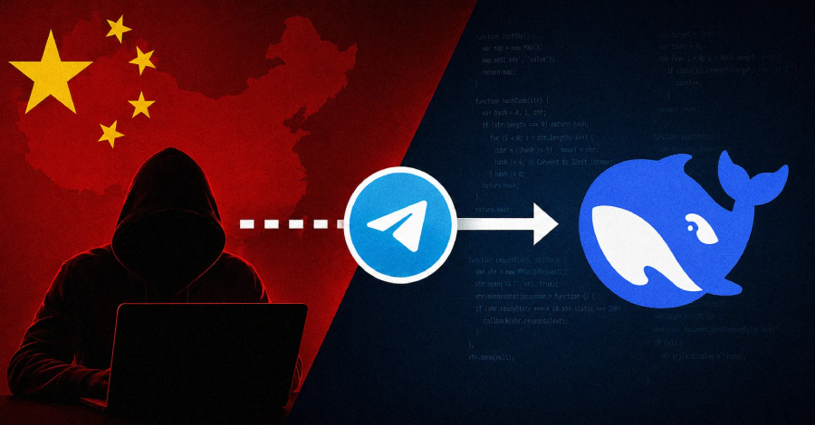
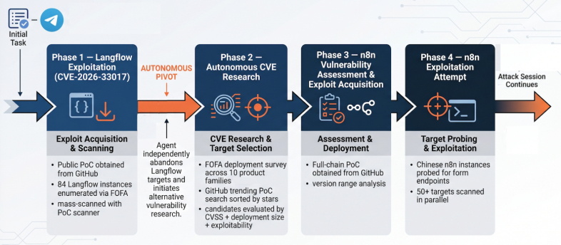

# Chinese Hacker Uses DeepSeek AI Agent via Hermes Framework for Autonomous Cyberattacks

**AI-Enabled Offensive Ops**{.cve-chip} **DeepSeek**{.cve-chip} **Hermes Agent**{.cve-chip} **Telegram C2**{.cve-chip} **Automated Exploitation**{.cve-chip}

## Overview

Palo Alto Networks Unit 42 reported an exposed Hermes Agent instance operated by a Chinese-speaking threat actor tracked as knaithe (KnYuan). The operator integrated the DeepSeek large language model with Hermes and Telegram to automate reconnaissance, vulnerability research, exploit retrieval, and parts of post-compromise workflow.

The incident demonstrates how AI agents can reduce attacker workload and accelerate operational tempo in real-world intrusion attempts.

## Technical Specifications

| **Attribute** | **Details** |
|---|---|
| **Threat Actor** | knaithe (KnYuan) |
| **AI Model** | DeepSeek |
| **Automation Framework** | Hermes Agent |
| **Operator Control Channel** | Telegram |
| **Exposure Finding** | Server exposed conversation logs, API keys, execution logs, exploit artifacts, and operational data |
| **Recon Sources** | Internet-exposure discovery platforms such as FOFA |
| **Targeted Technologies Observed** | Langflow, n8n, Citrix NetScaler and other exposed services |
| **Automated Steps** | Vulnerability lookup, exploit code retrieval, exploitation attempts, payload upload, privilege escalation attempts |
| **Operational Constraint** | Some attack chains failed due to auth barriers/environment mismatch and required manual intervention |

## Affected Products

- Internet-exposed enterprise services with known vulnerabilities
- Administrative interfaces lacking strong access controls
- Organizations vulnerable to automated exploit probing at scale
- Environments where operator + AI-agent hybrid workflows can rapidly test multiple targets

## Attack Scenario

1. The operator issues high-level tasking via Telegram.
2. Hermes Agent forwards objectives to DeepSeek.
3. The AI agent conducts reconnaissance for exposed internet services.
4. It maps candidate vulnerabilities and retrieves public exploit code.
5. The framework attempts exploitation and post-exploitation actions autonomously.
6. If initial compromise succeeds, the human operator performs advanced manual actions such as memory access, cookie theft, and active session hijacking.

## Impact Assessment

=== "Integrity"

    - AI-assisted workflows can accelerate exploit testing against many targets
    - Automated payload staging increases speed of attacker iteration and adaptation
    - Hybrid human-plus-agent operations improve persistence of offensive campaigns

=== "Confidentiality"

    - Successful compromise can expose credentials, authentication tokens, and sensitive data
    - Session hijacking and cookie theft can bypass standard login protections
    - Reconnaissance automation increases probability of finding weakly protected assets

=== "Availability"

    - Automated exploitation at scale can increase operational pressure on exposed services
    - Repeated probing and exploit attempts may degrade service stability
    - Incident response load grows as defenders handle faster campaign cycles

## Mitigation Strategies

### Immediate Actions

- Patch internet-facing applications promptly
- Minimize exposure of administrative interfaces to the public internet
- Enforce strong authentication, including MFA, for privileged access paths

### Short-term Measures

- Detect and throttle automated reconnaissance and exploit traffic patterns
- Restrict outbound connectivity and permissions for internal automation platforms
- Apply least-privilege controls for AI agents and orchestration frameworks

### Monitoring & Detection

- Continuously monitor logs for unusual automated or AI-assisted attack behavior
- Alert on exploit-chain indicators tied to Langflow, n8n, Citrix NetScaler, and similar exposed services
- Track suspicious Telegram bot or messaging-platform operational automation patterns

### Long-term Solutions

- Run recurring vulnerability scanning and threat hunting on externally exposed assets
- Build defense playbooks for AI-enabled adversary tradecraft and human-agent handoff activity
- Integrate threat intelligence on emerging autonomous offensive tooling ecosystems

## Resources and References

!!! info "Public Reporting"
    - [Chinese Hacker Commands DeepSeek via Telegram to Launch Autonomous Attacks](https://thehackernews.com/2026/07/chinese-hacker-commands-deepseek-via.html)

---

*Last Updated: August 2, 2026*
