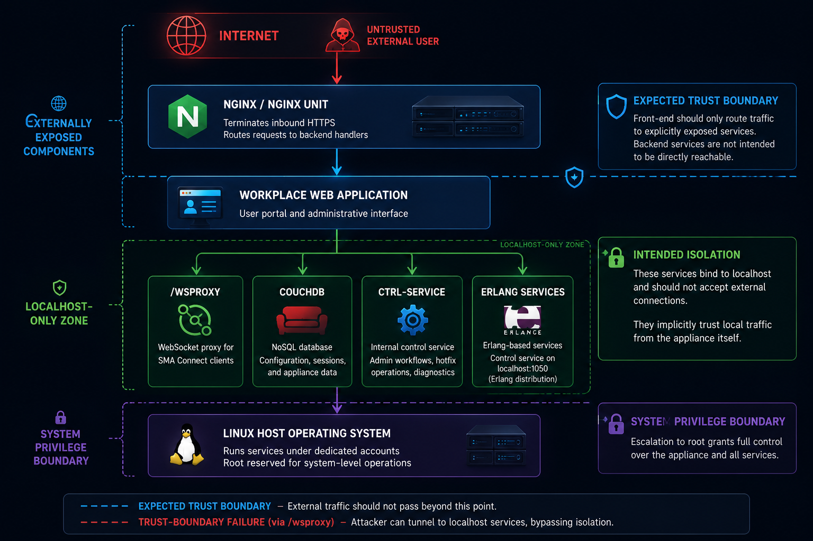

# INC Ransomware Emerges as Dominant Ransomware Threat

**Ransomware-as-a-Service**{.cve-chip} **Cross-Platform Encryption**{.cve-chip} **Double Extortion**{.cve-chip} **BYOVD Evasion**{.cve-chip} **Enterprise Disruption**{.cve-chip}

## Overview

Researchers report that the INC ransomware operation has become one of the most active ransomware threats in 2026.

Since emerging in 2023, the group has claimed more than 830 victims globally and is associated with exploitation of known vulnerabilities, remote-access compromise, data theft, and encryption of Windows, Linux, and VMware ESXi environments.

## Technical Specifications

| **Attribute** | **Details** |
|---|---|
| **Operating Model** | Ransomware-as-a-Service (RaaS) |
| **Malware Implementation** | Rewritten in Rust for broad/cross-platform support |
| **Primary Targets** | Windows, Linux, and VMware ESXi systems |
| **Initial Access Paths** | Phishing, stolen credentials, exploitation of internet-facing services |
| **Exploitation Examples Reported** | Citrix NetScaler, Fortinet EMS, SimpleHelp |
| **Credential Access** | Credential dumping, including theft of Veeam backup credentials |
| **Lateral Movement Tooling** | RDP, PsExec, AnyDesk, ScreenConnect, TeamViewer, Cobalt Strike |
| **Defense Evasion** | Bring Your Own Vulnerable Driver (BYOVD) to disable security controls |
| **Data Exfiltration Method** | Rclone-based staging/exfiltration before encryption |
| **Encryption Behavior** | Supports partial encryption, multithreading, and command-line deployment options |

## Affected Products

- Enterprise endpoints and servers running Windows and Linux
- VMware ESXi virtualization hosts and attached workloads
- Internet-facing remote access and management appliances/services
- Backup infrastructure, including Veeam environments and credential stores

## Attack Scenario

1. Threat actors gain initial access via phishing, stolen credentials, or exploitation of vulnerable remote services.
2. Privileges are escalated and credentials are harvested from AD and backup systems.
3. Lateral movement occurs through legitimate administration tools to blend with normal activity.
4. BYOVD techniques are used to weaken or disable security tooling.
5. Sensitive data is exfiltrated (often via Rclone) before encryption begins.
6. Windows, Linux, and ESXi assets are encrypted in a coordinated operation.
7. Operators demand ransom while threatening publication of stolen data (double extortion).

## Impact Assessment

=== "Integrity"

    - Broad administrative compromise enables unauthorized system and policy changes
    - Attackers can tamper with backup workflows to reduce recovery options
    - Security control degradation via BYOVD increases attacker freedom of action

=== "Confidentiality"

    - Double-extortion operations expose sensitive internal, customer, and partner data
    - Credential theft can lead to persistent unauthorized access beyond initial containment
    - Stolen backup credentials increase risk of wider data compromise

=== "Availability"

    - Multi-platform encryption can halt business-critical services across environments
    - ESXi targeting can impact many workloads simultaneously, increasing downtime
    - Recovery operations are costly, lengthy, and may require staged rebuilds

## Mitigation Strategies

### Immediate Actions

- Patch internet-facing services and appliances promptly, prioritizing known exploited paths
- Enforce MFA for all remote access and privileged administration workflows
- Restrict exposure and usage of remote administration tools to approved, monitored cases

### Short-term Measures

- Harden and isolate backup infrastructure, especially Veeam-related systems
- Monitor for credential dumping indicators and anomalous authentication patterns
- Detect or block known vulnerable drivers to reduce BYOVD effectiveness

### Monitoring & Detection

- Deploy EDR/XDR with behavior-focused detections for lateral movement and ransomware staging
- Monitor outbound traffic for unusual bulk transfers and Rclone-like exfiltration behavior
- Alert on suspicious use of dual-use admin tooling across non-standard hosts or time windows

### Long-term Solutions

- Maintain offline/immutable backups and routinely validate full restoration procedures
- Apply network segmentation and least-privilege access controls across IT/OT/virtualization layers
- Institutionalize ransomware-specific incident response exercises and rapid containment playbooks

## Resources and References

!!! info "Public Reporting"
    - [INC Ransomware Emerges as Dominant Actor Exploiting SonicWall SMA 1000 Flaws](https://thehackernews.com/2026/08/inc-ransomware-emerges-as-dominant.html)

---

*Last Updated: August 4, 2026*
