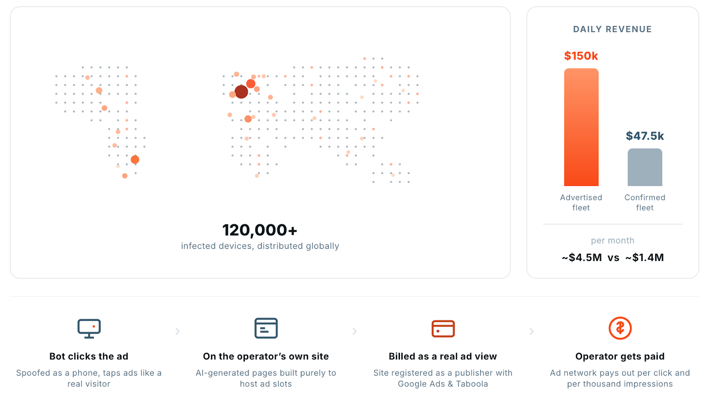
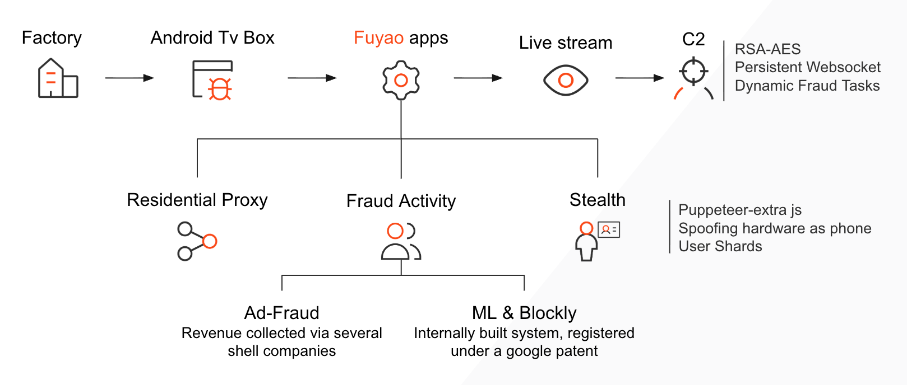

# Fuyao Android TV Box Malware Campaign

**Supply-Chain Malware**{.cve-chip} **Android TV Boxes**{.cve-chip} **Ad Fraud**{.cve-chip} **SOCKS5 Proxy Abuse**{.cve-chip} **Residential IP Exploitation**{.cve-chip}

## Overview

Bitsight researchers uncovered a large-scale malware campaign known as Fuyao involving low-cost Android TV boxes infected before reaching end users. The malware disguises affected devices as legitimate Android smartphones, executes ad-fraud operations, and converts victim internet connections into residential SOCKS5 proxy infrastructure used by cybercriminals.

Because infection occurs in the manufacturing or supply-chain stage, users may be compromised immediately after connecting the device online.

## Technical Specifications

| **Attribute** | **Details** |
|---|---|
| **Campaign Name** | Fuyao |
| **Infection Stage** | Pre-installed during manufacturing/supply chain |
| **Primary Device Class** | Low-cost Android TV boxes |
| **Identity Spoofing Method** | System property tampering (including build.prop and related properties) |
| **Impersonated Brands** | Samsung, Huawei, Xiaomi, Vivo (and similar smartphone profiles) |
| **C2 Behavior** | Connects to remote command-and-control infrastructure for tasking |
| **Malicious Functions** | Automated ad requests, fake impressions, click fraud, SOCKS5 proxy exposure |
| **Stealth Technique** | Monitors HDMI connection state and adapts behavior to reduce suspicion |
| **Operational Advantage for Attackers** | Uses residential victim IPs to evade IP-based detection and blocking |

## Affected Products

- Inexpensive Android TV boxes distributed through untrusted or weakly vetted supply chains
- Home and small-office networks where infected TV devices operate continuously
- Ad ecosystems impacted by fraudulent traffic generated from spoofed device identities
- Organizations exposed to abuse originating from compromised residential proxy endpoints

## Attack Scenario

1. A user purchases a low-cost Android TV box.
2. The device is already infected before shipment.
3. Once connected to the internet, malware contacts C2 infrastructure.
4. The malware spoofs the device identity to appear as a mainstream smartphone.
5. It performs ad fraud and/or exposes a SOCKS5 proxy service.
6. Attackers route malicious traffic through the victim's public IP while the victim remains unaware.

## Impact Assessment

=== "Integrity"

    - Device identity spoofing undermines trust in endpoint attribution and telemetry
    - Persistent malware control enables continued misuse without user awareness
    - Compromised IoT supply chains reduce confidence in firmware/device provenance

=== "Confidentiality"

    - Victim network metadata may be exposed through proxy and C2 operations
    - Residential proxy abuse can support credential attacks, phishing, scraping, and account takeover campaigns
    - Traffic relay can indirectly expose household network usage patterns

=== "Availability"

    - Increased bandwidth usage can degrade home/office network performance
    - Abuse can lead to IP reputation damage, throttling, or service blocks
    - Network congestion and persistent background activity reduce quality of service

## Mitigation Strategies

### Immediate Actions

- Purchase Android TV devices only from reputable vendors and authorized distributors
- Avoid uncertified or unusually inexpensive Android TV box models
- Replace devices suspected of factory pre-infection when trustworthy remediation is not possible

### Short-term Measures

- Keep firmware updated using official vendor channels only
- Segment IoT devices to isolated VLANs or guest networks
- Block known malicious C2 destinations and suspicious proxy traffic patterns

### Monitoring & Detection

- Monitor outbound traffic for unexpected persistent connections and SOCKS5 activity
- Use DNS filtering and network intrusion detection to detect suspicious behavior
- Track unusual ad-traffic patterns and high-volume background communications

### Long-term Solutions

- Enforce supply-chain security validation for IoT procurement and onboarding
- Maintain asset inventories and baseline behavior profiles for connected devices
- Integrate threat intelligence on botnet/proxy infrastructure linked to preloaded malware campaigns

## Resources and References

!!! info "Public Reporting"
    - [Cheap Android TV Boxes Pose as Phones and Turn Owners' Broadband Into Proxies](https://thehackernews.com/2026/07/cheap-android-tv-boxes-pose-as-phones.html)

---

*Last Updated: August 2, 2026*
