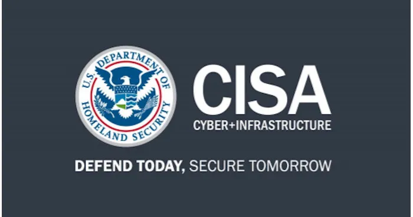

# CISA Urgent PLC Exposure Alert After Coordinated OT Attacks on Minnesota Water Systems

**Water Sector OT**{.cve-chip} **PLC Exposure Risk**{.cve-chip} **CISA/FBI Alerting**{.cve-chip} **Critical Infrastructure**{.cve-chip} **Coordinated Disruption**{.cve-chip}

## Overview

Following coordinated July 26-27 attacks that disrupted OT operations across more than 30 Minnesota community water utilities, CISA urged operators to remove PLCs and other OT assets from direct internet exposure and harden remote-access pathways.

Minnesota IT Services (MNIT) activated a statewide cyber incident-response effort that remains active while federal and state partners continue investigation, restoration support, and attribution analysis.

## Technical Specifications

### Minnesota OT Attack Context

- Coordinated disruption impacted 30+ community water systems, including Braham, Maple Plain, Plymouth, and South St. Paul.
- In Braham, computerized controls for well/treatment operations were disabled, forcing manual operations.
- Incident pattern showed simultaneous or closely timed OT-impacting activity across multiple municipalities.

### Threat Actors and Advisory Background

- CISA expanded its April 2026 advisory on Iranian-affiliated targeting of internet-exposed PLCs.
- Advisory scope initially emphasized Rockwell Automation controllers and later included Schneider Electric and Siemens assets.
- External assessments (including Tenable) noted alignment with CyberAv3ngers tradecraft, but no formal attribution has been publicly announced by state or federal authorities.

### CVE-2021-22681 - Rockwell MicroLogix 1400

| **Attribute** | **Details** |
|---|---|
| **CVE** | CVE-2021-22681 |
| **Affected Technology** | Rockwell MicroLogix 1400 PLCs |
| **Severity** | CVSS 9.8 (Critical) |
| **Patch Status** | No vendor security patch available |
| **Operational Relevance** | Exploited by Iranian-affiliated actors since March 2026; added to CISA KEV catalog |
| **Primary Risk** | Unauthorized remote access/control of exposed controllers |

### Observed PLC Attack Behaviors

- Threat actors target internet-facing PLCs and related OT interfaces with weak/default credentials.
- Common actions include credential/IP changes that lock out operators and disrupt SCADA/HMI visibility.
- FBI reporting indicates PLC-related utility incidents across at least seven U.S. states.

### Project-File Theft and Code Tampering

- CISA July 2026 updates note expansion to Schneider and Siemens-focused activity.
- For the first time, reporting includes PLC project-file exfiltration and tampering with reusable code modules.
- Documented behaviors include disabling safety alarms to reduce operator visibility into malicious changes.

## Affected Products

- Internet-exposed PLCs in water and wastewater OT environments
- SCADA/HMI systems dependent on stable controller communications
- Rockwell MicroLogix 1400 devices exposed to CVE-2021-22681-related risk
- Schneider Electric and Siemens controller ecosystems mentioned in expanded advisory context

## Attack Scenario

1. Utility PLCs remain directly reachable from the internet, sometimes via undocumented cellular links.
2. Weak/default credentials or known vulnerabilities provide remote footholds.
3. Threat actors alter PLC passwords/IP settings, causing operator lockout and OT monitoring disruption.
4. On applicable Rockwell MicroLogix 1400 deployments, CVE-2021-22681 may enable direct unauthorized control.
5. In advanced operations, attackers exfiltrate project files, study logic, and modify code modules.
6. Safety alarms or control logic are manipulated, increasing the risk of delayed detection and broader operational impact.
7. Utilities shift to manual operations while containment and forensic response proceed.

## Impact Assessment

=== "Integrity"

    - Unauthorized PLC changes can alter process logic, safety controls, and operational setpoints
    - Project-file tampering introduces risk of persistent and reusable malicious logic across facilities
    - Coordinated targeting degrades trust in municipal OT control environments

=== "Confidentiality"

    - Exfiltrated project files expose engineering logic and infrastructure design details
    - Potential exposure of credentials and configuration artifacts increases follow-on attack risk
    - Utility-specific OT architecture intelligence can be reused in future campaigns

=== "Availability"

    - Loss of automated control forces manual operation and can trigger service advisories
    - Multi-community disruptions increase restoration complexity and response load
    - Prolonged lockout conditions can affect treatment continuity and utility resilience

## Mitigation Strategies

### Disconnect PLCs and OT from Direct Internet Exposure

- Remove public reachability of PLCs and OT systems as an urgent priority.
- Route remote operations through secured VPN/gateway architectures, not direct controller access.

### Harden Authentication and Access Control

- Change default credentials and enforce strong password controls across OT assets.
- Apply IP allowlisting for remote engineering access and trusted management endpoints.
- Require MFA for remote/vendor access where operationally feasible.

### Segment OT and IT Networks

- Enforce strict OT/IT segmentation with minimal, controlled cross-zone pathways.
- Validate external connectivity paths, including undocumented cellular modems and third-party integrator links.

### Backups and Recovery Readiness

- Maintain known-clean PLC images, configurations, and engineering project backups.
- Test recovery workflows for lockout and unauthorized-change scenarios.
- For MicroLogix 1400 lockouts, follow Rockwell restoration guidance for unknown-password recovery.

### Audit and Continuous Assessment

- Audit internet-exposed OT assets, credential posture, and remote-access configurations regularly.
- Continuously monitor for anomalous PLC communication, unauthorized logic changes, and alarm suppression patterns.
- Align response procedures with CISA/FBI advisories and sector-specific incident playbooks.

## Resources and References

!!! info "Public Reporting"
    - [CISA urges utilities to remove internet-exposed PLCs after Minnesota attacks](https://securityaffairs.com/196453/ics-scada/cisa-urges-utilities-to-remove-internet-exposed-plcs-after-minnesota-attacks.html)
    - [CISA warns water utilities to remove internet-exposed PLCs](https://cyberogz.com/News/cisa-warns-water-utilities-to-remove-internet)
    - [CISA warns hackers are targeting water utilities](https://thenextweb.com/news/cisa-warns-hackers-targeting-water-utilities)
    - [CISA cybersecurity advisories portal](https://www.cisa.gov/news-events/cybersecurity-advisories)

---

*Last Updated: August 3, 2026*
