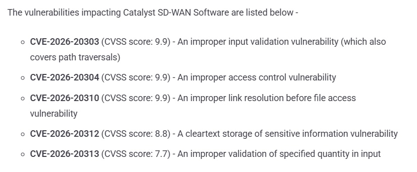

# Cisco Catalyst SD-WAN & IOS XE Security Vulnerabilities - 12 CVEs

**Cisco SD-WAN**{.cve-chip} **Cisco IOS XE**{.cve-chip} **Multi-CVE Advisory**{.cve-chip} **Management-Plane Risk**{.cve-chip} **Network Infrastructure Security**{.cve-chip}

## Overview

Cisco disclosed and patched 12 security vulnerabilities affecting Cisco Catalyst SD-WAN and Cisco IOS XE Software. The flaw set includes improper access control, path traversal, command injection, buffer overflow, resource-management issues, and input-validation weaknesses.

The most severe issues could enable unauthorized access, command execution, or broader compromise of network infrastructure. Cisco reported no known active exploitation of these 12 vulnerabilities at the time of disclosure.

## Technical Specifications

| **Attribute** | **Details** |
|---|---|
| **Total Vulnerabilities** | 12 CVEs across Catalyst SD-WAN and IOS XE |
| **Catalyst SD-WAN CVEs** | CVE-2026-20303, CVE-2026-20304, CVE-2026-20310, CVE-2026-20312, CVE-2026-20313 |
| **Highest SD-WAN Scores** | CVE-2026-20303, CVE-2026-20304, CVE-2026-20310 rated CVSS 9.9 |
| **IOS XE CVEs** | CVE-2026-20267 through CVE-2026-20273 |
| **Highest IOS XE Score** | CVE-2026-20272 rated CVSS 9.8 (command/OS/argument injection) |
| **Vulnerability Classes** | Improper access control, path traversal, command injection, buffer overflow/out-of-bounds write, resource/control-flow/input-validation weaknesses |
| **Primary Attack Surface** | Reachable management and control-plane components |
| **Known Exploitation at Disclosure** | Cisco reported no known active exploitation |

## Affected Products

- Cisco Catalyst SD-WAN deployments running vulnerable fixed-release predecessors
- Cisco IOS XE Software instances affected by CVE-2026-20267 to CVE-2026-20273
- Organizations exposing management/control interfaces beyond trusted admin boundaries
- Multi-site environments dependent on centralized SD-WAN control-plane integrity

## Attack Scenario

1. An attacker targets a vulnerable and reachable management/control-plane component.
2. Exploitation is attempted through crafted input, path manipulation, unauthorized access, or command-injection vectors, depending on CVE path.
3. A successful exploit provides unauthorized access to sensitive resources or execution capability on network infrastructure.
4. If SD-WAN control components are compromised, attackers may influence branch connectivity, routing decisions, policy enforcement, or configuration state across multiple sites.

## Impact Assessment

=== "Integrity"

    - Unauthorized configuration changes can alter routing, segmentation, and policy behavior
    - Control-plane compromise can propagate harmful changes across centrally managed sites
    - Tampering risk increases where privileged interfaces are broadly reachable

=== "Confidentiality"

    - Unauthorized access may expose sensitive operational/network configuration data
    - Management-plane compromise can reveal credentials, topology details, or policy artifacts
    - Broader SD-WAN visibility may aid follow-on internal targeting

=== "Availability"

    - Exploitation may disrupt connectivity or degrade network control-plane stability
    - Misconfiguration or malicious policy pushes can impact service availability at branch scale
    - Incident response and emergency upgrades can introduce short-term operational interruptions

## Mitigation Strategies

### Immediate Actions

- Upgrade immediately to Cisco fixed software releases for all affected SD-WAN and IOS XE deployments
- Inventory deployed versions and map exposure against Cisco advisory guidance
- Prioritize upgrades on internet-adjacent and high-privilege management-plane systems

### Short-term Measures

- Restrict management-interface access to trusted admin networks and VPN-only paths
- Enforce network segmentation and least-privilege administrative access controls
- Harden authentication and session controls for all administrative workflows

### Monitoring & Detection

- Monitor admin activity, configuration changes, and routing/policy modifications
- Alert on suspicious management-plane connections and unusual command activity
- Review logs for signs of unauthorized access attempts and failed exploit patterns

### Long-term Solutions

- Maintain recurring patch-governance cycles for network infrastructure software
- Implement proactive exposure-management for control-plane interfaces
- Integrate Cisco advisory monitoring into vulnerability-management and change-control processes

## Resources and References

!!! info "Public Reporting"
    - [Cisco Patches 12 SD-WAN and IOS XE Flaws, Including Three 9.9 CVSS Score Bugs](https://thehackernews.com/2026/08/cisco-patches-12-sd-wan-and-ios-xe.html)

---

*Last Updated: August 9, 2026*
