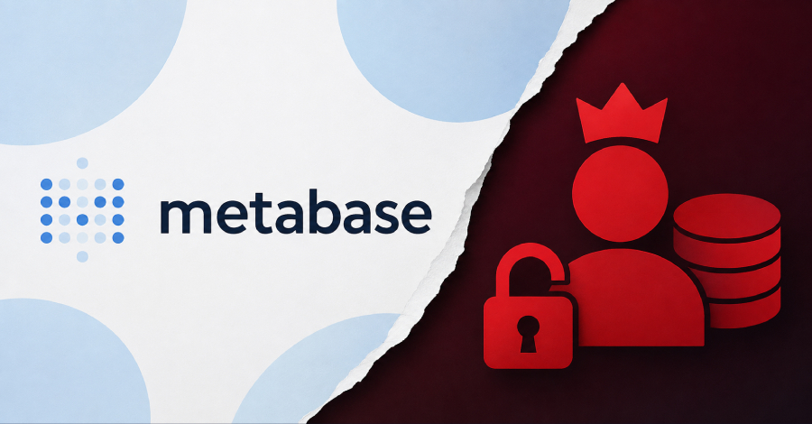
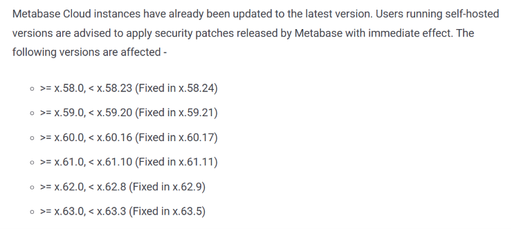

# Metabase Zero-Day Exploited in Wild Allows Admin Access Without Authentication

**Metabase SQL Injection**{.cve-chip} **Unauthenticated Attack Path**{.cve-chip} **Admin Takeover Risk**{.cve-chip} **Data Exposure**{.cve-chip} **BI Platform Security**{.cve-chip}

## Overview

Metabase disclosed a critical SQL injection vulnerability that was reportedly exploited in the wild before public disclosure.

Because Metabase often bridges users to internal business databases, successful exploitation can expose sensitive data, application configuration, and database credentials while providing potential administrative control over the Metabase environment.

## Technical Specifications

| **Attribute** | **Details** |
|---|---|
| **Vulnerability Type** | SQL Injection |
| **Authentication Requirement** | Not required for exploitation path described |
| **Primary Risk** | Unauthenticated attacker interaction with Metabase leading to admin-level abuse |
| **Likely Abuse Outcome** | Unauthorized SQL operations, account/control manipulation, and data access escalation |
| **Why Impact Is High** | Metabase commonly stores credentials and active connections to external/internal data sources |
| **Observed Threat Posture** | Exploited in the wild before broad public awareness |

## Affected Products

- Internet-exposed Metabase instances running vulnerable builds
- Connected enterprise databases trusted by Metabase data sources
- Organizations using Metabase as a query gateway into production datasets
- Environments where Metabase service accounts hold broad database privileges

## Attack Scenario

1. Attacker discovers an internet-facing vulnerable Metabase deployment.
2. Crafted request triggers SQL injection without prior authentication.
3. Unauthorized SQL operations are executed against Metabase backend logic.
4. Administrative access is obtained or abused through compromised application state.
5. Attacker accesses Metabase settings, credentials, and connected database metadata.
6. Legitimate data-source connections are used to query or exfiltrate sensitive information.

## Impact Assessment

=== "Integrity"

    - Unauthorized administrative control can alter dashboards, users, permissions, and query logic
    - Compromised Metabase trust boundaries may enable tampering with analytics workflows and governance
    - Abuse of privileged connections can modify or corrupt downstream data depending on granted rights

=== "Confidentiality"

    - Exposure risk includes sensitive business data reachable through configured database connections
    - Stored secrets and integration credentials may be stolen and reused beyond the Metabase instance
    - Data exfiltration can extend to multiple systems where Metabase has federated access

=== "Availability"

    - Attackers may disrupt reporting operations by altering configuration or exhausting query resources
    - Incident response may require temporary platform isolation and credential rotations
    - Downstream databases may experience operational strain from malicious or excessive query activity

## Mitigation Strategies

### Immediate Remediation

- Upgrade Metabase immediately to the vendor-provided fixed version.
- Restrict direct internet exposure and place Metabase behind VPN or trusted access controls.

### Identity and Access Controls

- Audit and harden Metabase administrator accounts, roles, and authentication settings.
- Apply least-privilege principles to all database accounts used by Metabase connections.

### Detection and Investigation

- Review application/database logs for exploitation attempts and anomalous SQL behavior.
- Investigate connected data sources for suspicious query patterns and unauthorized access.
- Monitor exposed instances continuously for indicators of compromise.

### Secret and Connection Hygiene

- Rotate credentials, API keys, and secrets associated with potentially affected instances.
- Revalidate database connection scopes and remove unnecessary high-privilege integrations.

## Resources and References

!!! info "Public Reporting"
    - [Metabase Zero-Day Exploited in Wild Allows Admin Access Without Authentication](https://thehackernews.com/2026/08/metabase-zero-day-exploited-in-wild.html)
    - [Metabase Zero-Day Exploited in the Wild, Exposing Admin Access and Sensitive Data](https://securityaffairs.com/196874/hacking/metabase-zero-day-exploited-in-the-wild-exposing-admin-access-and-sensitive-data.html)
    - [Metabase SQLi zero-day exploited in customer data-theft attacks](https://www.bleepingcomputer.com/news/security/framework-tally-disclose-metabase-data-theft-attacks/)

---

*Last Updated: August 10, 2026*
