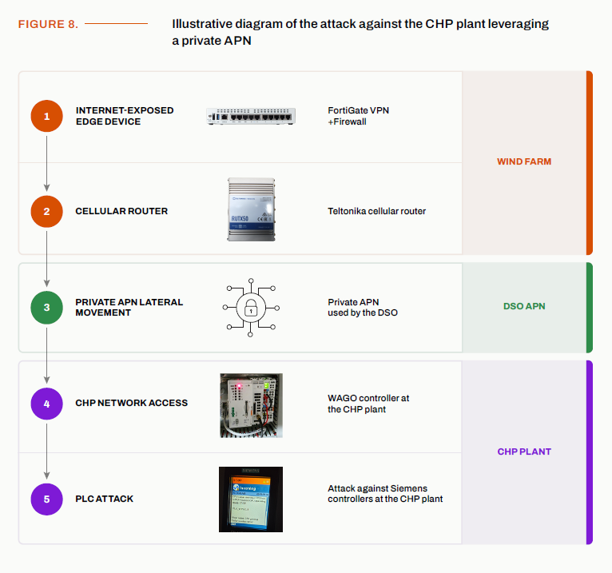

# Poland Energy Sector IT-to-OT Intrusion via Private APN

**IT-to-OT Pivot**{.cve-chip} **Private APN Abuse**{.cve-chip} **Industrial Router Exposure**{.cve-chip} **Siemens PLC Manipulation**{.cve-chip} **Critical Infrastructure**{.cve-chip}

## Overview

Attackers moved from an IT environment into an OT environment by abusing trusted connectivity through a private cellular APN. The intrusion demonstrates how a compromised IT system and inadequately protected industrial cellular router can provide a pathway into an isolated OT network.

Attackers ultimately reached industrial controllers and manipulated Siemens PLCs.

## Technical Details

The attack chain involved compromised IT infrastructure, a Fortinet device, a Teltonika RUTX50 cellular router, and connectivity through a private APN.

Attackers used tunneling to reach OT-connected infrastructure, including a WAGO controller, and subsequently reached Siemens PLCs. The attackers performed reconnaissance and manipulated PLC operating states.

A WAGO controller was also damaged in a way that affected its ability to boot and complicated forensic analysis.

## Technical Specifications

| **Attribute** | **Details** |
|---|---|
| **Intrusion Type** | Cross-domain IT-to-OT compromise |
| **Initial Domain** | Enterprise IT environment |
| **Pivot Mechanism** | Trusted private cellular APN path via industrial router |
| **Key Infrastructure Referenced** | Fortinet device, Teltonika RUTX50, WAGO controller, Siemens PLCs |
| **Access Technique** | Tunneling through connected infrastructure |
| **OT Actions Observed** | Reconnaissance and PLC state manipulation |
| **Anti-Forensics/Disruption** | Controller damage affecting boot and forensic visibility |
| **Sector Context** | Energy/industrial operations in Poland |

## Affected Products

- Internet-facing or remotely accessible IT perimeter systems in the affected environment
- Teltonika RUTX50 industrial cellular router connected to private APN infrastructure
- OT-connected WAGO controller and associated automation components
- Siemens PLCs exposed through trusted cross-network connectivity

## Attack Scenario

1. Initial access: attackers compromise exposed or remote-access IT infrastructure.
2. Discovery: an industrial cellular router is identified within reachable trust paths.
3. Pivot: private APN connectivity is abused as a trusted route.
4. IT-to-OT movement: attackers use this path to access OT-connected equipment.
5. OT reconnaissance: industrial controllers and networked control devices are mapped.
6. PLC manipulation: Siemens PLCs are moved into abnormal operating states and credentials/settings are changed.
7. Anti-forensics: industrial equipment is damaged or manipulated to hinder investigation.

## Impact Assessment

=== "Integrity"

    - Attackers gained capability to alter PLC states and operational settings
    - Unauthorized credential and configuration changes can undermine control-system trust
    - Manipulation of industrial devices can create unsafe or unstable process conditions

=== "Confidentiality"

    - Cross-domain access can expose sensitive IT and OT configuration data
    - Reconnaissance of control environments reveals high-value operational intelligence
    - Compromised routing infrastructure can leak information about segmented networks

=== "Availability"

    - Communications and industrial operations were disrupted during the incident
    - Damaged controller behavior reduced reliability and complicated recovery
    - Although electricity generation and heat supply were not interrupted, operational risk escalated significantly

## Mitigation Strategies

### Network Architecture and Segmentation

- Segment IT and OT networks with strict policy enforcement.
- Do not treat private APNs as inherently trusted security boundaries.
- Place cellular gateways in controlled DMZ zones with explicit filtering.

### Access Hardening

- Restrict industrial cellular-router management interfaces.
- Enforce MFA, strong credentials, and removal of default credentials.
- Restrict APN routing with firewall and ACL controls.

### Monitoring and Detection

- Monitor industrial protocols and PLC state changes for unauthorized manipulation.
- Centrally collect and retain logs from IT, router, and OT control layers.
- Perform OT-specific threat hunting focused on cross-domain pivot indicators.

### Resilience and Response

- Maintain offline backups of PLC configurations and critical control logic.
- Patch internet-facing VPN and firewall devices on a continuous priority basis.
- Conduct OT incident-response exercises that include IT-to-OT transition scenarios.

## Resources and References

!!! info "Public Reporting"
    - [Hackers Cross From IT to OT Through a Private APN in Poland](https://securityaffairs.com/196955/security/hackers-cross-from-it-to-ot-through-a-private-apn-in-poland.html)

---

*Last Updated: August 12, 2026*
