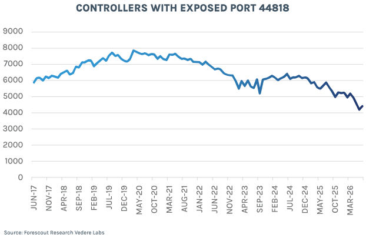

# Internet-Exposed Rockwell Automation PLCs

**ICS Exposure**{.cve-chip} **Rockwell PLCs**{.cve-chip} **EtherNet/IP**{.cve-chip} **Water Sector Risk**{.cve-chip} **OT Attack Surface**{.cve-chip}

## Overview

Forescout reported 4,407 Rockwell Automation PLCs exposed to the public internet, including 2,844 in the United States. About half of the identified devices were MicroLogix 1400 PLCs, and roughly 8% were MicroLogix 1100 units.

The finding highlights exposure and potential attack surface, not confirmed compromise of all listed devices. Researchers also identified 22 exposed PLCs in U.S. cities associated with recent water-utility cyber incidents.

## Technical Specifications

| **Attribute** | **Details** |
|---|---|
| **Exposed Device Count** | 4,407 Rockwell PLCs globally |
| **U.S. Exposure Count** | 2,844 devices |
| **Dominant Models Observed** | Approximately 50% MicroLogix 1400; approximately 8% MicroLogix 1100 |
| **Common Reachability** | EtherNet/IP over TCP port 44818 |
| **Connectivity Observation** | More than 70% of exposed U.S. PLCs mapped to major cellular-carrier networks |
| **Sector-Correlation Finding** | 22 exposed PLCs identified in cities tied to recent water-sector incidents |
| **Legacy CVE Relevance** | 19 of those 22 reportedly susceptible to CVE-2017-16740 (Modbus TCP issue in certain MicroLogix 1400 Series B/C, firmware 21.002 or earlier) |
| **Assessment Scope** | Internet exposure and risk surface; not blanket confirmation of compromise |

## Affected Products

- Rockwell Automation PLCs directly reachable from the public internet
- MicroLogix 1400 and MicroLogix 1100 deployments with weak perimeter controls
- Cellular-connected OT assets lacking private APN/VPN isolation
- Water and other critical-infrastructure environments with exposed controller interfaces

## Attack Scenario

1. An attacker scans internet space for exposed Rockwell PLCs.
2. A reachable industrial controller/protocol endpoint is identified.
3. The attacker enumerates controller identity and configuration.
4. Unauthorized access or manipulation attempts are performed.
5. Network or control parameters may be modified, potentially impacting process behavior.
6. Operators can lose visibility/control while industrial operations face disruption risk.

## Impact Assessment

=== "Integrity"

    - Unauthorized configuration changes can alter controller logic and process behavior
    - OT trust boundaries are weakened when PLC management interfaces are internet reachable
    - Manipulation risk increases in centrally important utility process nodes

=== "Confidentiality"

    - Exposed PLC metadata and configuration details can aid adversary targeting
    - Operational visibility information may be inferred from reachable interfaces
    - Exposure intelligence can be combined with other reconnaissance for targeted attacks

=== "Availability"

    - Controller tampering may disrupt industrial process continuity
    - Loss of operator visibility/control can delay response and recovery
    - Water and utility systems may face service instability if PLC workflows are affected

## Mitigation Strategies

### Immediate Actions

- Remove PLCs from direct internet exposure
- Block unnecessary inbound TCP/UDP 44818 and related industrial protocol access
- Place PLCs behind OT-aware firewalls with strict allowlists

### Short-term Measures

- Use VPN or private APN for remote cellular-connected OT access
- Enforce MFA for remote administrative workflows
- Eliminate default credentials and disable nonessential services

### Monitoring & Detection

- Continuously monitor PLC configuration and logic-change events
- Track unusual management-plane connections and protocol anomalies
- Investigate exposed PLCs linked to recent incident geographies for unauthorized modifications

### Long-term Solutions

- Update supported firmware and assess exposure to CVE-2017-16740 where applicable
- Maintain offline backups of controller configurations and logic
- Inventory all cellular-connected OT devices and segment IT/OT networks to reduce blast radius

## Resources and References

!!! info "Public Reporting"
    - [Over 4,400 Rockwell PLCs Exposed Online, 22 Found in Water Attack Cities](https://thehackernews.com/2026/08/over-4400-rockwell-plcs-exposed-online.html)

---

*Last Updated: August 9, 2026*
