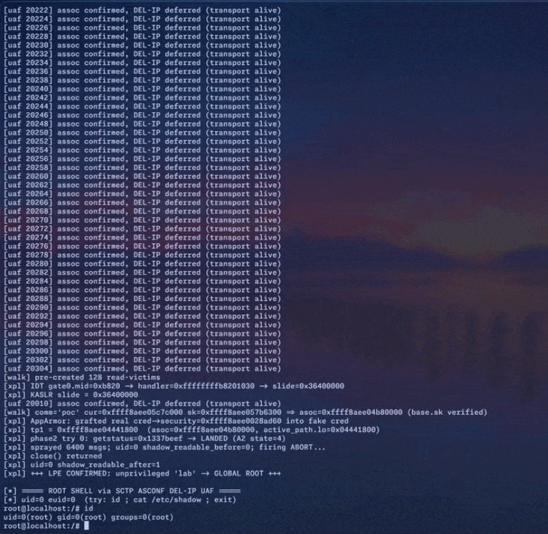

# Linux SCTP Flaw Could Let Local Users Gain Root

**Kernel Privilege Escalation**{.cve-chip} **SCTP ASCONF**{.cve-chip} **Use-After-Free**{.cve-chip} **Container Escape Risk**{.cve-chip} **Local Exploitation**{.cve-chip}

## Overview

SCTPhantom is an approximately 18-year-old use-after-free vulnerability in the Linux kernel SCTP implementation, specifically in Dynamic Address Reconfiguration (ASCONF) handling. A local attacker who can reach SCTP functionality may exploit this memory-management flaw to escalate privileges to root.

Tencent researchers also demonstrated a container-escape scenario, showing that code running inside a container could pivot to host compromise when vulnerable conditions are present.

## Technical Specifications

| **Attribute** | **Details** |
|---|---|
| **Vulnerability Name** | SCTPhantom |
| **Affected Component** | Linux kernel SCTP implementation (ASCONF/Dynamic Address Reconfiguration) |
| **Vulnerability Type** | Use-After-Free (UAF) |
| **Flaw Age** | Approximately 18 years |
| **Root Cause** | Inconsistent SCTP address deletion validation and transport-object selection logic |
| **Trigger Condition** | Crafted sequence of address add/delete operations plus wildcard delete |
| **Security Effect** | Frees SCTP transport object while stale pointer remains reachable |
| **Exploit Outcome** | Kernel memory corruption and local root privilege escalation |
| **Container Impact** | Tencent reported host-root results in 6 of 8 tested container-escape attempts |

## Affected Products

- Linux systems with vulnerable SCTP kernel code paths
- Hosts where SCTP functionality is enabled and reachable by untrusted local code
- Containerized environments where workloads can interact with SCTP paths
- Cloud/Kubernetes nodes that share vulnerable host kernels

## Attack Scenario

1. An attacker gains local code execution via compromised account, application flaw, or container access.
2. The attacker reaches SCTP functionality on the target kernel.
3. Crafted SCTP/ASCONF operations trigger vulnerable address-reconfiguration behavior.
4. A stale pointer references a previously freed SCTP transport object.
5. Memory corruption occurs in kernel context, enabling privilege escalation.
6. In containerized setups, successful exploitation may escalate from container context to host root.

## Impact Assessment

=== "Integrity"

    - Local attackers can gain root-level control over affected hosts
    - Kernel memory corruption can undermine trust boundaries and workload isolation
    - Host compromise in shared environments may impact multiple tenants or services

=== "Confidentiality"

    - Root-level access may expose sensitive data, secrets, and service credentials
    - Container-to-host escape can expose neighboring workload data on the same node
    - Post-exploitation access can enable broader network reconnaissance and theft

=== "Availability"

    - Kernel corruption can destabilize systems and trigger crashes
    - Host compromise can interrupt services and container workloads
    - Incident response and emergency patching may cause operational downtime

## Mitigation Strategies

### Immediate Actions

- Patch immediately to fixed kernel versions in the relevant branch: 6.6.148, 6.12.101, 6.18.42, or 7.1.6
- Apply distribution/vendor security updates (for example Debian, RHEL, Ubuntu) rather than relying only on upstream numbering
- Prioritize internet-adjacent, multi-tenant, and container-host systems for emergency updates

### Short-term Measures

- Identify hosts and containers where SCTP is enabled or reachable
- Disable or remove the SCTP kernel module where operationally safe and not required
- Restrict local untrusted code execution paths on vulnerable systems

### Monitoring & Detection

- Monitor abnormal SCTP activity and suspicious ASCONF patterns
- Alert on unexpected local privilege-escalation behavior and container breakout indicators
- Correlate kernel logs with process anomalies tied to SCTP interaction attempts

### Long-term Solutions

- Review container hardening (seccomp, capabilities, user namespaces, network policy)
- Enforce least privilege across local users, services, and container workloads
- Integrate kernel exposure review into recurring vulnerability-management workflows

## Resources and References

!!! info "Public Reporting"
    - [18-Year-Old Linux SCTP Flaw Could Let Local Users Gain Root and Escape Containers](https://thehackernews.com/2026/08/18-year-old-linux-sctp-flaw-could-let.html)

---

*Last Updated: August 9, 2026*
