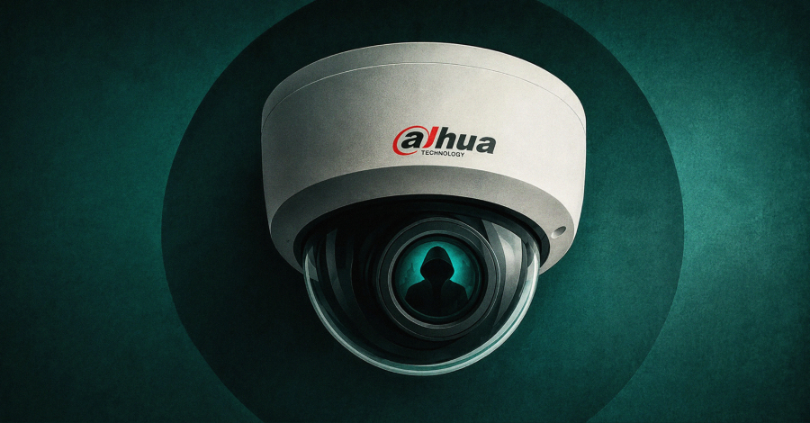
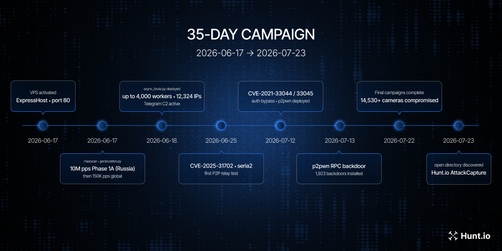

# Operation CameraSwarm Dahua Device Compromise Campaign

**Dahua Device Targeting**{.cve-chip} **Credential Attacks**{.cve-chip} **CVE-2021-33044**{.cve-chip} **CVE-2021-33045**{.cve-chip} **Surveillance Infrastructure Risk**{.cve-chip}

## Overview

Hunt.io reported that Operation CameraSwarm targeted internet-exposed Dahua IP cameras and related surveillance devices. Reported compromises were concentrated in Ukraine and Russia, while affected organizations, end users, and critical-infrastructure entities were not publicly disclosed.

The campaign was disclosed on August 19, 2026, with reported activity between June 17 and July 22, 2026. It is best characterized as an IoT surveillance-device compromise campaign combining credential attacks with exploitation of known authentication-bypass vulnerabilities.

CISA independently confirms that CVE-2021-33044 and CVE-2021-33045 have been exploited in the wild through KEV inclusion (August 2024). KEV status confirms exploitation of those CVEs but does not independently validate every Operation CameraSwarm campaign claim.

## Technical Details

### Threat Actor

The operator is unknown. Hunt.io assessed likely Russian-speaking activity based on language artifacts recovered during investigation. This is preliminary attribution only; no public confirmation exists for a specific group, individual, criminal organization, or state sponsor.

### Campaign Scope (Reported)

Hunt.io reported:

- More than 14,530 Dahua devices compromised during the campaign window.
- 12,324 unique IP addresses tied to 13,229 credential-attack records.
- 1,923 devices allegedly accessed via authentication-bypass exploitation and configured with a persistent account.
- 283 devices reportedly accessed through a P2P route.

These counts are Hunt.io findings and are not independently confirmed by Dahua, CISA, or public CERT reporting.

### Authentication-Bypass Vulnerabilities

Attackers reportedly exploited CVE-2021-33044 and CVE-2021-33045, both Dahua login-process identity-authentication bypass issues affecting specified product families and older firmware builds.

- CVE-2021-33044: Dahua states an attacker may bypass device identity authentication via maliciously constructed data packets.
- CVE-2021-33045: Dahua reports a separate login-path authentication bypass using similarly malicious packet construction.

Dahua assigned CVSS v3.1 score 8.1 in related advisory material, while reporting supplied for this incident indicates NVD scoring of 9.8 per CVE. Organizations should document this severity discrepancy rather than rely on one score alone.

### Affected Technology

Dahua advisory DHCC-SA-202106-001 lists affected IP cameras, PTZ cameras, thermal cameras, video intercom products, NVRs, and XVRs across specified IPC, VTO/VTH, NVR, and XVR model families with older firmware baselines.

Exact affected models and fixed builds vary by family. Owners should verify model and firmware build date against Dahua official advisory criteria.

### Exploitation Status

- Active exploitation of CVE-2021-33044 and CVE-2021-33045 is confirmed via CISA KEV entries.
- Public exploit and research references for both vulnerabilities are cited by NVD.
- Use of these CVEs in every reported Operation CameraSwarm device compromise is not independently confirmed outside Hunt.io reporting.

### Reported Access Methods

Hunt.io reported campaign use of:

- Credential attacks.
- CVE-2021-33044 and CVE-2021-33045 exploitation.
- Dahua P2P relay functionality, including a serial-number-based Easy4IP route for some NATed devices.

P2P relay behavior should be treated separately from CVE exploitation paths.

Malware families, C2 infrastructure, attacker IPs/domains, file hashes, and high-confidence network IOCs were not publicly disclosed in available reporting.

### Patch Status

Dahua remediation guidance is published in DHCC-SA-202106-001 and directs customers to apply appropriate repair software or newer supported firmware. Fixed firmware varies by device family; there is no single universal fixed version for all products.

## Technical Specifications

| **Attribute** | **Details** |
|---|---|
| **Campaign Name** | Operation CameraSwarm |
| **Disclosure Date** | August 19, 2026 |
| **Reported Activity Window** | June 17 to July 22, 2026 |
| **Primary Technology Targeted** | Internet-exposed Dahua surveillance devices |
| **Confirmed Exploited CVEs (KEV)** | CVE-2021-33044, CVE-2021-33045 |
| **Access Methods (Reported)** | Credential attacks, auth-bypass CVEs, P2P relay route |
| **Attribution Status** | Unknown; preliminary Russian-language artifact assessment by Hunt.io |
| **Independent Validation Limits** | Campaign counts/persistence/P2P volume not publicly validated by Dahua/CISA/CERTs |

## Affected Products

- Dahua IP cameras (including specified IPC families)
- Dahua PTZ and thermal surveillance camera lines in affected firmware ranges
- Dahua video intercom products (including relevant VTO/VTH families)
- Dahua NVR and XVR products in affected advisory scope
- Surveillance environments exposing device administration or P2P relay pathways

## Attack Scenario

1. Operator identifies externally reachable Dahua devices or serial information relevant to P2P-enabled devices.
2. Initial access is attempted via credential-based attacks against reachable systems.
3. For vulnerable firmware, attacker may exploit CVE-2021-33044 or CVE-2021-33045 by submitting malicious login packets that bypass authentication.
4. Hunt.io reported persistence via attacker-created accounts on a subset of compromised devices reached through CVE exploitation.
5. For some P2P-enabled devices behind NAT, reported serial-based relay routes may enable remote reachability.
6. Successful compromise can provide unauthorized access to device functions, surveillance feeds, and configuration, depending on privileges and network posture.

Public reporting does not confirm campaign-linked data theft, enterprise lateral movement, large-scale service disruption, or physical-security outcomes.

## Impact Assessment

=== "Confirmed Impact"

    - CISA confirms active exploitation in the wild for CVE-2021-33044 and CVE-2021-33045
    - Dahua confirms these flaws can enable authentication bypass through maliciously constructed packets on affected products

=== "Reported Impact"

    - Hunt.io reported more than 14,530 compromised devices with concentration in Ukraine and Russia
    - Specific victim organizations, sectors, and operational outcomes were not publicly identified

=== "Potential Impact"

    - Unauthorized access to surveillance feeds and configuration control
    - Account abuse, monitoring disruption, and potential foothold creation in poorly segmented networks
    - Possible broader downstream compromise in enterprise environments, though not publicly confirmed for this campaign

## Mitigation Strategies

### Patch Affected Dahua Devices

- Apply the appropriate repair firmware or newer supported version per DHCC-SA-202106-001.
- Validate each device model and firmware build date against Dahua affected-product criteria before upgrade.

### Remove Unnecessary Internet Exposure

- Remove direct internet exposure for cameras, NVRs, XVRs, intercom systems, and admin interfaces.
- Restrict access through hardened management networks, secure gateways, or controlled remote-access channels.

### Disable Unnecessary P2P Access

- Disable Dahua P2P or cloud-relay functionality when operationally unnecessary.
- Treat reported campaign P2P usage as a specific risk path requiring separate review.

### Harden Authentication

- Replace default, weak, shared, or reused passwords with unique strong credentials.
- Audit device and platform accounts, remove unknown or dormant users, and reduce unnecessary admin permissions.

### Segment Surveillance Infrastructure

- Isolate surveillance networks from enterprise IT, OT, and directory services except for explicitly required flows.
- Enforce strict ACL and firewall policy between cameras, recorders, VMS, and upstream environments.

### Investigate Suspected Compromise

- Review firmware versions, device accounts, admin logs, configuration changes, P2P settings, outbound traffic, and NVR/VMS logs.
- Preserve relevant logs and configuration exports before reset or re-provisioning actions.

### Recover Safely

- Rotate device, NVR, VMS, cloud-service, app, and management credentials.
- Rebuild from known-good baselines with validated firmware and segmented network placement before restoring service.

### Maintain Operational Continuity

- Where surveillance supports safety or critical operations, establish alternate monitoring before taking systems offline.
- Back up NVR/VMS configuration and verify restoration procedures in advance.

## Resources and References

!!! info "Public Reporting"
    - [The Hacker News coverage](https://thehackernews.com/2026/08/hackers-compromised-14500-dahua-devices.html)
    - [Dahua security advisory - identity authentication bypass](https://www.dahuasecurity.com/about-dahua/news-events/notice/security-advisory---identity-authentication-bypass-vulnerability-found-in-some-dahua-products)
    - [CISA KEV additions notice](https://www.cisa.gov/news-events/alerts/2024/08/21/cisa-adds-four-known-exploited-vulnerabilities-catalog)
    - [NVD: CVE-2021-33044](https://nvd.nist.gov/vuln/detail/CVE-2021-33044)
    - [NVD: CVE-2021-33045](https://nvd.nist.gov/vuln/detail/CVE-2021-33045)

---

*Last Updated: August 20, 2026*
