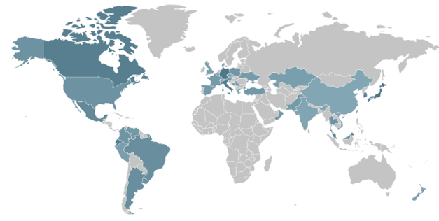
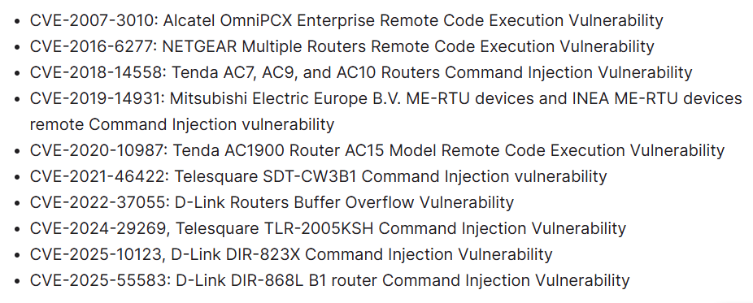

# Evooo1Bot - Multi-Functional Mirai-Based Linux Botnet

**Mirai Variant**{.cve-chip} **Linux Botnet**{.cve-chip} **SOCKS5 Relay Abuse**{.cve-chip} **SSH Brute Force**{.cve-chip} **DDoS + Proxy Operations**{.cve-chip}

## Overview

Evooo1Bot is a modular Linux botnet derived from Mirai that expands beyond classic DDoS-only behavior. In addition to flood capabilities, it supports SOCKS5 relay operations, SSH brute-force propagation, credential-sniffing, remote administration, and exploitation of known weaknesses on exposed edge devices.

A key risk is conversion of compromised routers and network-edge systems into persistent proxy nodes, allowing attackers to route malicious traffic through victim infrastructure and obscure source attribution.

## Technical Specifications

| **Attribute** | **Details** |
|---|---|
| **Family** | Mirai-derived modular Linux botnet |
| **C2 Transport** | Encrypted command-and-control over TCP/443 |
| **Obfuscation Layers** | AES-256-CTR, ChaCha20, XOR string/data obfuscation |
| **Anti-Analysis Features** | Checks for debuggers, sandboxes, VMs, and containerized analysis environments |
| **Remote Command Capacity** | 28 bot commands |
| **Persistence Mechanisms** | systemd, SysV init, shell profiles, rc.local, cron |
| **Self-Recovery Behavior** | Cron task can attempt payload re-download every 5 minutes |
| **Proxy Capability** | SOCKS5 module with direct and reverse relay modes |
| **Propagation Module** | SSH scanner using approximately 150 username/password pairs |
| **Data-Theft Capability** | Credential-sniffing via /proc/net/tcp monitoring |
| **DDoS Engine** | Mirai-style module supporting 16 flood methods |

## Affected Products

- Internet-facing Linux routers, gateways, and edge devices with weak hardening
- Systems exposing SSH or vulnerable services to untrusted networks
- IoT and network infrastructure devices with default or reused credentials
- Environments lacking monitoring for unauthorized proxy behavior and bot persistence

## Attack Scenario

1. Attackers scan internet-facing devices for vulnerable services.
2. A known vulnerability or weak SSH credentials are exploited.
3. A loader drops an architecture-specific Evooo1Bot payload.
4. The malware establishes persistence and connects to encrypted C2.
5. The compromised device joins the botnet.
6. Attackers use the node for DDoS, credential collection, SSH propagation, or SOCKS5 relay to mask follow-on attacks.

## Impact Assessment

=== "Integrity"

    - Compromised edge devices can be remotely controlled and re-tasked
    - Bot operators may alter network behavior through proxy and command modules
    - Persistence mechanisms make eradication harder and increase reinfection risk

=== "Confidentiality"

    - Credential-sniffing modules may expose authentication data
    - Compromised devices can become stepping stones for deeper network access
    - Proxy functionality may conceal additional data-theft operations behind victim IPs

=== "Availability"

    - Infected nodes may participate in DDoS attacks, consuming local bandwidth/resources
    - Unauthorized SOCKS5 relays can degrade network performance and stability
    - Reputation damage and provider blocking may impact connectivity for victims

## Mitigation Strategies

### Immediate Actions

- Patch internet-facing routers, gateways, firewalls, and IoT devices promptly
- Replace default credentials with strong unique passwords
- Disable unnecessary WAN administration, Telnet, and exposed SSH services

### Short-term Measures

- Restrict management interfaces to trusted networks or VPN-only access
- Segment IoT and network infrastructure from critical internal systems
- Replace unsupported or end-of-life devices that cannot be secured

### Monitoring & Detection

- Monitor outbound traffic for unusual SOCKS/proxy behavior and suspicious external destinations
- Detect unexpected cron/systemd/init persistence changes
- Alert on abnormal SSH scanning or brute-force patterns originating from edge assets

### Long-term Solutions

- Maintain continuous vulnerability management for edge/IoT assets
- Keep IPS/AV signatures current and block known malicious infrastructure
- Establish baseline behavior for network devices and automate anomaly detection

## Resources and References

!!! info "Public Reporting"
    - [New Evooo1Bot Linux botnet turns routers into traffic relay nodes](https://www.bleepingcomputer.com/news/security/new-evooo1bot-linux-botnet-turns-routers-into-traffic-relay-nodes/)
    - [Multi-Functional Linux Botnet "Evooo1Bot" | FortiGuard Labs](https://www.fortinet.com/blog/threat-research/multi-functional-linux-botnet-evooo1bot)

---

*Last Updated: August 16, 2026*
