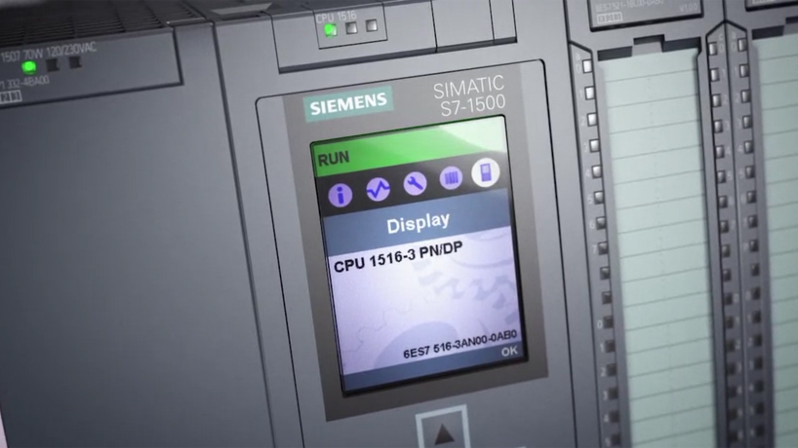

# AI-generated Python tooling targeting Siemens S7 PLCs in critical infrastructure

**Siemens S7 Targeting**{.cve-chip} **S7comm Abuse**{.cve-chip} **AI-Assisted Tooling**{.cve-chip} **python-snap7**{.cve-chip} **OT Reconnaissance Risk**{.cve-chip}

## Overview

On August 19, 2026, NSA, CISA, FBI, the Department of Energy, and EPA issued a joint advisory on an active threat targeting Siemens S7 Series PLCs in U.S. critical-infrastructure environments.

The campaign uses artificial intelligence to help generate Python tooling that interacts with Siemens controllers via the S7comm industrial protocol. The advisory does not center on one newly discovered CVE; instead, it describes adversaries combining exposed devices, weak authentication, outdated software, public industrial libraries, and AI-assisted scripting.

## Technical Details

### Targeted PLC Families

- Siemens S7-200
- Siemens S7-300
- Siemens S7-400
- Siemens S7-1200
- Siemens S7-1500

### Targeted Sectors

- Critical manufacturing
- Energy
- Water and wastewater
- Chemical
- Food and agriculture
- Commercial facilities

### Discovery and Access Methods

- Threat actors use internet-scanning services such as Censys and ZoomEye to identify exposed Siemens PLCs.
- They prioritize systems with critical/high-severity unpatched vulnerabilities, outdated software, and weak authentication.
- Earlier CISA reporting highlights exposed OT ports, especially TCP/102 for Siemens S7comm, and weakly protected remote-access paths such as modems.

### AI-Assisted Attack Tooling

- Adversaries use AI-generated Python code built around `snap7.dll` and the open-source `python-snap7` library to communicate with S7 controllers over S7comm.
- Tooling is disguised as legitimate OT monitoring software so execution and network activity appear routine.
- Potential operator capabilities include controller fingerprinting, logic upload/download, configuration changes, and CPU start/stop commands when protections are insufficient.

### Activity Objective

- Reported activity is primarily persistent reconnaissance and capability development to extract configuration, process data, and program structure.
- U.S. agencies warn this preparation could support future data theft, equipment damage, extended outages, or safety incidents.

## Technical Specifications

| **Attribute** | **Details** |
|---|---|
| **Advisory Date** | August 19, 2026 |
| **Issuing Agencies** | NSA, CISA, FBI, DOE, EPA |
| **Campaign Nature** | Active targeting and reconnaissance against Siemens S7 PLC environments |
| **Primary Protocol** | Siemens S7comm (notably TCP/102 exposure risk) |
| **Tooling Stack** | AI-assisted Python scripts using `python-snap7` and `snap7.dll` |
| **Targeting Method** | Internet scanning and exploitation of weak authentication/exposure gaps |
| **Core Risk Theme** | Reconnaissance and preparatory access that could enable later disruptive actions |
| **Single-CVE Focus** | Not a single new CVE campaign; multi-factor exposure and misuse model |

## Affected Products

- Siemens S7-200, S7-300, S7-400, S7-1200, and S7-1500 PLC deployments
- Engineering workstations and TIA Portal environments that can access PLC programming functions
- OT networks with direct or indirect internet reachability to S7comm services (including TCP/102)
- Remote-access infrastructure used to reach OT environments, including poorly controlled modem pathways

## Attack Scenario

1. Threat actors identify exposed OT assets by scanning for Siemens S7 PLCs, engineering interfaces, or remote-access systems.
2. They gain or abuse access through known weaknesses, outdated software, weak credentials, or insecure remote-access paths.
3. AI-generated Python tooling (for example using `python-snap7`) is introduced, often disguised as normal OT monitoring software.
4. Attackers conduct low-noise reconnaissance over S7comm to query controller status, configuration, process data, modules, and logic structure.
5. With sufficient access, they can prepare for or execute manipulations such as configuration changes, logic modification, I/O behavior changes, or operational command execution.
6. The advisory frames destructive manipulation as a credible future risk and does not publicly confirm that those destructive actions occurred in this campaign.

## Impact Assessment

=== "Integrity"

    - Unauthorized read/write controller access can enable tampering with PLC logic and configuration
    - Manipulated process setpoints or I/O behavior can degrade process correctness and control trust
    - Abused engineering functions can undermine change-management assurance in OT operations

=== "Confidentiality"

    - Reconnaissance activity can expose sensitive process data, topology details, and program structure
    - Compromised engineering workstations may leak credentials and project artifacts
    - Extracted ICS configuration information can support future, more targeted attacks

=== "Availability"

    - Potential outcomes include process interruption, extended downtime, equipment stress or damage, and safety incidents
    - Unauthorized CPU start/stop operations could directly disrupt production continuity
    - Loss of trusted PLC state may prolong restoration and validation timelines

## Mitigation Strategies

### Remove Direct Internet Exposure

- Identify Siemens S7 PLCs and ensure they are not directly reachable from the public internet.
- Place remote access behind secure OT gateways or VPNs, restrict to approved users, and enforce MFA.

### Inventory and Patch

- Maintain inventory of Siemens S7 controllers, TIA Portal systems, engineering stations, network paths, and remote-access devices.
- Apply Siemens security updates and remediate critical/high vulnerabilities under operational change control.

### Protect Programming Functions

- Enable protections against unauthorized remote programming through TIA Portal.
- Restrict who can read, upload, download, or modify PLC logic.
- Validate deployed PLC programs and engineering project files against offline known-good backups.

### Segment OT Environments

- Segment PLCs from enterprise IT and, where feasible, segment PLC zones from each other.
- Use firewalls and ACLs to limit S7comm TCP/102 traffic to authorized engineering stations, HMIs, and SCADA servers.

### Control Scripting Tooling

- Restrict unapproved Python, PowerShell, Node.js, and similar interpreters on OT jump hosts and engineering workstations via allowlisting.
- Investigate unexpected use of `python-snap7`, `snap7.dll`, or scripts communicating with PLCs.

### Monitor OT Behavior

- Deploy OT-aware monitoring capable of parsing S7comm traffic.
- Alert on uncommon or unauthorized PLC operations such as program upload/download, CPU stop/start commands, password changes, and write operations from unfamiliar systems.

### Maintain Recovery Readiness

- Keep tested, offline, known-clean backups of PLC configuration, ladder logic, and engineering projects.
- Practice safe restoration and manual-operation procedures for critical processes.

### Global Relevance Context

- Siemens S7 technologies are broadly used across industries, including in Egypt.
- The advisory describes active U.S. targeting, but underlying exposure patterns are globally relevant to any organization operating Siemens S7 environments.

## Resources and References

!!! info "Public Reporting"
    - [U.S. warns of AI-powered attacks on Siemens PLCs in critical infrastructure](https://www.bleepingcomputer.com/news/security/us-warns-of-ai-powered-attacks-on-siemens-plcs-in-critical-infrastructure/)
    - [CISA warns of new offensive by hackers linked to IRA against industrial controllers at Siemens and Schneider Electric](https://tiinside.com.br/en/27/07/2026/CISA-warns-of-new-offensive-by-hackers-linked-to-IRA-against-industrial-controllers-at-Siemens-and-Schneider-Electric./)

---

*Last Updated: August 20, 2026*
