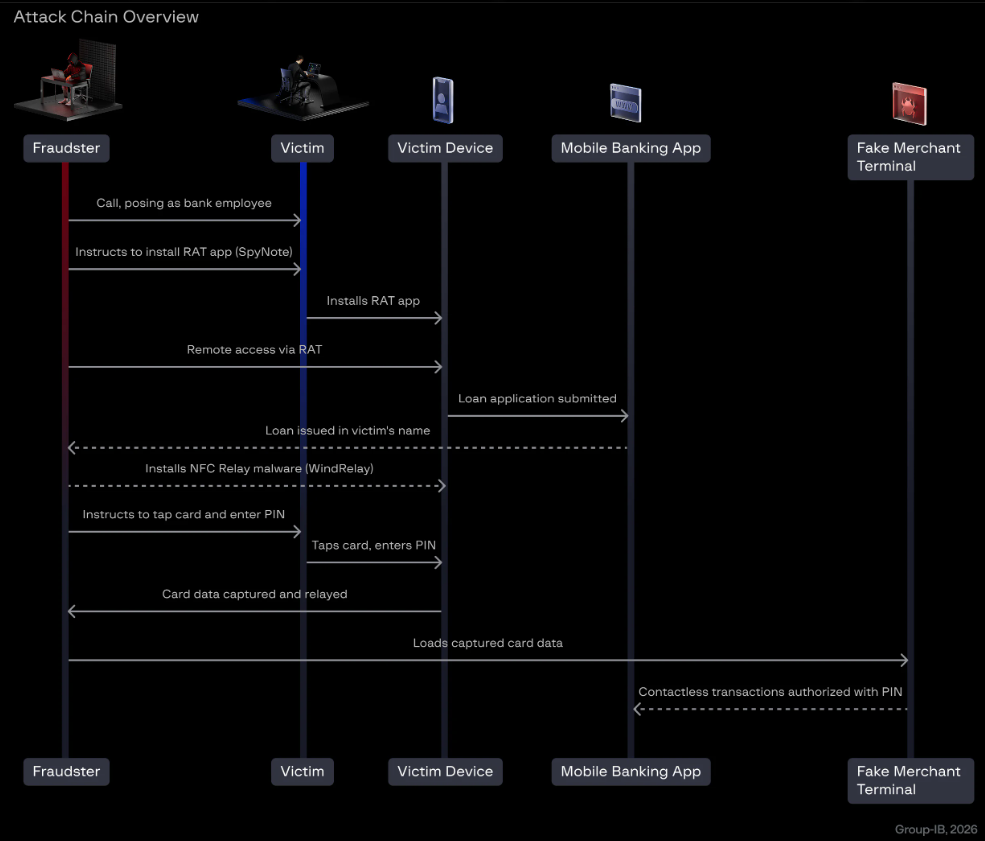

# WindRelay Android Malware

**Android Malware**{.cve-chip} **Vishing Fraud**{.cve-chip} **SpyNote RAT**{.cve-chip} **NFC Relay Attack**{.cve-chip} **Banking Abuse**{.cve-chip}

## Overview

Threat actors used bank-impersonation vishing calls to socially engineer victims into installing a malicious Android app containing SpyNote RAT. Victims were then convinced to grant Accessibility permissions, enabling remote device control.

After initial compromise, operators deployed WindRelay, an Android NFC relay malware, and abused the victim's banking app to request loans and perform fraudulent contactless payments. In reported cases, victims were instructed to tap physical payment cards to infected phones and provide PINs, while live NFC communication was relayed to attacker-controlled devices at legitimate POS terminals.

## Technical Specifications

| **Attribute** | **Details** |
|---|---|
| **Initial Malware Stage** | SpyNote Android RAT |
| **Delivery Method** | Social engineering/vishing plus sideloaded APK outside official app stores |
| **Privilege Escalation Path** | Abuse of Android Accessibility Service permissions |
| **Second Stage** | WindRelay NFC relay malware |
| **Fraud Mechanism** | Real-time NFC relay between victim card and attacker device |
| **Primary Financial Abuse** | Unauthorized loan requests and fraudulent contactless transactions |
| **Additional SpyNote Capabilities** | SMS theft, credential theft, OTP/auth-code capture, GPS tracking, keylogging, microphone/camera access |
| **Threat Infrastructure Note** | Group-IB reported four identified C2 IP addresses and nearly two dozen WindRelay samples on VirusTotal (Nov 2025-Jul 2026) |
| **Observed Attack Duration** | Full social-engineering and fraud workflow reported in approximately 13-minute call window |

## Affected Products

- Android devices where users can install apps from unofficial sources
- Banking users vulnerable to vishing and remote-access social engineering
- Payment cards used in contactless transactions when paired with compromised phones
- Financial institutions exposed to account-takeover and real-time NFC relay fraud

## Attack Scenario

1. A victim is selected and contacted by a fake bank employee.
2. The victim is convinced to sideload a malicious APK containing SpyNote.
3. The victim grants Accessibility permissions, giving remote-control capability.
4. Operators deploy WindRelay as a second-stage component.
5. Attackers access the victim banking app and submit a loan request in the victim's name.
6. The victim is instructed to tap a physical card against the compromised phone and share PIN details.
7. WindRelay relays live NFC transaction data to attacker-controlled devices.
8. Fraudulent payments are completed at legitimate POS terminals.

## Impact Assessment

=== "Integrity"

    - Attackers can remotely control victim devices and manipulate banking workflows
    - Unauthorized financial operations, including loan applications, can be executed in victim identity
    - Accessibility abuse undermines trust in device-level interaction boundaries

=== "Confidentiality"

    - SpyNote can steal SMS, credentials, OTP codes, location, and input data
    - Access to microphone/camera may expose additional personal and security-sensitive context
    - Payment and account data can be abused for ongoing fraud operations

=== "Availability"

    - Victim account lockouts and fraud investigations may temporarily disrupt access to financial services
    - Financial institutions can face increased fraud-response and chargeback burden
    - Broader trust in contactless payment workflows may be degraded

## Mitigation Strategies

### Immediate Actions

- Do not install APKs from phone-call instructions, chat apps, or unofficial channels
- Never grant Accessibility permissions to unknown or untrusted applications
- End unsolicited financial-support calls and call the bank through official contact numbers

### Short-term Measures

- Keep Google Play Protect enabled and apply Android security updates promptly
- Review installed apps with Accessibility, NFC, SMS, and remote-control permissions
- Enable real-time transaction/account alerts for banking and card activity

### Monitoring & Detection

- Monitor for unusual NFC-related fraud patterns and rapid high-risk payment sequences
- Detect suspicious remote-control behavior tied to Accessibility abuse
- Track indicators associated with known WindRelay/SpyNote infrastructure and samples

### Long-term Solutions

- Strengthen anti-vishing customer education and verification workflows
- Enhance bank fraud controls for relay-style NFC abuse and social-engineering-linked transactions
- Integrate mobile threat detection and continuous app-risk auditing for high-risk user segments

## Resources and References

!!! info "Public Reporting"
    - [Gone with the WindRelay: A New Malware Combo Behind a Growing Fraud Scheme | Group-IB Blog](https://www.group-ib.com/blog/windrelay-nfc-spynote-rat-combo-fraud/)
    - [Android malware combo takes out loans and relays victims' credit cards](https://www.bleepingcomputer.com/news/security/android-malware-combo-takes-out-loans-and-relays-victims-credit-cards/)

---

*Last Updated: August 16, 2026*
