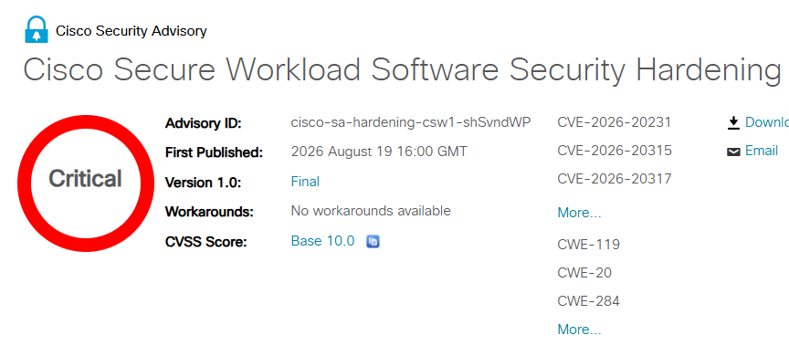

# Six Maximum-Severity Flaws Found in Cisco Products

**Critical Vulnerabilities**{.cve-chip} **Cisco Crosswork**{.cve-chip} **Cisco Secure Workload**{.cve-chip} **CVSS 10.0**{.cve-chip} **Authentication Bypass**{.cve-chip} **Injection Risks**{.cve-chip}

## Overview

Cisco disclosed nine critical vulnerabilities affecting Cisco Crosswork and Cisco Secure Workload. Six of the flaws received the maximum CVSS base score of 10.0.

The weaknesses include SQL injection, missing authentication, improper access control, improper authentication, external control of file/path information, and command/OS/argument injection. Cisco reported the issues were identified during internal security review and were not known to be exploited in the wild at disclosure time.

## Technical Specifications

| **Attribute** | **Details** |
|---|---|
| **Affected Product Group 1** | Cisco Crosswork |
| **Crosswork CVEs** | CVE-2026-20030, CVE-2026-20357, CVE-2026-20358, CVE-2026-20359 |
| **Affected Product Group 2** | Cisco Secure Workload |
| **Secure Workload CVEs** | CVE-2026-20231, CVE-2026-20315, CVE-2026-20317, CVE-2026-20318, CVE-2026-20319 |
| **CWE Categories** | CWE-89 (SQL Injection), CWE-306 (Missing Authentication), CWE-73 (External Control of File/Path), CWE-284 (Improper Access Control), CWE-287 (Improper Authentication), CWE-74 (Command/OS/Argument Injection) |
| **Cisco Severity Rating** | Critical |
| **Maximum Reported CVSS** | 10.0 |
| **Exploitation Status at Disclosure** | No known active exploitation reported |

## Affected Products

- Cisco Crosswork (affected versions per Cisco advisories)
- Cisco Secure Workload (affected versions per Cisco advisories)
- Enterprise environments exposing management interfaces/APIs for these platforms
- Organizations relying on centralized network and workload management through affected deployments

## Attack Scenario

1. An attacker identifies an exposed vulnerable Cisco management platform.
2. The attacker interacts with vulnerable interfaces or APIs.
3. Depending on the target flaw, the attacker may attempt SQL injection, authentication bypass, access-control bypass, file/path manipulation, or command argument injection.
4. If exploitation succeeds, the attacker can gain unauthorized access to sensitive management functions.
5. Compromised management capabilities can be used for further administrative abuse or environment-wide impact.

## Impact Assessment

=== "Integrity"

    - Unauthorized modification of configurations, settings, or managed objects
    - Abuse of privileged management workflows across enterprise infrastructure
    - Potential command execution and manipulation of operational controls

=== "Confidentiality"

    - Unauthorized access to sensitive management data and system information
    - Potential exposure of configuration details useful for follow-on attacks
    - Risk of broader data disclosure in centrally managed environments

=== "Availability"

    - Disruption of network-management and security-operations workflows
    - Service instability from malicious commands or configuration tampering
    - Downstream impact on dependent systems controlled by compromised platforms

## Mitigation Strategies

### Immediate Actions

- Inventory Cisco Crosswork and Cisco Secure Workload deployments and identify affected versions.
- Apply Cisco fixed software releases as soon as operationally possible.
- Restrict management interfaces and APIs from untrusted or internet-exposed networks.

### Short-term Measures

- Enforce strong authentication and least-privilege administrative access.
- Segment management planes from production/user networks.
- Review and harden exposed API endpoints and access paths.

### Monitoring & Detection

- Monitor authentication, API, configuration, and administrative activity for anomalies.
- Review logs for suspicious requests and unexpected configuration or file changes.
- Hunt for indicators of unauthorized administrative actions on affected systems.

### Long-term Solutions

- Establish recurring vulnerability-management validation for management platforms.
- Integrate advisory-driven patch SLAs for critical infrastructure tooling.
- Regularly test management-plane isolation and access-control effectiveness.

## Resources and References

!!! info "Vendor Advisory and Reporting"
    - [Cisco Secure Workload Software Security Hardening Release: August 2026](https://sec.cloudapps.cisco.com/security/center/content/CiscoSecurityAdvisory/cisco-sa-hardening-csw1-shSvndWP)
    - [Six Maximum-Severity Flaws Found in Cisco Products](https://securityaffairs.com/197640/security/six-maximum-severity-flaws-found-in-cisco-products.html)
    - [Cisco Patches Nine Crosswork and Secure Workload Flaws, Five Scoring CVSS 10.0](https://thehackernews.com/2026/08/cisco-patches-nine-crosswork-and-secure.html)

---

*Last Updated: August 23, 2026*
