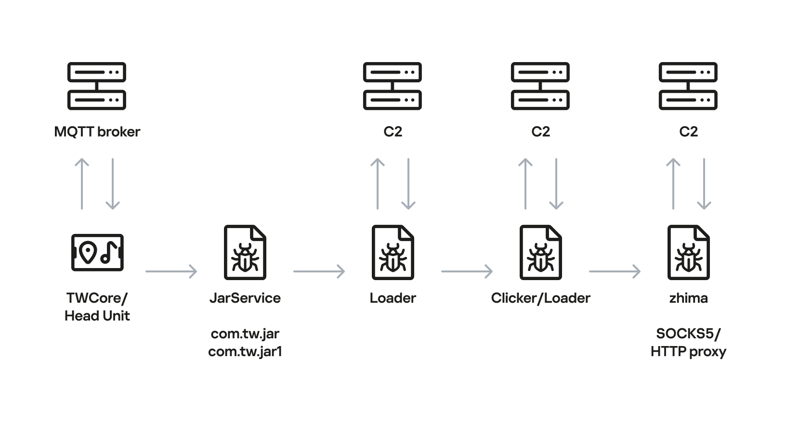

# DoFun Android Car Head Unit Supply-Chain Malware Campaign

**Supply-Chain Malware**{.cve-chip} **Android Head Units**{.cve-chip} **TWCore Abuse**{.cve-chip} **Ad Fraud**{.cve-chip} **Proxy Botnet**{.cve-chip}

## Overview

Researchers identified a malware family targeting Android-based DoFun automotive head units through the built-in firmware-update mechanism. The campaign abuses TWCore, a legitimate system application used for analytics and updates, to install malware for ad fraud and residential proxy-botnet operations.

Kaspersky discovered the activity in June 2026 and describes it as the first documented malware infection chain specifically designed for automotive head units. Published reporting states the campaign does not target driving controls or critical vehicle systems.

## Technical Details

### Affected Technology

- Android-based automotive infotainment/head units developed by DoFun.
- Impact is linked to the firmware update ecosystem for these units, not Google Android Automotive OS.

### Initial Delivery Mechanism

- Attackers abused TWCore, a legitimate DoFun application responsible for analytics and software updates.
- Delivery occurred through the built-in updater, making this a supply-chain/update-channel compromise.
- TWCore reportedly receives update instructions through MQTT broker `cardoor[.]cn`; reported `installNotExists` behavior can install APKs not already present.

### Malware Chain

- JarService: malicious Trojan dropper installed via abused update flow.
- Loader/downloader stage: gathers device information, contacts C2, retrieves secondary payloads.
- Functional payloads: ad-click fraud components and the `zhima` reverse-proxy module.

### Botnet Functionality

- `zhima` can convert an infected head unit into a reverse-proxy node.
- Operator or proxy-network customers can relay traffic through the infected device connection.
- Kaspersky detection naming includes `HEUR:Trojan-Proxy.AndroidOS.Zhima`.

### Attribution

Kaspersky attributes the activity with high confidence to MoYu Group, previously associated with BADBOX-style ad-fraud/residential-proxy ecosystems. This is researcher attribution, not formal government attribution.

### Exploitation Status

Confirmed active campaign. Kaspersky observed abuse of the DoFun update mechanism in June 2026. Public reporting states the vendor was notified and indicated a fix, but exact remediation versions and dates were not disclosed.

## Technical Specifications

| **Attribute** | **Details** |
|---|---|
| **Campaign Type** | Supply-chain malware via built-in update channel |
| **Primary Target** | DoFun Android-based automotive head units |
| **Initial Access Path** | Abuse of TWCore firmware-update workflow |
| **Key Infrastructure Mentioned** | MQTT broker `cardoor[.]cn` |
| **Dropper Stage** | JarService Trojan |
| **Secondary Capability** | Ad fraud and reverse-proxy enrollment |
| **Proxy Module** | `zhima` (`HEUR:Trojan-Proxy.AndroidOS.Zhima`) |
| **Safety-System Targeting** | No public evidence of direct driving-control compromise |

## Affected Products

- DoFun Android automotive infotainment/head units in affected update ecosystems
- Devices receiving compromised instructions through abused TWCore update paths
- Fleet and consumer vehicles using exposed or unmanaged connected head-unit services
- Connected automotive IoT deployments with weak update-provenance controls

## Attack Scenario

1. A DoFun head unit checks for updates through the legitimate TWCore service.
2. Attacker-controlled update path delivers JarService as if it were legitimate firmware/update content.
3. JarService launches a loader that profiles device state and communicates with attacker C2.
4. Secondary modules are fetched, including ad-fraud tooling and `zhima` proxy functionality.
5. Infected head unit is enrolled as a residential-style reverse-proxy node.
6. Operators monetize infection through ad fraud and proxy traffic relaying.
7. No confirmed public evidence indicates interference with steering, braking, or other critical driving systems in this campaign.

## Impact Assessment

=== "Confirmed Impact"

    - Infected head units can be used for ad fraud and proxy-botnet operations
    - Trusted update channel abuse increases stealth and persistence risk
    - Device bandwidth/resources may be consumed by unauthorized third-party traffic relay

=== "Potential Impact"

    - Elevated mobile-data usage, degraded connectivity, and performance issues
    - Public IPs linked to infected devices may be associated with suspicious or abusive traffic
    - Multi-stage architecture allows future payload changes, although no destructive vehicle-control payloads are publicly reported

=== "Sector Context"

    - Relevant to fleets, logistics, taxis, ride-hailing, dealerships, service centers, and consumer vehicles
    - Automotive infotainment and connected-device ecosystems can become monetization infrastructure
    - Weak device governance can expose broader enterprise or fleet operations to secondary risk

## Mitigation Strategies

### Apply Vendor Remediation

- Contact DoFun, reseller, installer, or integrator to verify affected firmware scope.
- Install corrected vendor firmware/update package after authenticity validation.
- Because public reporting does not list exact fixed builds, confirm versions directly with supplier channels.

### Restrict Untrusted Update Paths

- Do not install firmware/APK packages from unofficial websites, links, USB media, or third-party installers.
- Validate firmware provenance and digital signatures where supported.

### Inspect Affected Devices

- Review installed apps/services for unexpected components, especially JarService or unknown post-update installs.
- Investigate unexplained data usage, persistent outbound sessions, and suspicious MQTT/C2 communications (including `cardoor[.]cn` patterns).

### Isolate Suspected Devices

- Disconnect suspected compromised units from Wi-Fi/mobile data and fleet/corporate networks.
- Avoid connecting suspect devices to trusted diagnostics or internal enterprise systems until triage completes.

### Rebuild From Trusted Firmware

- Preserve evidence before reflash/reset actions.
- Reflash from verified vendor images; do not assume a simple factory reset fully removes compromised system components.

### Fleet and Enterprise Controls

- Maintain inventory of head units, firmware versions, SIMs, remote-management services, and installers.
- Segment infotainment from telematics, diagnostics, payments, fleet operations, and corporate IT.
- Monitor telemetry for proxy-like or high-volume outbound behavior.

## Resources and References

!!! info "Public Reporting"
    - [Hackers infect Android car head units with proxy botnet malware](https://www.bleepingcomputer.com/news/security/hackers-infect-android-car-head-units-with-proxy-botnet-malware/)
    - [Android car malware spreads through update mechanism](https://thehackernews.com/2026/08/android-car-malware-spreads-through.html)
    - [Kaspersky analysis of head-unit malware campaign](https://www.kaspersky.com/blog/car-botnet-malware-for-head-units-with-android/56296/)
    - [SC Media coverage](https://www.scworld.com/brief/new-malware-targets-android-car-head-units-for-ad-fraud-and-botnet-creation)

---

*Last Updated: August 24, 2026*
