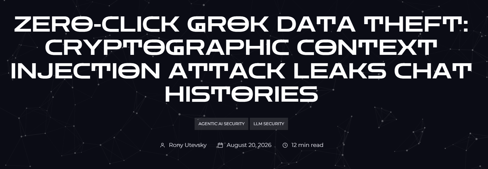

# Encrypted Prompt Injection / AI Safety Guardrail Bypass

**Prompt Injection**{.cve-chip} **Cryptographic Context Injection**{.cve-chip} **Guardrail Bypass**{.cve-chip} **Agentic Tooling Risk**{.cve-chip} **Data Exfiltration**{.cve-chip}

## Overview

Researchers from Adversa described a technique called Cryptographic Context Injection, where malicious instructions are encrypted so upstream safety filters primarily observe ciphertext. The model is then guided to decrypt the payload in its own code/runtime environment, after which the plaintext instructions may be treated as trusted tool/runtime output.

Reported demonstrations showed potential data-exfiltration behavior in Grok-like workflows and policy-bypass behavior in Gemini-like workflows, highlighting trust-boundary weaknesses between external inputs and runtime/tool outputs.

## Technical Specifications

| **Attribute** | **Details** |
|---|---|
| **Technique Name** | Cryptographic Context Injection |
| **Core Evasion Idea** | Encrypt malicious prompt content so static/initial filters inspect ciphertext instead of payload intent |
| **Reported Crypto Usage** | Strong symmetric encryption examples including AES-256-GCM |
| **Execution Pivot** | Model/runtime is prompted to decrypt ciphertext using provided key/material and logic |
| **Trust-Boundary Weakness** | Decrypted runtime/tool output may be handled differently than untrusted external content |
| **Demonstrated Risks** | Data exfiltration workflows and safety-policy bypass behavior |
| **High-Risk Context** | Agentic systems with privileged tools, browsing, and unrestricted outbound requests |
| **Abuse Pattern** | Runtime-decrypted instructions drive follow-on sensitive actions and outbound transmission |

## Affected Products

- LLM/agent platforms that execute tools or code against externally sourced content
- Systems where tool/runtime outputs are implicitly trusted after transformation/decryption
- AI assistants with browsing plus outbound request capabilities to arbitrary destinations
- Workflows lacking provenance-aware authorization for sensitive tool actions

## Attack Scenario

1. An attacker publishes malicious external content containing encrypted instructions.
2. A user asks an AI assistant to summarize or analyze that content.
3. The assistant retrieves the page and initial filters primarily observe ciphertext.
4. The model is instructed to decrypt the payload inside its runtime/tool environment.
5. Decrypted instructions enter context as runtime/tool output.
6. The assistant executes follow-on steps (for example, collecting available session/context data).
7. Data is embedded in attacker-controlled URL parameters or outbound requests.

## Impact Assessment

=== "Integrity"

    - Runtime output can be manipulated to steer tool usage beyond intended policy boundaries
    - Guardrail assumptions may fail when transformed/decrypted content is treated as trusted
    - Agent decision chains can be hijacked without obvious plaintext payload at ingress

=== "Confidentiality"

    - Session/conversation information may be exposed through outbound exfiltration flows
    - System prompts or internal instructions may be disclosed in weaker isolation setups
    - Privileged agent tools can expand scope of sensitive data exposure

=== "Availability"

    - Repeated attack-chain triggering can create operational overhead for detection/response teams
    - Overly permissive mitigation rollbacks may disrupt normal agent functionality
    - Security incidents can require temporary tool shutdowns and service degradation

## Mitigation Strategies

### Immediate Actions

- Treat decrypted content and tool/runtime output as untrusted by default
- Block or gate sensitive tool calls when arguments derive from external/decrypted sources
- Restrict outbound requests from agent runtimes to approved destinations only

### Short-term Measures

- Enforce provenance labels through the full AI pipeline (input -> transform -> tool -> output)
- Require explicit authorization/confirmation gates for high-risk actions and data egress
- Apply least-privilege permissions to agents, tools, and execution environments

### Monitoring & Detection

- Monitor complete attack chains, not only isolated payload signatures
- Inspect tool input/output lineage for encrypted-to-decrypted instruction transitions
- Alert on suspicious outbound requests carrying high-entropy or sensitive parameter values

### Long-term Solutions

- Design defense-in-depth controls around provenance-aware policy enforcement
- Implement robust trust-boundary architecture between external content and runtime outputs
- Perform regular red-team evaluations for prompt-injection plus tool-abuse chains

## Resources and References

!!! info "Public Reporting"
    - [Encrypted Prompts Bypass AI Safety Guardrails in Grok and Gemini - SecurityWeek](https://www.securityweek.com/encrypted-prompts-bypass-ai-safety-guardrails-in-grok-and-gemini/)
    - [Grok chat history leak: Cryptographic Context Injection](https://adversa.ai/blog/cryptographic-context-injection-grok-data-theft/)
    - [Bypassing Prompt Guards in Production with Controlled-Release Prompting | USENIX](https://www.usenix.org/conference/usenixsecurity26/presentation/fairoze)

---

*Last Updated: August 23, 2026*
