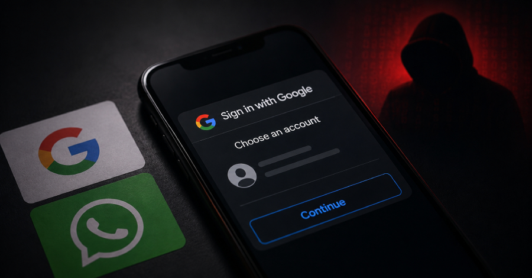
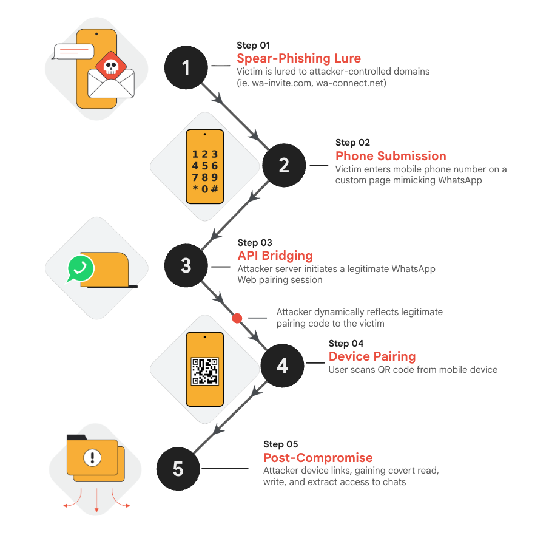

# Suspected Russian Hackers Abuse Google OAuth and WhatsApp Linking to Hijack Accounts

**Account Hijacking**{.cve-chip} **OAuth Phishing**{.cve-chip} **Social Engineering**{.cve-chip} **Russian APT**{.cve-chip} **MFA Bypass**{.cve-chip} **Device Linking Abuse**{.cve-chip}

## Overview

Three suspected Russian cyber-espionage clusters — UNC6293, UNC7005, and UNC5976 — conducted persistent phishing campaigns designed to compromise victims' personal accounts.

Rather than directly exploiting vulnerabilities in Google or WhatsApp, the attackers abused legitimate authentication and device-linking functionality. Victims were socially engineered into authenticating through Google OAuth flows or linking an attacker-controlled WhatsApp device, enabling account takeover without requiring password compromise.

## Technical Specifications

| **Attribute** | **Details** |
|---|---|
| **Attack Groups** | UNC6293, UNC7005, UNC5976 (suspected Russian cyber-espionage) |
| **Primary Attack Vector** | OAuth phishing and device-linking abuse |
| **Authentication Method Abused** | Google OAuth (legitimate flow), WhatsApp device linking (legitimate flow) |
| **Exploitation Technique** | Social engineering, phishing pages impersonating trusted services, redirect infrastructure |
| **Account Access Method** | OAuth token theft or attacker-controlled device linking |
| **Key Weakness** | User-approved legitimate flows without authentication resistance or device verification |
| **Target Profile** | High-value individuals including executives, researchers, diplomats, defense personnel |
| **Exploitation Status at Disclosure** | Ongoing campaigns documented by security researchers |

## Affected Products

- Google Workspace and personal Google accounts
- WhatsApp messaging application
- File-sharing services commonly used by target organizations
- Any organization whose personnel are targeted by phishing campaigns
- Email providers and document-storage platforms accessed via OAuth integration

## Attack Scenario

1. Attacker identifies a high-value target (executive, researcher, diplomat, or defense personnel).
2. Attacker sends tailored phishing message with malicious link or attachment.
3. Victim visits a convincing malicious website impersonating a file-sharing service or trusted organization.
4. Victim is seamlessly directed through a legitimate Google OAuth authentication process or WhatsApp device-linking workflow.
5. Victim authenticates or approves the device-linking request, believing it is legitimate.
6. Attacker obtains OAuth token or successfully links their own device to the victim's WhatsApp account.
7. Attacker accesses the compromised account, reading emails, documents, and messaging communications.
8. Attacker may conduct further credential theft, surveillance, malware deployment, or contact targeting.

## Impact Assessment

=== "Integrity"

    - Account credentials and session tokens compromised and exploitable by attackers
    - Potential lateral movement to linked services and contacts
    - Victim accounts used to conduct follow-on phishing and social engineering
    - Malware or remote-access tools potentially deployed through compromised accounts

=== "Confidentiality"

    - Full access to personal email and document storage
    - Complete access to messaging history and contacts
    - Exposure of organizational intelligence and operational information
    - Risk to follow-on targets identified through compromised contacts and communications

=== "Availability"

    - Account unavailability due to attacker control or password changes
    - Disruption of victim's ability to communicate securely
    - Potential service disruptions from incident response and remediation efforts
    - Organizational impact from compromised personnel communications

## Mitigation Strategies

### Immediate Actions

- Enable phishing-resistant authentication such as passkeys or hardware security keys.
- Review OAuth application grants and revoke suspicious or unrecognized third-party applications.
- Inspect and remove unrecognized or suspicious devices from WhatsApp Linked Devices.
- Reset passwords for all potentially affected accounts and clear active sessions.

### Short-term Measures

- Enable and enforce multi-factor authentication on all critical accounts.
- Review OAuth token activity logs and revoke any suspicious or unexplained tokens.
- Monitor authentication logs for unusual sign-in patterns, locations, or devices.
- Never approve a WhatsApp device-linking request solely because a website instructs you to—use official WhatsApp workflows only.

### Monitoring & Detection

- Monitor for suspicious OAuth token creation or API access patterns.
- Alert on authentication from unusual locations, devices, or times.
- Review email forwarding rules, recovery contacts, and connected applications for unauthorized changes.
- Monitor domains impersonating organizational partners, conferences, file-sharing services, and defense organizations.

### Long-term Solutions

- Strengthen phishing and social-engineering awareness training, with particular focus on executives, researchers, diplomats, and defense personnel.
- Implement conditional access policies to restrict authentication from unusual or high-risk locations.
- Maintain endpoint protection to detect and prevent installation of infostealer malware or remote-access trojans.
- Establish regular account audits and access reviews for high-value personnel.
- Deploy email security controls to detect and block OAuth phishing campaigns.

## Resources and References

!!! info "Public Reporting and Advisories"
    - [Suspected Russian Hackers Abuse Google OAuth and WhatsApp Linking to Hijack Accounts - The Hacker News](https://thehackernews.com/2026/08/suspected-russian-hackers-abuse-google.html)

---

*Last Updated: August 23, 2026*
