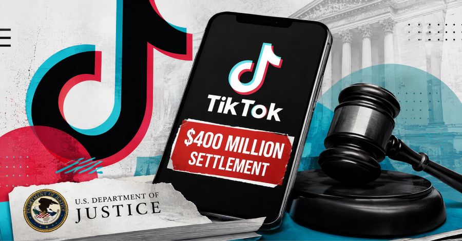

# TikTok / ByteDance Children's Privacy & COPPA Case — $400M Settlement

**Privacy Violation**{.cve-chip} **COPPA Violation**{.cve-chip} **Child Safety Failure**{.cve-chip} **Data Retention Abuse**{.cve-chip} **Regulatory Settlement**{.cve-chip} **Parental Consent Bypass**{.cve-chip}

## Overview

The U.S. Department of Justice and TikTok/ByteDance reached a $400 million settlement resolving allegations that TikTok violated the Children's Online Privacy Protection Act (COPPA).

The 2024 lawsuit alleged that TikTok knowingly allowed children under 13 to create and maintain regular accounts, collected and retained their personal information without the required parental consent, and failed in some cases to delete children's accounts and associated information after receiving parental deletion requests. The settlement includes an immediate $300 million payment, with an additional $100 million due after a court order vacates the earlier consent decree involving Musical.ly.

## Technical Specifications

| **Attribute** | **Details** |
|---|---|
| **Regulatory Framework** | Children's Online Privacy Protection Act (COPPA) - 15 U.S.C. § 6501 et seq. |
| **Complaint Categories** | Age detection/account management failure, unauthorized data collection, data retention without parental consent, failure to delete on parental request |
| **Affected User Population** | Children under 13 years of age |
| **Data Retention Issue** | Personal information retained in Kids Mode, including email addresses and identifying details |
| **Data Transfer Issue** | Children's personal information transferred to TikTok U.S. Data Security Inc. without parental notice or consent |
| **Enforcement Authority** | U.S. Department of Justice (DOJ), Federal Trade Commission (FTC) |
| **Settlement Amount** | $400 million total ($300M immediate + $100M conditional) |
| **Litigation Status** | Resolved by settlement; no admission of liability by TikTok |

## Affected Products

- TikTok mobile application (all versions allowing account creation prior to remediation)
- TikTok web platform (accounts.tiktok.com and similar)
- TikTok Kids Mode (age-restricted version)
- Musical.ly (predecessor platform, subject to earlier consent decree)
- Any child under 13 who created or accessed a TikTok account

## Attack Scenario

Not a malicious cyberattack. The scenario involves a regulatory and privacy-compliance failure:

1. A child under 13 years of age visits TikTok or downloads the TikTok application.
2. TikTok's age-verification and account-management mechanisms fail to detect or prevent account creation by minors.
3. The child creates and maintains a regular TikTok account (not restricted to Kids Mode).
4. TikTok collects personal information including email address, device identifiers, and behavioral data.
5. Personal information is retained in TikTok's databases and transferred to affiliated entities.
6. No parental consent was obtained or verified prior to data collection.
7. If a parent later requests account deletion, TikTok's deletion processes fail to reliably remove all associated data.
8. Regulatory investigation identifies patterns of non-compliance and launches enforcement action.

## Impact Assessment

=== "Integrity"

    - Failure of age-verification and account-management processes designed to protect children
    - Systemic non-compliance with data minimization and parental-consent requirements
    - Unreliable account deletion and data purge processes
    - Regulatory trust and accountability damage

=== "Confidentiality"

    - Unauthorized collection of personal information from minors without parental consent
    - Retention of sensitive identifiers (email addresses, device IDs, behavioral profiles)
    - Potential transfer of children's data to third parties without parental notice
    - Risk of secondary misuse of collected children's data

=== "Availability"

    - Regulatory enforcement disruption and operational costs
    - Requirement to remediate compliance gaps across platforms
    - Potential service restrictions or enhanced oversight requirements
    - Reputational damage affecting user trust and platform adoption

## Mitigation Strategies

### Immediate Actions

- Strengthen age-assurance and age-detection mechanisms to reliably prevent under-13 account creation.
- Improve detection algorithms to identify existing accounts belonging to children.
- Implement automated removal of accounts confirmed to be under 13 years of age.
- Verify and enforce parental-consent mechanisms before any personal data collection.

### Short-term Measures

- Audit all personal information collected from users under 13 and delete non-essential data.
- Implement reliable, auditable data-retention and deletion processes aligned with COPPA requirements.
- Enhance parental controls and account-oversight functionality for custodial accounts.
- Review and remediate data-transfer practices to affiliated entities.
- Conduct comprehensive COPPA compliance audit and remediation program.

### Monitoring & Detection

- Establish automated monitoring for account creation patterns consistent with minors.
- Monitor parental deletion requests and verify end-to-end execution.
- Audit data-retention and data-transfer logs to ensure compliance.
- Track compliance metrics and report to regulators as required by settlement.

### Long-term Solutions

- Implement privacy-by-design principles for youth-facing platforms and features.
- Establish stronger governance and accountability structures around children's data.
- Conduct regular third-party audits of COPPA compliance and age-detection mechanisms.
- Maintain transparent documentation of data practices and parental-consent processes.
- Establish escalation and remediation workflows for compliance gaps identified by regulators or researchers.

## Resources and References

!!! info "Government and Public Reporting"
    - [TikTok Agrees to $400 Million Settlement in U.S. Child Privacy Lawsuit - The Hacker News](https://thehackernews.com/2026/08/tiktok-agrees-to-400-million-settlement.html)
    - [Justice Department Secures $400M Settlement with TikTok and ByteDance to Resolve Children's Privacy Litigation - U.S. Department of Justice](https://www.justice.gov/opa/pr/justice-department-secures-400m-settlement-tiktok-and-bytedance-resolve-childrens-privacy)
    - [TikTok agrees to $400 million US children's privacy settlement - Reuters](https://www.reuters.com/world/us-justice-department-tiktok-settle-400-million-childrens-privacy-suit-axios-2026-08-21/)

---

*Last Updated: August 23, 2026*
