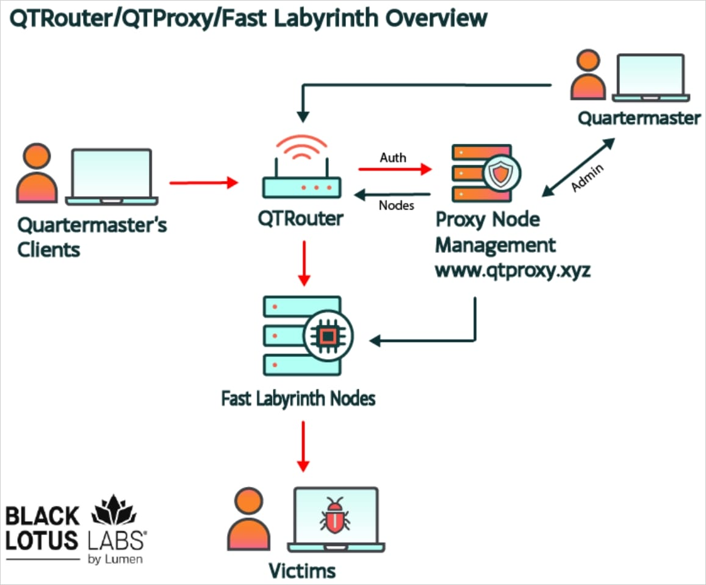
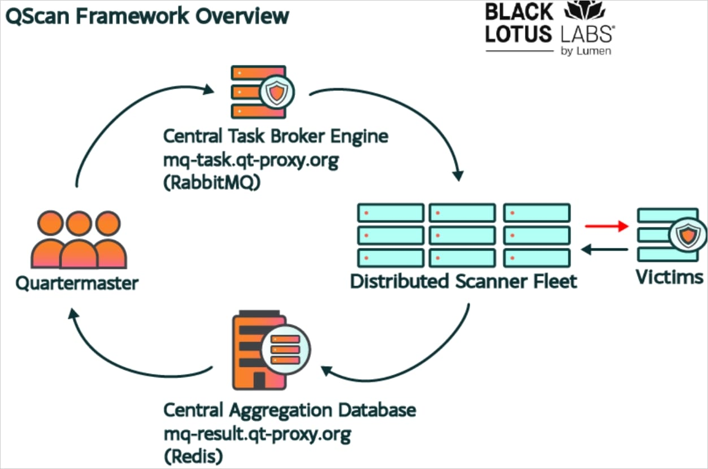

# FBI Disrupts China-Linked QTFY Infrastructure (QScan and QTRouter)

**QTFY Activity**{.cve-chip} **QScan**{.cve-chip} **QTRouter**{.cve-chip} **Proxy Obfuscation**{.cve-chip} **China-Linked Intrusions**{.cve-chip}

## Overview

The U.S. Department of Justice and FBI disrupted two China-linked hacking platforms, QScan and QTRouter, allegedly operated by the PRC state-sponsored group QTFY. The infrastructure was reportedly used to target U.S. critical infrastructure and sensitive networks.

Public reporting states QTFY has been active since at least 2018.

## Technical Details

QScan was reportedly used to scan for vulnerable systems and automatically compromise large numbers of internet-connected devices, including IoT assets.

Compromised systems were incorporated into QTRouter, an obfuscation network that also used commercial proxy services and leased VPS infrastructure to mask traffic origin.

Reportedly seized domains include:

- qtproxy[.]xyz
- qt-proxy[.]org
- qt-team[.]com

According to reporting, these domains were hard-coded for malware communication and authentication, so seizure disrupted core platform operations.

## Technical Specifications

| **Attribute** | **Details** |
|---|---|
| **Threat Infrastructure** | QScan reconnaissance/compromise platform and QTRouter obfuscation network |
| **Alleged Operator** | QTFY (China-linked, state-sponsored attribution in public reporting) |
| **Activity Timeline** | Reportedly active since at least 2018 |
| **Primary Abuse Pattern** | Vulnerability scanning, IoT compromise, and routed obfuscation through proxy/VPS layers |
| **Disrupted Assets** | qtproxy[.]xyz, qt-proxy[.]org, qt-team[.]com |
| **Operational Advantage to Adversary** | Conceals true origin of malicious traffic and supports follow-on intrusion activity |
| **Public Clarification Note** | DOJ later clarified listed U.S. entities were targets, not necessarily all confirmed victims |

## Affected Products

- Internet-exposed IoT devices with weak security posture or unpatched vulnerabilities
- Vulnerable internet-facing enterprise services leveraged for initial compromise
- Networks lacking segmentation between edge/IoT assets and sensitive internal systems
- Organizations exposed to adversary traffic routed through compromised or leased intermediary infrastructure

## Attack Scenario

1. QScan conducts internet-wide reconnaissance for vulnerable services and devices.
2. Exposed IoT or other weakly protected systems are compromised.
3. Compromised assets are added into QTRouter obfuscation infrastructure.
4. Adversary operations are routed through mixed proxies, VPS servers, and hijacked devices.
5. Concealed infrastructure is used to support intrusion and espionage attempts against sensitive U.S. organizations.
6. Successful operations may enable data access and theft from targeted environments.

## Impact Assessment

=== "Confirmed Impact"

    - U.S. authorities disrupted infrastructure tied to QScan and QTRouter operations
    - Domain seizures impaired malware communication/authentication pathways tied to reported hard-coded dependencies
    - Campaign capability included scalable traffic obfuscation and broad target reach

=== "Clarification and Reporting Context"

    - Initial public framing listed agencies and organizations in relation to targeting activity
    - DOJ later clarified listed organizations were targets and not necessarily all confirmed victims of successful compromise
    - Confirmed successful intrusion scope appears narrower than early reporting impressions

=== "Potential Impact"

    - Obfuscation networks built on compromised IoT assets increase detection and attribution difficulty
    - Routed malicious traffic can enable sustained espionage and data-theft operations against sensitive sectors
    - Reliance on legitimate proxy/VPS services can reduce effectiveness of simple IP-based blocking controls

## Mitigation Strategies

### Patch and Exposure Reduction

- Rapidly patch internet-facing systems and known vulnerabilities.
- Maintain accurate inventory of internet-exposed assets.
- Update IoT firmware and remove unnecessary direct internet exposure.

### Identity and Access Hardening

- Replace default credentials and enforce strong authentication controls.
- Segment IoT and edge systems away from critical business and infrastructure networks.
- Restrict privileged pathways from edge assets into core systems.

### Monitoring and Detection

- Monitor unusual outbound traffic and proxy-like connection behavior.
- Use network logging and detection for suspicious authentication activity and lateral movement indicators.
- Hunt for traffic patterns consistent with chained relay/proxy infrastructure.

### Response and Intelligence Use

- Do not rely only on IP blocklists because adversaries can rotate through compromised devices and commercial infrastructure.
- Review FBI/NSA indicators of compromise and detection guidance for this campaign.
- Correlate endpoint, network, and identity telemetry to identify indirect routing abuse.

## Resources and References

!!! info "Public Reporting"
    - [FBI Disrupts China-Linked QTFY Infrastructure Used to Steal Data From U.S. Organizations](https://thehackernews.com/2026/08/fbi-disrupts-china-linked-qtfy.html)
    - [FBI disrupts proxy network enabling Chinese espionage operations](https://www.bleepingcomputer.com/news/security/fbi-disrupts-proxy-network-enabling-chinese-espionage-operations/)
    - [DoJ Corrects China Hacking Claim, Says U.S. Agencies Were Targets, Not Victims](https://thehackernews.com/2026/08/doj-corrects-china-hacking-claim-says.html?m=1)
    - [FBI Disrupts Chinese Proxy Tools Used in Mass Hacking of US Agencies and Infrastructure | WIRED](https://www.wired.com/story/fbi-disrupts-chinese-proxy-tools-used-in-mass-hacking-of-us-agencies-and-infrastructure/)
    - [Justice Department and FBI Seize Platforms Operated and Used by China State-Sponsored Hackers to Target U.S. Critical Infrastructure](https://www.justice.gov/opa/pr/justice-department-and-fbi-seize-platforms-operated-and-used-china-state-sponsored-hackers)
    - [US officials revise claims that government agencies were hacked by Chinese, now say they were targets | Reuters](https://www.reuters.com/world/us-officials-backpedal-claims-that-government-agencies-were-hacked-by-chinese-2026-08-28/)

---

*Last Updated: August 31, 2026*
